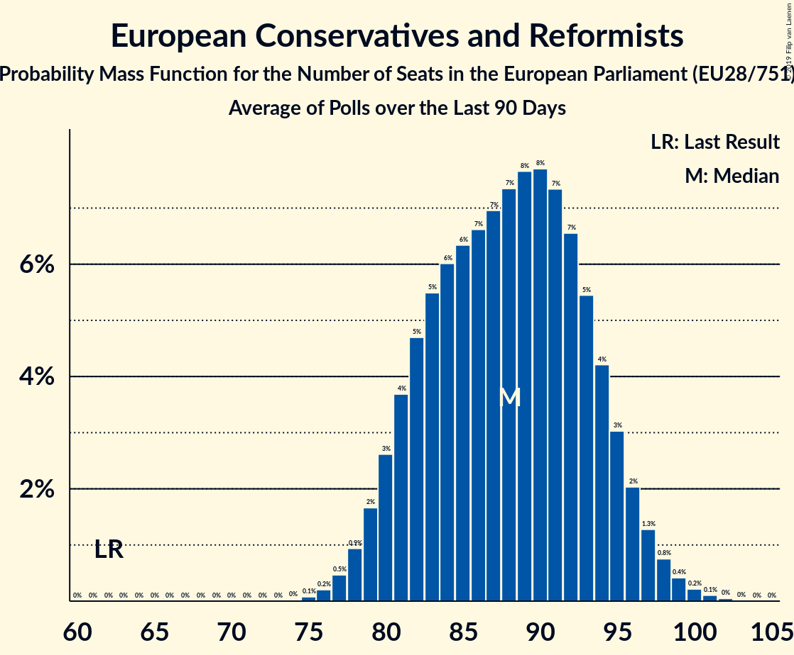

# European Conservatives and Reformists

Members registered from **18 countries**:

> BE, BG, CZ, DE, ES, FR, GB, GR, HR, IT, LT, LU, LV, NL, PL, PT, SE, SK

## Seats

Last result: **62** seats (General Election of 25 May 2014)

Current median: **93** seats (+31 seats)

At least one member in **13 countries** have a median of 1 seat or more:

> BE, BG, CZ, ES, GB, GR, HR, IT, LV, NL, PL, SE, SK

### Confidence Intervals

| Party | Area | Last Result | Median | 80% Confidence Interval | 90% Confidence Interval | 95% Confidence Interval | 99% Confidence Interval |
|:-----:|:----:|:-----------:|:------:|:-----------------------:|:-----------------------:|:-----------------------:|:-----------------------:|
| European Conservatives and Reformists | EU | 62 | 93 | 88–98 | 86–99 | 85–100 | 82–102 |
| Conservative Party | GB-GBN | | 36 | 32–38 | 30–39 | 29–39 | 28–40 |
| Zjednoczona Prawica | PL | | 22 | 20–25 | 20–25 | 19–26 | 19–27 |
| Vox | ES | | 9 | 7–10 | 7–10 | 7–11 | 7–11 |
| Fratelli d’Italia | IT | | 7 | 6–8 | 6–9 | 5–9 | 5–10 |
| Sverigedemokraterna | SE | | 5 | 4–6 | 4–6 | 4–6 | 4–7 |
| Forum voor Democratie | NL | | 3 | 2–4 | 2–4 | 2–4 | 2–4 |
| Nieuw-Vlaamse Alliantie | BE-VLG | | 3 | 3 | 3–4 | 3–4 | 3–4 |
| Občanská demokratická strana | CZ | | 3 | 2–3 | 2–3 | 2–4 | 2–4 |
| Most nezavisnih lista | HR | | 1 | 0–1 | 0–1 | 0–1 | 0–1 |
| Nacionālā apvienība „Visu Latvijai!”–„Tēvzemei un Brīvībai/LNNK” | LV | | 1 | 1 | 1–2 | 1–2 | 1–2 |
| Sloboda a Solidarita | SK | | 1 | 0–1 | 0–1 | 0–1 | 0–1 |
| Slovenská národná strana | SK | | 1 | 1 | 1 | 1 | 0–1 |
| Ελληνική Λύση | GR | | 1 | 0–1 | 0–1 | 0–1 | 0–1 |
| ВМРО–Българско Национално Движение | BG | | 1 | 0–1 | 0–1 | 0–2 | 0–2 |
| Alternativ Demokratesch Reformpartei | LU | | 0 | 0 | 0 | 0 | 0 |
| Centro partija „Gerovės Lietuva“ | LT | | 0 | 0 | 0–1 | 0–1 | 0–1 |
| Chega | PT | | 0 | 0 | 0–1 | 0–1 | 0–1 |
| Debout la France | FR | | 0 | 0 | 0 | 0 | 0 |
| Familienpartei Deutschlands | DE | | 0 | 0–1 | 0–1 | 0–1 | 0–1 |
| Hrvatska konzervativna stranka | HR | | 0 | 0 | 0 | 0 | 0 |
| Hrvatski rast | HR | | 0 | 0 | 0 | 0 | 0 |
| Latvijas Reģionu apvienība | LV | | 0 | 0 | 0 | 0–1 | 0–1 |
| Lietuvos lenkų rinkimų akcija | LT | | 0 | 0–1 | 0–1 | 0–1 | 0–1 |
| Staatkundig Gereformeerde Partij | NL | | 0 | 0 | 0 | 0 | 0–1 |
| Ulster Unionist Party | GB-NIR | | 0 | 0 | 0 | 0 | 0 |
| Обединени Патриоти | BG | | 0 | 0–1 | 0–1 | 0–1 | 0–1 |

### Probability Mass Function

The following table shows the probability mass function per seat for the [poll average](average-2019-11-30.html) for European Conservatives and Reformists.

| Number of Seats | Probability | Accumulated | Special Marks |
|:---------------:|:-----------:|:-----------:|:-------------:|
| 62 | 0% | 100% | Last Result |
| 63 | 0% | 100% |  |
| 64 | 0% | 100% |  |
| 65 | 0% | 100% |  |
| 66 | 0% | 100% |  |
| 67 | 0% | 100% |  |
| 68 | 0% | 100% |  |
| 69 | 0% | 100% |  |
| 70 | 0% | 100% |  |
| 71 | 0% | 100% |  |
| 72 | 0% | 100% |  |
| 73 | 0% | 100% |  |
| 74 | 0% | 100% |  |
| 75 | 0% | 100% |  |
| 76 | 0% | 100% |  |
| 77 | 0% | 100% |  |
| 78 | 0% | 100% |  |
| 79 | 0% | 100% |  |
| 80 | 0.1% | 100% |  |
| 81 | 0.2% | 99.9% |  |
| 82 | 0.3% | 99.7% |  |
| 83 | 0.5% | 99.4% |  |
| 84 | 0.9% | 98.9% |  |
| 85 | 1.3% | 98% |  |
| 86 | 2% | 97% |  |
| 87 | 3% | 95% |  |
| 88 | 4% | 92% |  |
| 89 | 5% | 88% |  |
| 90 | 7% | 83% |  |
| 91 | 9% | 76% |  |
| 92 | 10% | 67% |  |
| 93 | 11% | 57% | Median |
| 94 | 11% | 46% |  |
| 95 | 10% | 35% |  |
| 96 | 8% | 26% |  |
| 97 | 6% | 18% |  |
| 98 | 4% | 11% |  |
| 99 | 3% | 7% |  |
| 100 | 2% | 4% |  |
| 101 | 1.1% | 2% |  |
| 102 | 0.6% | 1.0% |  |
| 103 | 0.3% | 0.5% |  |
| 104 | 0.1% | 0.2% |  |
| 105 | 0.1% | 0.1% |  |
| 106 | 0% | 0% |  |

