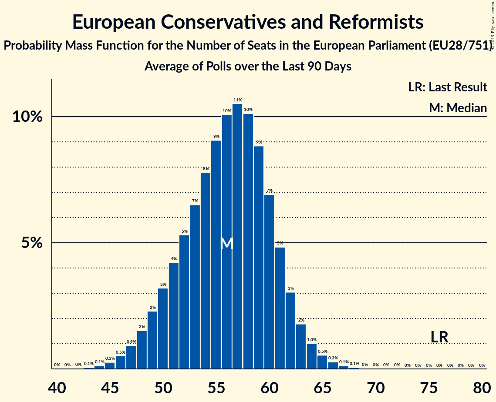

# European Conservatives and Reformists

## Seats

Last result: **76** seats (General Election of 25 May 2014)

### Confidence Intervals

| Party | Last Result | Median | 80% Confidence Interval | 90% Confidence Interval | 95% Confidence Interval | 99% Confidence Interval |
|:-----:|:-----------:|:------:|:-----------------------:|:-----------------------:|:-----------------------:|:-----------------------:|
| European Conservatives and Reformists | 76 | 56 | 51–61 | 49–62 | 48–63 | 46–65 |
| Prawo i Sprawiedliwość [PL] (ECR) | | 20 | 18–22 | 17–23 | 17–23 | 16–24 |
| Conservative Party [GB-GBN] (ECR) | | 8 | 1–9 | 1–9 | 1–10 | 1–11 |
| Forum voor Democratie [NL] (ECR) | | 5 | 4–5 | 4–5 | 3–5 | 3–6 |
| Fratelli d’Italia [IT] (ECR) | | 4 | 3–5 | 3–5 | 0–5 | 0–6 |
| N-VA [BE-VLG] (ECR) | | 4 | 4 | 3–4 | 3–5 | 3–5 |
| Sverigedemokraterna [SE] (ECR) | | 4 | 3–4 | 3–4 | 3–4 | 2–5 |
| Občanská demokratická strana [CZ] (ECR) | | 3 | 2–4 | 2–4 | 2–4 | 2–4 |
| ChristenUnie–Staatkundig Gereformeerde Partij [NL] (ECR) | | 2 | 1–2 | 1–2 | 1–2 | 1–3 |
| Sloboda a Solidarita [SK] (ECR) | | 2 | 1–2 | 1–2 | 1–2 | 1–2 |
| Lietuvos lenkų rinkimų akcija [LT] (ECR) | | 1 | 0–1 | 0–1 | 0–1 | 0–1 |
| Most nezavisnih lista [HR] (ECR) | | 1 | 0–1 | 0–1 | 0–1 | 0–1 |
| Nacionālā apvienība „Visu Latvijai!”–„Tēvzemei un Brīvībai/LNNK” [LV] (ECR) | | 1 | 1–2 | 1–2 | 1–2 | 1–2 |
| OBYČAJNÍ ĽUDIA a nezávislé osobnosti [SK] (ECR) | | 1 | 1 | 1 | 1 | 1–2 |
| Partija tvarka ir teisingumas [LT] (ECR) | | 1 | 0–1 | 0–1 | 0–1 | 0–1 |
| Slovenská národná strana [SK] (ECR) | | 1 | 1 | 1 | 1 | 1 |
| ВМРО–Българско Национално Движение [BG] (ECR) | | 1 | 0–1 | 0–1 | 0–1 | 0–2 |
| Debout la France [FR] (ECR) | | 0 | 0 | 0–4 | 0–4 | 0–5 |
| Hrvatska konzervativna stranka [HR] (ECR) | | 0 | 0 | 0 | 0 | 0–1 |
| Latvijas Reģionu apvienība [LV] (ECR) | | 0 | 0–1 | 0–1 | 0–1 | 0–1 |
| Lietuvos Centro Partija [LT] (ECR) | | 0 | 0–1 | 0–1 | 0–1 | 0–1 |
| Ulster Unionist Party [GB-NIR] (ECR) | | 0 | 0 | 0 | 0–1 | 0–1 |
| Ανεξάρτητοι Έλληνες [GR] (ECR) | | 0 | 0 | 0 | 0 | 0–1 |

### Probability Mass Function

The following table shows the probability mass function per seat for the [poll average](average-2019-05-26.html) for European Conservatives and Reformists.

| Number of Seats | Probability | Accumulated | Special Marks |
|:---------------:|:-----------:|:-----------:|:-------------:|
| 43 | 0.1% | 100% |  |
| 44 | 0.1% | 99.9% |  |
| 45 | 0.3% | 99.8% |  |
| 46 | 0.5% | 99.5% |  |
| 47 | 0.9% | 99.0% |  |
| 48 | 2% | 98% |  |
| 49 | 2% | 97% |  |
| 50 | 3% | 94% |  |
| 51 | 4% | 91% |  |
| 52 | 5% | 87% |  |
| 53 | 7% | 82% |  |
| 54 | 8% | 75% |  |
| 55 | 9% | 67% |  |
| 56 | 10% | 58% | Median |
| 57 | 11% | 48% |  |
| 58 | 10% | 38% |  |
| 59 | 9% | 27% |  |
| 60 | 7% | 19% |  |
| 61 | 5% | 12% |  |
| 62 | 3% | 7% |  |
| 63 | 2% | 4% |  |
| 64 | 1.0% | 2% |  |
| 65 | 0.5% | 1.0% |  |
| 66 | 0.3% | 0.5% |  |
| 67 | 0.1% | 0.2% |  |
| 68 | 0.1% | 0.1% |  |
| 69 | 0% | 0% |  |
| 70 | 0% | 0% |  |
| 71 | 0% | 0% |  |
| 72 | 0% | 0% |  |
| 73 | 0% | 0% |  |
| 74 | 0% | 0% |  |
| 75 | 0% | 0% |  |
| 76 | 0% | 0% | Last Result |

