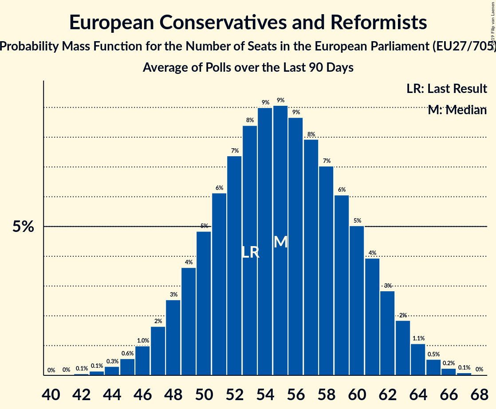

# European Conservatives and Reformists

## Seats

Last result: **53** seats (General Election of 25 May 2014)

### Confidence Intervals

| Party | Last Result | Median | 80% Confidence Interval | 90% Confidence Interval | 95% Confidence Interval | 99% Confidence Interval |
|:-----:|:-----------:|:------:|:-----------------------:|:-----------------------:|:-----------------------:|:-----------------------:|
| European Conservatives and Reformists | 53 | 55 | 49–60 | 48–62 | 47–63 | 44–65 |
| Prawo i Sprawiedliwość (ECR) | | 22 | 19–25 | 18–25 | 18–26 | 17–27 |
| Forum voor Democratie (ECR) | | 4 | 3–6 | 3–6 | 3–6 | 3–7 |
| Fratelli d’Italia (ECR) | | 4 | 0–5 | 0–5 | 0–5 | 0–6 |
| N-VA (ECR) | | 4 | 4 | 3–4 | 3–4 | 3–5 |
| Sverigedemokraterna (ECR) | | 4 | 3–5 | 3–5 | 3–5 | 3–5 |
| Občanská demokratická strana (ECR) | | 3 | 2–4 | 2–4 | 2–4 | 2–4 |
| Dansk Folkeparti (ECR) | | 2 | 2–3 | 2–3 | 2–3 | 2–3 |
| OBYČAJNÍ ĽUDIA a nezávislé osobnosti (ECR) | | 2 | 1–2 | 1–2 | 1–2 | 1–2 |
| Perussuomalaiset (ECR) | | 2 | 2–3 | 1–3 | 1–3 | 1–3 |
| Sloboda a Solidarita (ECR) | | 2 | 1–2 | 1–2 | 1–3 | 1–3 |
| ChristenUnie (ECR) | | 1 | 1–2 | 1–2 | 1–2 | 0–2 |
| Eesti Konservatiivne Rahvaerakond (ECR) | | 1 | 1 | 1–2 | 1–2 | 1–2 |
| Nacionālā apvienība „Visu Latvijai!”–„Tēvzemei un Brīvībai/LNNK” (ECR) | | 1 | 1 | 1 | 1 | 0–2 |
| Обединени Патриоти (ECR) | | 1 | 0–2 | 0–2 | 0–2 | 0–2 |
| Debout la France (ECR) | | 0 | 0–5 | 0–6 | 0–6 | 0–6 |
| Hrvatska konzervativna stranka (ECR) | | 0 | 0 | 0 | 0 | 0 |
| Lietuvos lenkų rinkimų akcija (ECR) | | 0 | 0–1 | 0–1 | 0–1 | 0–1 |
| Staatkundig Gereformeerde Partij (ECR) | | 0 | 0 | 0 | 0 | 0 |
| Ανεξάρτητοι Έλληνες (ECR) | | 0 | 0 | 0 | 0 | 0 |

### Probability Mass Function

The following table shows the probability mass function per seat for the [poll average](average-2019-03-31.html) for European Conservatives and Reformists.

| Number of Seats | Probability | Accumulated | Special Marks |
|:---------------:|:-----------:|:-----------:|:-------------:|
| 42 | 0.1% | 100% |  |
| 43 | 0.2% | 99.9% |  |
| 44 | 0.3% | 99.8% |  |
| 45 | 0.6% | 99.4% |  |
| 46 | 1.1% | 98.8% |  |
| 47 | 2% | 98% |  |
| 48 | 3% | 96% |  |
| 49 | 4% | 93% |  |
| 50 | 5% | 89% |  |
| 51 | 7% | 84% |  |
| 52 | 8% | 77% |  |
| 53 | 9% | 69% | Last Result |
| 54 | 9% | 61% |  |
| 55 | 9% | 51% | Median |
| 56 | 9% | 42% |  |
| 57 | 8% | 33% |  |
| 58 | 7% | 26% |  |
| 59 | 6% | 19% |  |
| 60 | 5% | 13% |  |
| 61 | 3% | 9% |  |
| 62 | 2% | 5% |  |
| 63 | 2% | 3% |  |
| 64 | 0.8% | 2% |  |
| 65 | 0.4% | 0.7% |  |
| 66 | 0.2% | 0.3% |  |
| 67 | 0.1% | 0.1% |  |
| 68 | 0% | 0% |  |

