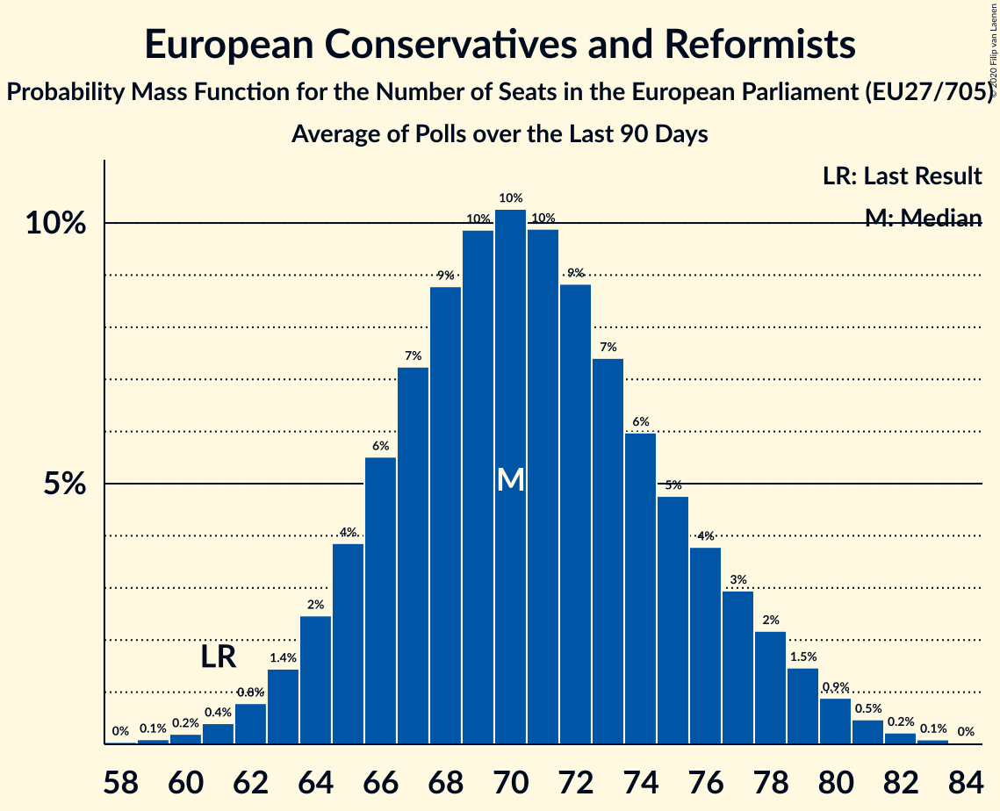

# European Conservatives and Reformists

Members registered from **16 countries**:

> BE, BG, CZ, DE, ES, FR, GR, HR, IT, LT, LU, LV, NL, PL, SE, SK

## Seats

Last result: **62** seats (General Election of 26 May 2019)

Current median: **70** seats (+8 seats)

At least one member in **15 countries** have a median of 1 seat or more:

> BE, BG, CZ, ES, FR, GR, HR, IT, LT, LU, LV, NL, PL, SE, SK

### Confidence Intervals

| Party | Area | Last Result | Median | 80% Confidence Interval | 90% Confidence Interval | 95% Confidence Interval | 99% Confidence Interval |
|:-----:|:----:|:-----------:|:------:|:-----------------------:|:-----------------------:|:-----------------------:|:-----------------------:|
| European Conservatives and Reformists | EU | 62 | 70 | 66–74 | 65–75 | 64–76 | 62–77 |
| Zjednoczona Prawica | PL | | 23 | 22–24 | 22–24 | 21–25 | 21–25 |
| Fratelli d’Italia | IT | | 12 | 10–13 | 10–13 | 9–14 | 9–15 |
| Vox | ES | | 9 | 7–11 | 7–11 | 7–12 | 6–12 |
| Debout la France | FR | | 5 | 4–6 | 4–6 | 0–6 | 0–7 |
| Sverigedemokraterna | SE | | 5 | 4–6 | 4–6 | 4–6 | 4–6 |
| Nieuw-Vlaamse Alliantie | BE-VLG | | 3 | 3 | 2–3 | 2–3 | 2–3 |
| Občanská demokratická strana | CZ | | 3 | 2–4 | 2–4 | 2–4 | 2–5 |
| Domovinski pokret Miroslava Škore | HR | | 2 | 2 | 2 | 2 | 1–3 |
| Forum voor Democratie | NL | | 2 | 2–4 | 2–4 | 2–4 | 1–4 |
| Alternativ Demokratesch Reformpartei | LU | | 1 | 0–1 | 0–1 | 0–1 | 0–1 |
| Lietuvos lenkų rinkimų akcija | LT | | 1 | 0–1 | 0–1 | 0–1 | 0–1 |
| Nacionālā apvienība „Visu Latvijai!”–„Tēvzemei un Brīvībai/LNNK” | LV | | 1 | 1 | 1 | 1 | 1 |
| Sloboda a Solidarita | SK | | 1 | 0–2 | 0–2 | 0–2 | 0–2 |
| Ελληνική Λύση | GR | | 1 | 1 | 1–2 | 0–2 | 0–2 |
| ВМРО–Българско Национално Движение | BG | | 1 | 0–1 | 0–2 | 0–2 | 0–2 |
| Обединени Патриоти | BG | | 1 | 1 | 1–2 | 1–2 | 1–2 |
| Centro partija „Gerovės Lietuva“ | LT | | 0 | 0 | 0–1 | 0–1 | 0–1 |
| Familienpartei Deutschlands | DE | | 0 | 0–1 | 0–1 | 0–1 | 0–1 |
| Hrvatski suverenisti | HR | | 0 | 0 | 0 | 0 | 0–1 |
| Latvijas Reģionu Apvienība | LV | | 0 | 0–1 | 0–1 | 0–1 | 0–1 |
| Most nezavisnih lista | HR | | 0 | 0–1 | 0–1 | 0–1 | 0–1 |
| Slovenská národná strana | SK | | 0 | 0–1 | 0–1 | 0–1 | 0–1 |
| Staatkundig Gereformeerde Partij | NL | | 0 | 0 | 0 | 0 | 0–1 |

### Probability Mass Function

The following table shows the probability mass function per seat for the [poll average](average-2020-04-30.html) for European Conservatives and Reformists.

| Number of Seats | Probability | Accumulated | Special Marks |
|:---------------:|:-----------:|:-----------:|:-------------:|
| 59 | 0% | 100% |  |
| 60 | 0.1% | 99.9% |  |
| 61 | 0.2% | 99.8% |  |
| 62 | 0.4% | 99.6% | Last Result |
| 63 | 0.9% | 99.2% |  |
| 64 | 2% | 98% |  |
| 65 | 3% | 97% |  |
| 66 | 5% | 93% |  |
| 67 | 8% | 88% |  |
| 68 | 11% | 80% |  |
| 69 | 13% | 69% |  |
| 70 | 14% | 56% | Median |
| 71 | 13% | 42% |  |
| 72 | 11% | 30% |  |
| 73 | 8% | 19% |  |
| 74 | 5% | 11% |  |
| 75 | 3% | 6% |  |
| 76 | 2% | 3% |  |
| 77 | 0.7% | 1.1% |  |
| 78 | 0.3% | 0.4% |  |
| 79 | 0.1% | 0.1% |  |
| 80 | 0% | 0% |  |

