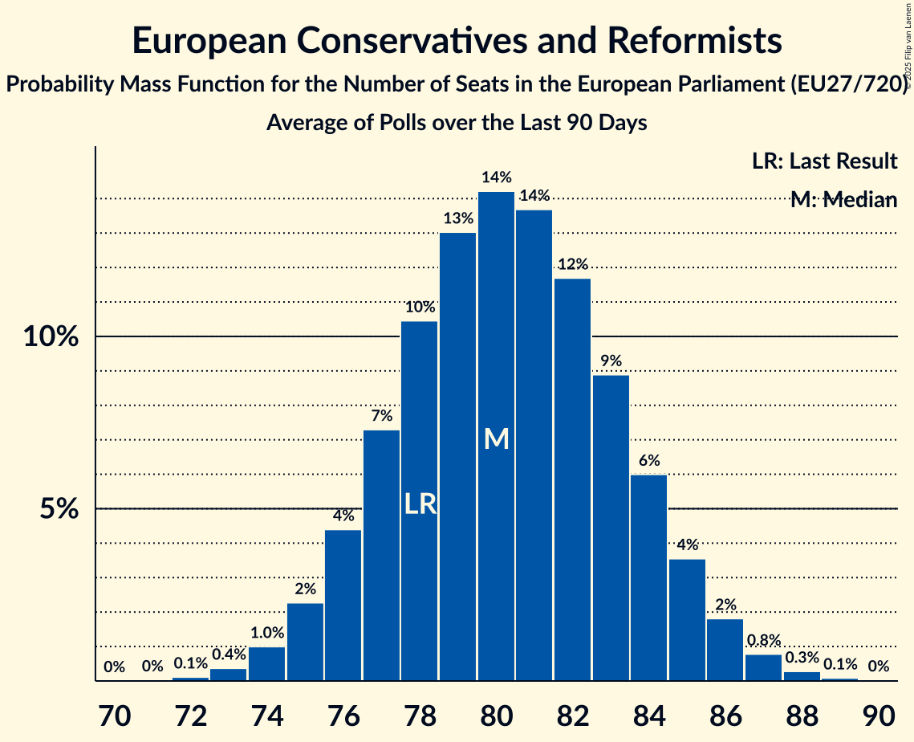

# European Conservatives and Reformists

Members registered from **19 countries**:

> BE, BG, CY, CZ, DK, EE, FI, FR, GR, HR, IT, LT, LU, LV, NL, PL, RO, SE, SK

## Seats

Last result: **78** seats (General Election of 26 May 2019)

Current median: **76** seats (-2 seats)

At least one member in **15 countries** have a median of 1 seat or more:

> BE, CY, CZ, DK, FI, GR, HR, IT, LT, LU, LV, PL, RO, SE, SK

### Confidence Intervals

| Party | Area | Last Result | Median | 80% Confidence Interval | 90% Confidence Interval | 95% Confidence Interval | 99% Confidence Interval |
|:-----:|:----:|:-----------:|:------:|:-----------------------:|:-----------------------:|:-----------------------:|:-----------------------:|
| European Conservatives and Reformists | EU | 78 | 76 | 73–80 | 72–80 | 71–81 | 70–83 |
| Fratelli d’Italia | IT | | 26 | 24–28 | 23–29 | 22–29 | 22–30 |
| Zjednoczona Prawica | PL | | 19 | 17–20 | 17–20 | 16–21 | 16–21 |
| Alianța pentru Unirea Românilor | RO | | 7 | 7 | 7 | 7 | 7 |
| Sverigedemokraterna | SE | | 5 | 4–5 | 4–5 | 4–5 | 4–6 |
| Nieuw-Vlaamse Alliantie | BE-VLG | | 3 | 3–4 | 3–4 | 3–4 | 3–4 |
| Perussuomalaiset | FI | | 3 | 2–3 | 2–3 | 2–3 | 2–3 |
| Danmarksdemokraterne | DK | | 2 | 1–2 | 1–2 | 1–2 | 1–2 |
| Nacionālā apvienība „Visu Latvijai!”–„Tēvzemei un Brīvībai/LNNK” | LV | | 2 | 2 | 2 | 1–2 | 1–2 |
| Občanská demokratická strana | CZ | | 2 | 2–4 | 2–4 | 2–5 | 1–5 |
| Ελληνική Λύση | GR | | 2 | 2 | 1–2 | 1–3 | 1–3 |
| Alternativ Demokratesch Reformpartei | LU | | 1 | 1 | 1 | 1 | 1 |
| Lietuvos valstiečių ir žaliųjų sąjunga | LT | | 1 | 1 | 1 | 1–2 | 1–2 |
| Most nezavisnih lista | HR | | 1 | 1 | 1 | 1 | 0–1 |
| Sloboda a Solidarita | SK | | 1 | 1 | 1–2 | 0–2 | 0–2 |
| Εθνικό Λαϊκό Μέτωπο | CY | | 1 | 1 | 1 | 1 | 1 |
| Debout la France | FR | | 0 | 0 | 0 | 0 | 0–5 |
| Domovinski pokret | HR | | 0 | 0 | 0 | 0 | 0 |
| Eesti Rahvuslased ja Konservatiivid | EE | | 0 | 0 | 0 | 0 | 0 |
| Hrvatski suverenisti | HR | | 0 | 0 | 0 | 0 | 0 |
| Juiste Antwoord 2021 | NL | | 0 | 0 | 0 | 0 | 0 |
| Kresťanská únia | SK | | 0 | 0 | 0 | 0 | 0 |
| Lietuvos lenkų rinkimų akcija | LT | | 0 | 0 | 0 | 0 | 0–1 |
| Partidul Național Conservator Român | RO | | 0 | 0 | 0 | 0 | 0 |
| Staatkundig Gereformeerde Partij | NL | | 0 | 0 | 0 | 0 | 0 |
| Suverēnā vara | LV | | 0 | 0 | 0–1 | 0–1 | 0–1 |
| Има такъв народ | BG | | 0 | 0–1 | 0–1 | 0–1 | 0–2 |

### Probability Mass Function

The following table shows the probability mass function per seat for the [poll average](average-2025-01-31.html) for European Conservatives and Reformists.

| Number of Seats | Probability | Accumulated | Special Marks |
|:---------------:|:-----------:|:-----------:|:-------------:|
| 68 | 0.1% | 100% |  |
| 69 | 0.3% | 99.9% |  |
| 70 | 0.8% | 99.7% |  |
| 71 | 2% | 98.8% |  |
| 72 | 4% | 97% |  |
| 73 | 8% | 92% |  |
| 74 | 11% | 84% |  |
| 75 | 14% | 73% |  |
| 76 | 15% | 59% | Median |
| 77 | 14% | 44% |  |
| 78 | 11% | 30% | Last Result |
| 79 | 8% | 19% |  |
| 80 | 5% | 10% |  |
| 81 | 3% | 5% |  |
| 82 | 1.3% | 2% |  |
| 83 | 0.5% | 0.7% |  |
| 84 | 0.2% | 0.2% |  |
| 85 | 0% | 0.1% |  |
| 86 | 0% | 0% |  |

