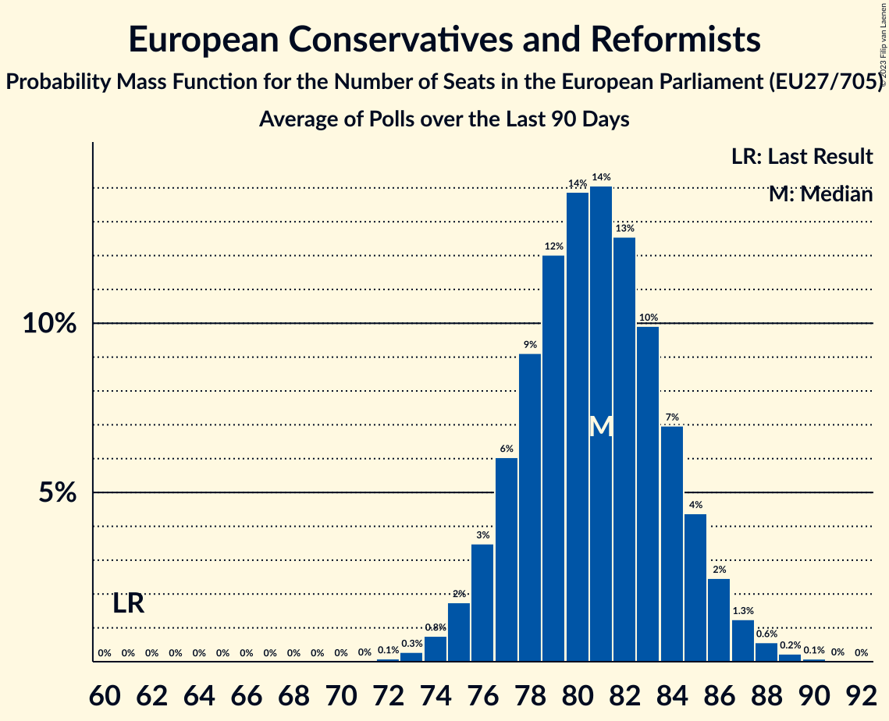

# European Conservatives and Reformists

Members registered from **17 countries**:

> BE, CY, CZ, ES, FI, FR, GR, HR, IT, LT, LU, LV, NL, PL, RO, SE, SK

## Seats

Last result: **61** seats (General Election of 26 May 2019)

Current median: **81** seats (+20 seats)

At least one member in **13 countries** have a median of 1 seat or more:

> BE, CZ, ES, FI, GR, HR, IT, LV, NL, PL, RO, SE, SK

### Confidence Intervals

| Party | Area | Last Result | Median | 80% Confidence Interval | 90% Confidence Interval | 95% Confidence Interval | 99% Confidence Interval |
|:-----:|:----:|:-----------:|:------:|:-----------------------:|:-----------------------:|:-----------------------:|:-----------------------:|
| European Conservatives and Reformists | EU | 61 | 81 | 77–85 | 76–86 | 75–87 | 73–89 |
| Fratelli d’Italia | IT | | 24 | 23–27 | 22–27 | 22–28 | 21–29 |
| Zjednoczona Prawica | PL | | 20 | 18–23 | 18–23 | 18–24 | 17–24 |
| Vox | ES | | 9 | 8–10 | 7–11 | 7–11 | 7–12 |
| Alianța pentru Unirea Românilor | RO | | 6 | 5–7 | 5–7 | 5–7 | 5–8 |
| Občanská demokratická strana | CZ | | 4 | 3–5 | 3–6 | 3–6 | 3–6 |
| Sverigedemokraterna | SE | | 4 | 4–5 | 4–5 | 3–5 | 3–5 |
| Nieuw-Vlaamse Alliantie | BE-VLG | | 3 | 3 | 2–3 | 2–3 | 2–3 |
| Perussuomalaiset | FI | | 3 | 3 | 3 | 3 | 3 |
| Domovinski pokret Miroslava Škore | HR | | 1 | 1 | 1 | 1 | 1 |
| Juiste Antwoord 2021 | NL | | 1 | 0–2 | 0–2 | 0–2 | 0–2 |
| Latvijas Reģionu Apvienība | LV | | 1 | 1 | 1 | 1 | 1 |
| Most nezavisnih lista | HR | | 1 | 1–2 | 1–2 | 1–2 | 1–2 |
| Nacionālā apvienība „Visu Latvijai!”–„Tēvzemei un Brīvībai/LNNK” | LV | | 1 | 1 | 1 | 1 | 1 |
| Sloboda a Solidarita | SK | | 1 | 0–1 | 0–1 | 0–1 | 0–2 |
| Ελληνική Λύση | GR | | 1 | 0–1 | 0–1 | 0–1 | 0–1 |
| Alternativ Demokratesch Reformpartei | LU | | 0 | 0 | 0 | 0 | 0 |
| Centro partija „Gerovės Lietuva“ | LT | | 0 | 0 | 0 | 0 | 0 |
| Debout la France | FR | | 0 | 0 | 0 | 0 | 0 |
| Forum voor Democratie | NL | | 0 | 0 | 0–1 | 0–1 | 0–1 |
| Hrvatski suverenisti | HR | | 0 | 0 | 0 | 0 | 0 |
| Lietuvos lenkų rinkimų akcija | LT | | 0 | 0 | 0 | 0 | 0 |
| Slovenská národná strana | SK | | 0 | 0 | 0 | 0–1 | 0–1 |
| Staatkundig Gereformeerde Partij | NL | | 0 | 0 | 0–1 | 0–1 | 0–1 |
| Κίνημα Αλληλεγγύη | CY | | 0 | 0 | 0 | 0 | 0 |

### Probability Mass Function

The following table shows the probability mass function per seat for the [poll average](average-2023-05-31.html) for European Conservatives and Reformists.

| Number of Seats | Probability | Accumulated | Special Marks |
|:---------------:|:-----------:|:-----------:|:-------------:|
| 61 | 0% | 100% | Last Result |
| 62 | 0% | 100% |  |
| 63 | 0% | 100% |  |
| 64 | 0% | 100% |  |
| 65 | 0% | 100% |  |
| 66 | 0% | 100% |  |
| 67 | 0% | 100% |  |
| 68 | 0% | 100% |  |
| 69 | 0% | 100% |  |
| 70 | 0% | 100% |  |
| 71 | 0% | 100% |  |
| 72 | 0.1% | 100% |  |
| 73 | 0.4% | 99.8% |  |
| 74 | 0.9% | 99.5% |  |
| 75 | 2% | 98.5% |  |
| 76 | 4% | 97% |  |
| 77 | 6% | 93% |  |
| 78 | 9% | 86% |  |
| 79 | 11% | 77% |  |
| 80 | 13% | 66% |  |
| 81 | 13% | 53% | Median |
| 82 | 12% | 40% |  |
| 83 | 10% | 28% |  |
| 84 | 7% | 18% |  |
| 85 | 5% | 11% |  |
| 86 | 3% | 6% |  |
| 87 | 2% | 3% |  |
| 88 | 0.9% | 2% |  |
| 89 | 0.4% | 0.7% |  |
| 90 | 0.2% | 0.3% |  |
| 91 | 0.1% | 0.1% |  |
| 92 | 0% | 0% |  |

