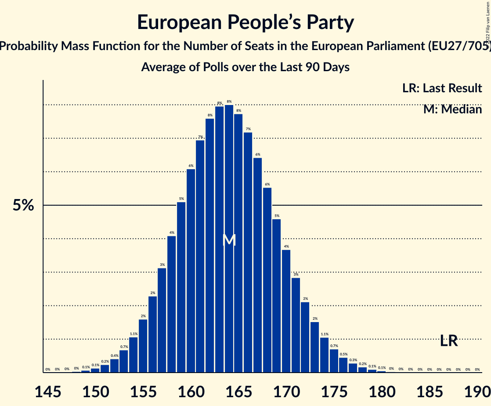

# European People’s Party

Members registered from **26 countries**:

> AT, BE, BG, CY, CZ, DE, DK, EE, ES, FI, FR, GR, HR, IE, IT, LT, LU, LV, MT, NL, PL, PT, RO, SE, SI, SK

## Seats

Last result: **187** seats (General Election of 26 May 2019)

Current median: **157** seats (-30 seats)

At least one member in **26 countries** have a median of 1 seat or more:

> AT, BE, BG, CY, CZ, DE, DK, EE, ES, FI, FR, GR, HR, IE, IT, LT, LU, LV, MT, NL, PL, PT, RO, SE, SI, SK

### Confidence Intervals

| Party | Area | Last Result | Median | 80% Confidence Interval | 90% Confidence Interval | 95% Confidence Interval | 99% Confidence Interval |
|:-----:|:----:|:-----------:|:------:|:-----------------------:|:-----------------------:|:-----------------------:|:-----------------------:|
| European People’s Party | EU | 187 | 157 | 151–163 | 150–165 | 148–167 | 145–170 |
| Christlich Demokratische Union Deutschlands | DE | | 19 | 17–21 | 17–21 | 16–22 | 16–23 |
| Partido Popular | ES | | 19 | 17–21 | 15–22 | 14–22 | 13–23 |
| Koalicja Obywatelska | PL | | 16 | 14–18 | 14–19 | 13–19 | 13–20 |
| Les Républicains | FR | | 11 | 11 | 11 | 11 | 11 |
| Νέα Δημοκρατία | GR | | 8 | 7–8 | 7–9 | 7–9 | 7–9 |
| Forza Italia | IT | | 7 | 6–9 | 5–10 | 5–10 | 5–11 |
| Christlich-Soziale Union in Bayern | DE | | 6 | 5–6 | 5–7 | 4–7 | 4–7 |
| Partido Social Democrata | PT | | 6 | 5–8 | 5–8 | 5–8 | 4–8 |
| Partidul Național Liberal | RO | | 6 | 5–9 | 5–9 | 5–9 | 5–10 |
| Hrvatska demokratska zajednica | HR | | 5 | 5–6 | 4–6 | 4–6 | 4–6 |
| Kansallinen Kokoomus | FI | | 4 | 4 | 4–5 | 4–5 | 4–5 |
| Moderata samlingspartiet | SE | | 4 | 4–5 | 4–5 | 4–5 | 4–5 |
| Österreichische Volkspartei | AT | | 4 | 4–5 | 4–5 | 4–5 | 3–5 |
| Граждани за европейско развитие на България | BG | | 4 | 4–5 | 4–5 | 4–6 | 3–6 |
| Fine Gael | IE | | 3 | 3–4 | 2–4 | 2–5 | 2–5 |
| Partit Nazzjonalista | MT | | 3 | 2–3 | 2–3 | 2–3 | 2–3 |
| Chrëschtlech-Sozial Vollekspartei | LU | | 2 | 2 | 2 | 2 | 2 |
| Det Konservative Folkeparti | DK | | 2 | 2–3 | 2–3 | 2–3 | 2–4 |
| Jaunā VIENOTĪBA | LV | | 2 | 2 | 2 | 1–2 | 1–2 |
| Koalicja Polska | PL | | 2 | 0–3 | 0–4 | 0–4 | 0–4 |
| Slovenska demokratska stranka | SI | | 2 | 2–3 | 2–3 | 2–3 | 2–3 |
| Starostové a nezávislí | CZ | | 2 | 2 | 2–3 | 2–3 | 1–3 |
| Tėvynės sąjunga–Lietuvos krikščionys demokratai | LT | | 2 | 2–3 | 2–3 | 2–3 | 2–3 |
| Uniunea Democrată Maghiară din România | RO | | 2 | 0–2 | 0–2 | 0–2 | 0–2 |
| Δημοκρατικός Συναγερμός | CY | | 2 | 2 | 2 | 2 | 2 |
| Christen-Democratisch Appèl | NL | | 1 | 0–2 | 0–2 | 0–2 | 0–3 |
| Christen-Democratisch en Vlaams | BE-VLG | | 1 | 1 | 1 | 1 | 1 |
| ChristenUnie | NL | | 1 | 0–1 | 0–1 | 0–2 | 0–2 |
| Christlich-Soziale Partei | BE-DEG | | 1 | 1 | 1 | 1 | 1 |
| Erakond Isamaa | EE | | 1 | 0–1 | 0–1 | 0–1 | 0–1 |
| Jaunā konservatīvā partija | LV | | 1 | 0–1 | 0–1 | 0–1 | 0–1 |
| Kresťanskodemokratické hnutie | SK | | 1 | 1 | 1 | 1 | 0–2 |
| Kristdemokraterna | SE | | 1 | 1–2 | 1–2 | 1–2 | 1–2 |
| Nova Slovenija–Krščanski demokrati | SI | | 1 | 0–1 | 0–1 | 0–1 | 0–1 |
| OBYČAJNÍ ĽUDIA a nezávislé osobnosti | SK | | 1 | 1–2 | 1–2 | 1–2 | 1–2 |
| Zaļo un Zemnieku savienība | LV | | 1 | 0–1 | 0–1 | 0–1 | 0–1 |
| Демократична България | BG | | 1 | 1–2 | 0–2 | 0–2 | 0–2 |
| 50Plus | NL | | 0 | 0 | 0 | 0 | 0 |
| CDS–Partido Popular | PT | | 0 | 0 | 0 | 0 | 0–1 |
| Centre démocrate humaniste | BE-FRC | | 0 | 0–1 | 0–1 | 0–1 | 0–1 |
| Forța Dreptei | RO | | 0 | 0 | 0 | 0 | 0 |
| Kristendemokraterne | DK | | 0 | 0 | 0 | 0 | 0 |
| Kristillisdemokraatit | FI | | 0 | 0 | 0 | 0 | 0 |
| Křesťanská a demokratická unie–Československá strana lidová | CZ | | 0 | 0–1 | 0–1 | 0–1 | 0–1 |
| Partidul Mișcarea Populară | RO | | 0 | 0–2 | 0–2 | 0–2 | 0–2 |
| Porozumienie | PL | | 0 | 0 | 0 | 0 | 0 |
| Slovenska ljudska stranka | SI | | 0 | 0 | 0 | 0 | 0 |
| Strana maďarskej koalície–Magyar Koalíció Pártja | SK | | 0 | 0 | 0–1 | 0–1 | 0–1 |
| TOP 09 | CZ | | 0 | 0–1 | 0–1 | 0–1 | 0–1 |
| Za ľudí | SK | | 0 | 0 | 0 | 0 | 0 |
| Изправи се Бг | BG | | 0 | 0 | 0 | 0 | 0 |

### Probability Mass Function

The following table shows the probability mass function per seat for the [poll average](average-2022-07-31.html) for European People’s Party.

| Number of Seats | Probability | Accumulated | Special Marks |
|:---------------:|:-----------:|:-----------:|:-------------:|
| 142 | 0% | 100% |  |
| 143 | 0.1% | 99.9% |  |
| 144 | 0.1% | 99.9% |  |
| 145 | 0.3% | 99.7% |  |
| 146 | 0.5% | 99.5% |  |
| 147 | 0.8% | 99.0% |  |
| 148 | 1.2% | 98% |  |
| 149 | 2% | 97% |  |
| 150 | 3% | 95% |  |
| 151 | 4% | 92% |  |
| 152 | 5% | 89% |  |
| 153 | 6% | 84% |  |
| 154 | 7% | 78% |  |
| 155 | 8% | 71% |  |
| 156 | 8% | 64% |  |
| 157 | 8% | 56% | Median |
| 158 | 8% | 47% |  |
| 159 | 8% | 39% |  |
| 160 | 7% | 31% |  |
| 161 | 6% | 24% |  |
| 162 | 5% | 18% |  |
| 163 | 4% | 13% |  |
| 164 | 3% | 9% |  |
| 165 | 2% | 7% |  |
| 166 | 2% | 4% |  |
| 167 | 1.1% | 3% |  |
| 168 | 0.7% | 2% |  |
| 169 | 0.4% | 1.0% |  |
| 170 | 0.3% | 0.6% |  |
| 171 | 0.2% | 0.3% |  |
| 172 | 0.1% | 0.2% |  |
| 173 | 0% | 0.1% |  |
| 174 | 0% | 0% |  |
| 175 | 0% | 0% |  |
| 176 | 0% | 0% |  |
| 177 | 0% | 0% |  |
| 178 | 0% | 0% |  |
| 179 | 0% | 0% |  |
| 180 | 0% | 0% |  |
| 181 | 0% | 0% |  |
| 182 | 0% | 0% |  |
| 183 | 0% | 0% |  |
| 184 | 0% | 0% |  |
| 185 | 0% | 0% |  |
| 186 | 0% | 0% |  |
| 187 | 0% | 0% | Last Result |

