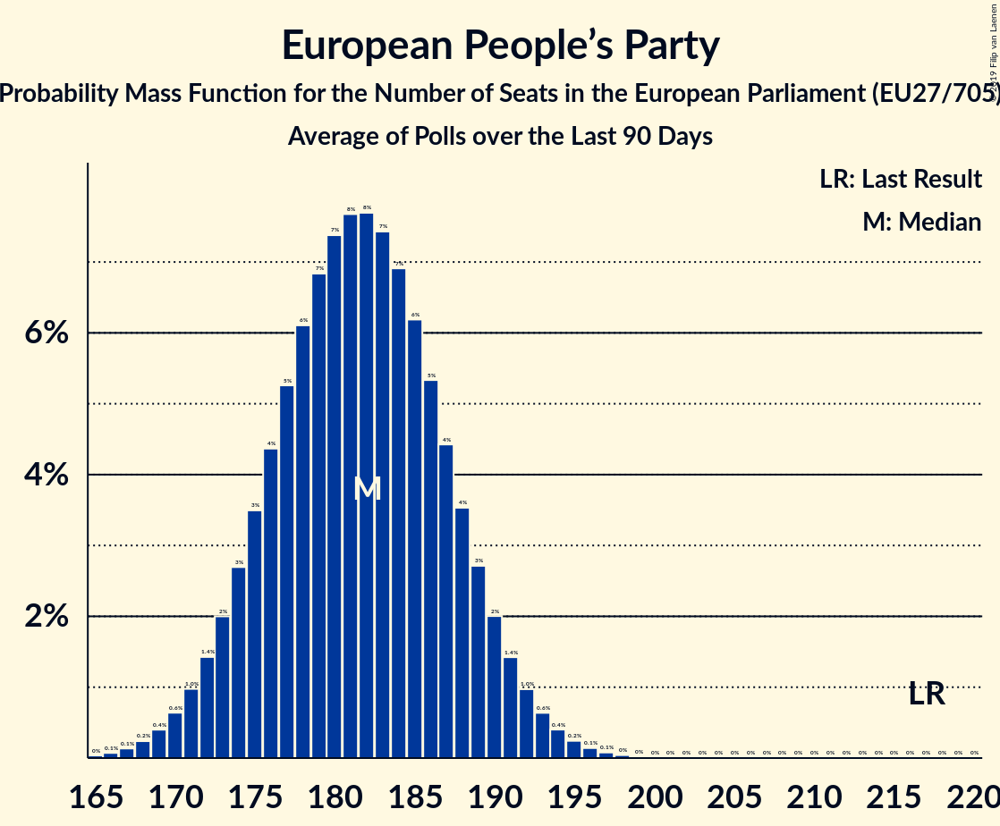

# European People’s Party

## Seats

Last result: **217** seats (General Election of 25 May 2014)

### Confidence Intervals

| Party | Last Result | Median | 80% Confidence Interval | 90% Confidence Interval | 95% Confidence Interval | 99% Confidence Interval |
|:-----:|:-----------:|:------:|:-----------------------:|:-----------------------:|:-----------------------:|:-----------------------:|
| European People’s Party | 217 | 182 | 175–188 | 173–190 | 171–192 | 168–195 |
| CDU (EPP) | | 25 | 23–27 | 22–28 | 21–28 | 21–29 |
| Koalicja Europejska (EPP) | | 21 | 16–24 | 16–24 | 15–25 | 14–26 |
| Les Républicains (EPP) | | 13 | 11–15 | 11–16 | 11–16 | 10–16 |
| Fidesz–KDNP (EPP) | | 12 | 11–14 | 11–14 | 11–14 | 11–14 |
| Partido Popular (EPP) | | 12 | 11–14 | 10–15 | 10–15 | 9–16 |
| Partidul Național Liberal (EPP) | | 9 | 8–11 | 8–12 | 7–12 | 7–12 |
| Forza Italia (EPP) | | 8 | 7–10 | 7–10 | 6–11 | 6–12 |
| Νέα Δημοκρατία (EPP) | | 8 | 7–9 | 6–9 | 6–9 | 6–10 |
| Österreichische Volkspartei (EPP) | | 7 | 6–7 | 6–8 | 5–8 | 5–8 |
| Partido Social Democrata (EPP) | | 6 | 5–7 | 5–7 | 5–7 | 5–8 |
| Граждани за европейско развитие на България (EPP) | | 6 | 6–7 | 6–7 | 6–8 | 5–8 |
| Hrvatska demokratska zajednica (EPP) | | 5 | 3–6 | 3–6 | 3–6 | 3–6 |
| CSU (EPP) | | 4 | 4–5 | 4–5 | 3–6 | 3–6 |
| Fine Gael (EPP) | | 4 | 4–6 | 4–7 | 4–7 | 4–7 |
| Moderata samlingspartiet (EPP) | | 4 | 3–4 | 3–4 | 3–4 | 3–5 |
| Christen-Democratisch Appèl (EPP) | | 3 | 3 | 2–3 | 2–3 | 2–4 |
| Chrëschtlech-Sozial Vollekspartei (EPP) | | 3 | 3 | 3 | 3 | 3 |
| Kansallinen Kokoomus (EPP) | | 3 | 2–3 | 2–3 | 2–3 | 2–4 |
| Tėvynės sąjunga–Lietuvos krikščionys demokratai (EPP) | | 3 | 3 | 2–3 | 2–3 | 2–3 |
| CD&V (EPP) | | 2 | 2 | 2–3 | 2–3 | 2–3 |
| CDS–Partido Popular (EPP) | | 2 | 1–2 | 1–2 | 1–2 | 1–2 |
| Kristdemokraterna (EPP) | | 2 | 2–3 | 2–3 | 2–3 | 2–3 |
| Partit Nazzjonalista (EPP) | | 2 | 2 | 2–3 | 2–3 | 2–3 |
| Slovenska demokratska stranka (EPP) | | 2 | 1–3 | 1–3 | 1–3 | 1–3 |
| TOP 09–Starostové a nezávislí–Strana zelených (EPP) | | 2 | 1–2 | 1–2 | 1–3 | 1–3 |
| Δημοκρατικός Συναγερμός (EPP) | | 2 | 2 | 2 | 2 | 2–3 |
| Christlich-Soziale Partei (EPP) | | 1 | 1 | 1 | 1 | 1 |
| Jaunā Vienotība (EPP) | | 1 | 1–2 | 1–2 | 1–3 | 1–3 |
| Jaunā konservatīvā partija (EPP) | | 1 | 0–1 | 0–1 | 0–1 | 0–1 |
| Kresťanskodemokratické hnutie (EPP) | | 1 | 1 | 0–1 | 0–1 | 0–2 |
| Křesťanská a demokratická unie–Československá strana lidová (EPP) | | 1 | 0–1 | 0–1 | 0–1 | 0–1 |
| MOST–HÍD (EPP) | | 1 | 1 | 1 | 0–1 | 0–1 |
| Nova Slovenija–Krščanski demokrati (EPP) | | 1 | 1 | 1 | 0–1 | 0–1 |
| cdH (EPP) | | 1 | 1 | 1 | 1 | 0–1 |
| Det Konservative Folkeparti (EPP) | | 0 | 0–1 | 0–1 | 0–1 | 0–1 |
| Erakond Isamaa (EPP) | | 0 | 0–1 | 0–1 | 0–1 | 0–1 |
| Kristendemokraterne (EPP) | | 0 | 0 | 0 | 0 | 0 |
| Kristillisdemokraatit (EPP) | | 0 | 0 | 0 | 0–1 | 0–1 |
| Noi con l’Italia (EPP) | | 0 | 0 | 0 | 0 | 0 |
| Partidul Mișcarea Populară (EPP) | | 0 | 0–2 | 0–2 | 0–2 | 0–3 |
| Slovenska ljudska stranka (EPP) | | 0 | 0 | 0 | 0 | 0 |
| Strana maďarskej koalície–Magyar Koalíció Pártja (EPP) | | 0 | 0 | 0 | 0 | 0–1 |
| Uniunea Democrată Maghiară din România (EPP) | | 0 | 0–2 | 0–2 | 0–2 | 0–2 |
| Демократична България (EPP) | | 0 | 0–1 | 0–1 | 0–1 | 0–1 |
| Реформаторски блок (EPP) | | 0 | 0 | 0 | 0 | 0 |

### Probability Mass Function

The following table shows the probability mass function per seat for the [poll average](average-2019-03-31.html) for European People’s Party.

| Number of Seats | Probability | Accumulated | Special Marks |
|:---------------:|:-----------:|:-----------:|:-------------:|
| 165 | 0% | 100% |  |
| 166 | 0.1% | 99.9% |  |
| 167 | 0.1% | 99.9% |  |
| 168 | 0.2% | 99.7% |  |
| 169 | 0.4% | 99.5% |  |
| 170 | 0.6% | 99.1% |  |
| 171 | 1.0% | 98% |  |
| 172 | 1.4% | 97% |  |
| 173 | 2% | 96% |  |
| 174 | 3% | 94% |  |
| 175 | 3% | 91% |  |
| 176 | 4% | 88% |  |
| 177 | 5% | 84% |  |
| 178 | 6% | 78% |  |
| 179 | 7% | 72% |  |
| 180 | 7% | 65% |  |
| 181 | 8% | 58% |  |
| 182 | 8% | 50% | Median |
| 183 | 7% | 43% |  |
| 184 | 7% | 35% |  |
| 185 | 6% | 28% |  |
| 186 | 5% | 22% |  |
| 187 | 4% | 17% |  |
| 188 | 4% | 12% |  |
| 189 | 3% | 9% |  |
| 190 | 2% | 6% |  |
| 191 | 1.4% | 4% |  |
| 192 | 1.0% | 3% |  |
| 193 | 0.6% | 2% |  |
| 194 | 0.4% | 1.0% |  |
| 195 | 0.2% | 0.6% |  |
| 196 | 0.1% | 0.3% |  |
| 197 | 0.1% | 0.2% |  |
| 198 | 0% | 0.1% |  |
| 199 | 0% | 0% |  |
| 200 | 0% | 0% |  |
| 201 | 0% | 0% |  |
| 202 | 0% | 0% |  |
| 203 | 0% | 0% |  |
| 204 | 0% | 0% |  |
| 205 | 0% | 0% |  |
| 206 | 0% | 0% |  |
| 207 | 0% | 0% |  |
| 208 | 0% | 0% |  |
| 209 | 0% | 0% |  |
| 210 | 0% | 0% |  |
| 211 | 0% | 0% |  |
| 212 | 0% | 0% |  |
| 213 | 0% | 0% |  |
| 214 | 0% | 0% |  |
| 215 | 0% | 0% |  |
| 216 | 0% | 0% |  |
| 217 | 0% | 0% | Last Result |

