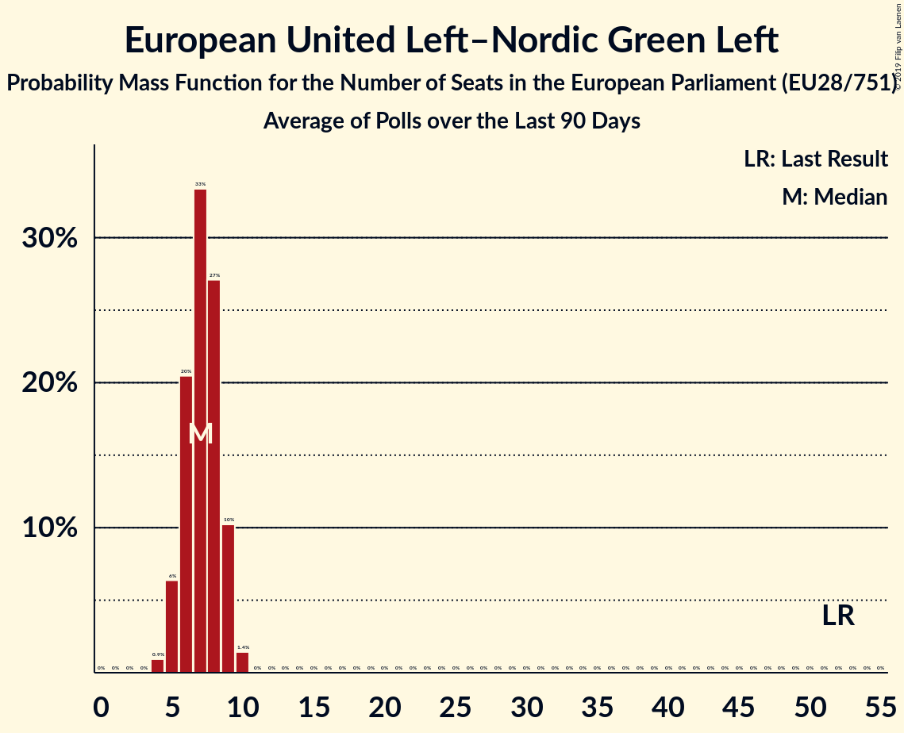

# European United Left–Nordic Green Left

## Seats

Last result: **52** seats (General Election of 25 May 2014)

### Confidence Intervals

| Party | Last Result | Median | 80% Confidence Interval | 90% Confidence Interval | 95% Confidence Interval | 99% Confidence Interval |
|:-----:|:-----------:|:------:|:-----------------------:|:-----------------------:|:-----------------------:|:-----------------------:|
| European United Left–Nordic Green Left | 52 | 7 | 6–9 | 5–9 | 5–9 | 4–10 |
| Bloco de Esquerda [PT] (GUE/NGL) | | 2 | 1–2 | 1–2 | 1–2 | 1–2 |
| Coligação Democrática Unitária [PT] (GUE/NGL) | | 2 | 1–2 | 1–2 | 1–2 | 1–2 |
| Vänsterpartiet [SE] (GUE/NGL) | | 2 | 1–2 | 1–2 | 1–2 | 1–3 |
| Partij voor de Dieren [NL] (GUE/NGL) | | 1 | 0–1 | 0–1 | 0–1 | 0–1 |
| Socialistische Partij [NL] (GUE/NGL) | | 1 | 0–1 | 0–1 | 0–1 | 0–2 |
| Jaunā Saskaņa [LV] (GUE/NGL) | | 0 | 0–1 | 0–1 | 0–1 | 0–1 |
| Levica [SI] (GUE/NGL) | | 0 | 0–1 | 0–1 | 0–1 | 0–1 |

### Probability Mass Function

The following table shows the probability mass function per seat for the [poll average](average-2019-05-31.html) for European United Left–Nordic Green Left.

| Number of Seats | Probability | Accumulated | Special Marks |
|:---------------:|:-----------:|:-----------:|:-------------:|
| 3 | 0.1% | 100% |  |
| 4 | 1.4% | 99.9% |  |
| 5 | 8% | 98.5% |  |
| 6 | 22% | 91% |  |
| 7 | 33% | 68% | Median |
| 8 | 25% | 35% |  |
| 9 | 9% | 10% |  |
| 10 | 1.2% | 1.2% |  |
| 11 | 0% | 0% |  |
| 12 | 0% | 0% |  |
| 13 | 0% | 0% |  |
| 14 | 0% | 0% |  |
| 15 | 0% | 0% |  |
| 16 | 0% | 0% |  |
| 17 | 0% | 0% |  |
| 18 | 0% | 0% |  |
| 19 | 0% | 0% |  |
| 20 | 0% | 0% |  |
| 21 | 0% | 0% |  |
| 22 | 0% | 0% |  |
| 23 | 0% | 0% |  |
| 24 | 0% | 0% |  |
| 25 | 0% | 0% |  |
| 26 | 0% | 0% |  |
| 27 | 0% | 0% |  |
| 28 | 0% | 0% |  |
| 29 | 0% | 0% |  |
| 30 | 0% | 0% |  |
| 31 | 0% | 0% |  |
| 32 | 0% | 0% |  |
| 33 | 0% | 0% |  |
| 34 | 0% | 0% |  |
| 35 | 0% | 0% |  |
| 36 | 0% | 0% |  |
| 37 | 0% | 0% |  |
| 38 | 0% | 0% |  |
| 39 | 0% | 0% |  |
| 40 | 0% | 0% |  |
| 41 | 0% | 0% |  |
| 42 | 0% | 0% |  |
| 43 | 0% | 0% |  |
| 44 | 0% | 0% |  |
| 45 | 0% | 0% |  |
| 46 | 0% | 0% |  |
| 47 | 0% | 0% |  |
| 48 | 0% | 0% |  |
| 49 | 0% | 0% |  |
| 50 | 0% | 0% |  |
| 51 | 0% | 0% |  |
| 52 | 0% | 0% | Last Result |

