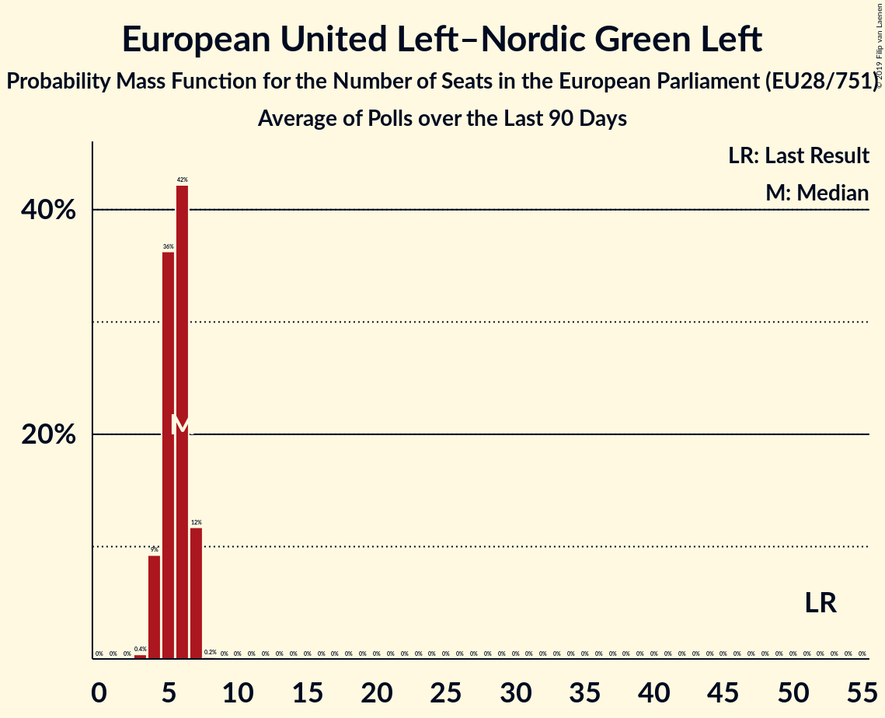

# European United Left–Nordic Green Left

## Seats

Last result: **52** seats (General Election of 25 May 2014)

### Confidence Intervals

| Party | Last Result | Median | 80% Confidence Interval | 90% Confidence Interval | 95% Confidence Interval | 99% Confidence Interval |
|:-----:|:-----------:|:------:|:-----------------------:|:-----------------------:|:-----------------------:|:-----------------------:|
| European United Left–Nordic Green Left | 52 | 47 | 43–50 | 42–51 | 42–52 | 40–54 |
| DIE LINKE [DE] (GUE/NGL) | | 8 | 6–10 | 6–10 | 5–11 | 5–11 |
| La France insoumise [FR] (GUE/NGL) | | 7 | 6–9 | 6–10 | 6–10 | 5–10 |
| Unidos Podemos [ES] (GUE/NGL) | | 7 | 6–8 | 6–8 | 6–8 | 5–9 |
| Συνασπισμός Ριζοσπαστικής Αριστεράς [GR] (GUE/NGL) | | 5 | 5–6 | 4–6 | 4–6 | 4–7 |
| Sinn Féin [IE] (GUE/NGL) | | 3 | 1–3 | 1–3 | 1–4 | 1–4 |
| Bloco de Esquerda [PT] (GUE/NGL) | | 2 | 1–2 | 1–2 | 1–3 | 1–3 |
| Socialistische Partij [NL] (GUE/NGL) | | 2 | 1–2 | 1–2 | 1–2 | 1–3 |
| Vänsterpartiet [SE] (GUE/NGL) | | 2 | 2 | 1–2 | 1–2 | 1–3 |
| Ανορθωτικό Κόμμα Εργαζόμενου Λαού [CY] (GUE/NGL) | | 2 | 1–2 | 1–2 | 1–2 | 1–2 |
| Coligação Democrática Unitária [PT] (GUE/NGL) | | 1 | 1–2 | 1–2 | 1–2 | 1–2 |
| Enhedslisten–De Rød-Grønne [DK] (GUE/NGL) | | 1 | 1–2 | 1–2 | 1–2 | 1–2 |
| Komunistická strana Čech a Moravy [CZ] (GUE/NGL) | | 1 | 1–2 | 1–2 | 1–3 | 0–3 |
| Levica [SI] (GUE/NGL) | | 1 | 0–1 | 0–1 | 0–1 | 0–1 |
| PTB [BE-FRC] (GUE/NGL) | | 1 | 1 | 1 | 1 | 1–2 |
| Partei Mensch Umwelt Tierschutz [DE] (GUE/NGL) | | 1 | 1 | 0–2 | 0–2 | 0–2 |
| Partido Animalista Contra el Maltrato Animal [ES] (GUE/NGL) | | 1 | 0–2 | 0–2 | 0–2 | 0–2 |
| Partij voor de Dieren [NL] (GUE/NGL) | | 1 | 0–1 | 0–1 | 0–1 | 0–1 |
| Sinn Féin [GB-NIR] (GUE/NGL) | | 1 | 1 | 1–2 | 1–2 | 1–2 |
| Vasemmistoliitto [FI] (GUE/NGL) | | 1 | 1 | 1 | 1 | 1 |
| Nouveau Parti anticapitaliste [FR] (GUE/NGL) | | 0 | 0 | 0 | 0 | 0 |
| PVDA [BE-VLG] (GUE/NGL) | | 0 | 0–1 | 0–1 | 0–1 | 0–1 |
| Parti communiste français [FR] (GUE/NGL) | | 0 | 0 | 0 | 0 | 0 |
| Potere al Popolo [IT] (GUE/NGL) | | 0 | 0 | 0 | 0 | 0 |
| Solidarity–People Before Profit [IE] (GUE/NGL) | | 0 | 0 | 0 | 0 | 0–1 |
| Λαϊκή Ενότητα [GR] (GUE/NGL) | | 0 | 0–1 | 0–1 | 0–1 | 0–1 |
| Πλεύση Ελευθερίας [GR] (GUE/NGL) | | 0 | 0 | 0 | 0 | 0 |

### Probability Mass Function

The following table shows the probability mass function per seat for the [poll average](average-2019-04-30.html) for European United Left–Nordic Green Left.

| Number of Seats | Probability | Accumulated | Special Marks |
|:---------------:|:-----------:|:-----------:|:-------------:|
| 38 | 0% | 100% |  |
| 39 | 0.2% | 99.9% |  |
| 40 | 0.5% | 99.8% |  |
| 41 | 1.4% | 99.2% |  |
| 42 | 3% | 98% |  |
| 43 | 6% | 95% |  |
| 44 | 9% | 89% |  |
| 45 | 12% | 80% |  |
| 46 | 14% | 68% |  |
| 47 | 15% | 53% | Median |
| 48 | 13% | 39% |  |
| 49 | 10% | 26% |  |
| 50 | 7% | 15% |  |
| 51 | 4% | 8% |  |
| 52 | 2% | 4% | Last Result |
| 53 | 1.1% | 2% |  |
| 54 | 0.4% | 0.6% |  |
| 55 | 0.1% | 0.2% |  |
| 56 | 0% | 0% |  |

