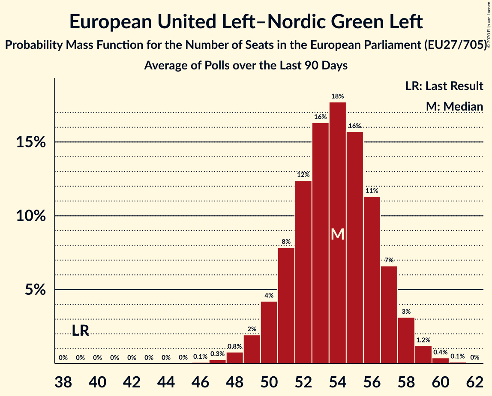

# European United Left–Nordic Green Left

Members registered from **16 countries**:

> BE, CY, CZ, DE, DK, ES, FI, FR, GR, HR, IE, LU, NL, PT, SE, SI

## Seats

Last result: **39** seats (General Election of 26 May 2019)

Current median: **53** seats (+14 seats)

At least one member in **15 countries** have a median of 1 seat or more:

> BE, CY, CZ, DE, DK, ES, FI, FR, GR, HR, IE, NL, PT, SE, SI

### Confidence Intervals

| Party | Area | Last Result | Median | 80% Confidence Interval | 90% Confidence Interval | 95% Confidence Interval | 99% Confidence Interval |
|:-----:|:----:|:-----------:|:------:|:-----------------------:|:-----------------------:|:-----------------------:|:-----------------------:|
| European United Left–Nordic Green Left | EU | 39 | 53 | 50–57 | 49–57 | 49–58 | 47–60 |
| La France insoumise | FR | | 10 | 9–12 | 8–12 | 8–12 | 8–13 |
| Die Linke | DE | | 7 | 6–9 | 6–9 | 6–9 | 5–10 |
| Unidos Podemos | ES | | 7 | 5–8 | 5–8 | 5–9 | 4–9 |
| Sinn Féin | IE | | 6 | 5–6 | 4–6 | 3–6 | 3–6 |
| Συνασπισμός Ριζοσπαστικής Αριστεράς | GR | | 5 | 5–6 | 5–6 | 5–6 | 4–6 |
| Bloco de Esquerda | PT | | 2 | 1–2 | 1–2 | 1–2 | 1–3 |
| Parti du Travail de Belgique | BE-FRC | | 2 | 1–2 | 1–2 | 1–2 | 1–2 |
| Socialistische Partij | NL | | 2 | 2 | 2–3 | 1–3 | 1–3 |
| Vänsterpartiet | SE | | 2 | 2 | 2 | 2–3 | 2–3 |
| Ανορθωτικό Κόμμα Εργαζόμενου Λαού | CY | | 2 | 2 | 2 | 2 | 1–2 |
| Coligação Democrática Unitária | PT | | 1 | 1 | 1 | 1 | 0–2 |
| Enhedslisten–De Rød-Grønne | DK | | 1 | 1 | 1 | 1 | 0–1 |
| Komunistická strana Čech a Moravy | CZ | | 1 | 0–2 | 0–2 | 0–2 | 0–2 |
| Levica | SI | | 1 | 0–1 | 0–1 | 0–1 | 0–1 |
| Možemo! | HR | | 1 | 1 | 1 | 1 | 1 |
| Partei Mensch Umwelt Tierschutz | DE | | 1 | 0–1 | 0–1 | 0–1 | 0–1 |
| Partij voor de Dieren | NL | | 1 | 0–1 | 0–1 | 0–1 | 0–2 |
| Vasemmistoliitto | FI | | 1 | 1 | 1 | 1 | 1 |
| Μέτωπο Ευρωπαϊκής Ρεαλιστικής Ανυπακοής | GR | | 1 | 0–1 | 0–1 | 0–1 | 0–1 |
| Euskal Herria Bildu | ES | | 0 | 0–1 | 0–1 | 0–1 | 0–2 |
| Independents 4 Change | IE | | 0 | 0 | 0 | 0 | 0 |
| Nouveau Parti anticapitaliste | FR | | 0 | 0 | 0 | 0 | 0 |
| Parti communiste français | FR | | 0 | 0 | 0 | 0 | 0 |
| Partij van de Arbeid van België | BE-VLG | | 0 | 0–1 | 0–1 | 0–1 | 0–1 |
| Solidarity–People Before Profit | IE | | 0 | 0 | 0 | 0 | 0 |
| déi Lénk | LU | | 0 | 0 | 0 | 0 | 0 |
| Πλεύση Ελευθερίας | GR | | 0 | 0 | 0 | 0 | 0 |

### Probability Mass Function

The following table shows the probability mass function per seat for the [poll average](average-2020-10-31.html) for European United Left–Nordic Green Left.

| Number of Seats | Probability | Accumulated | Special Marks |
|:---------------:|:-----------:|:-----------:|:-------------:|
| 39 | 0% | 100% | Last Result |
| 40 | 0% | 100% |  |
| 41 | 0% | 100% |  |
| 42 | 0% | 100% |  |
| 43 | 0% | 100% |  |
| 44 | 0% | 100% |  |
| 45 | 0.1% | 100% |  |
| 46 | 0.2% | 99.9% |  |
| 47 | 0.6% | 99.7% |  |
| 48 | 2% | 99.1% |  |
| 49 | 3% | 98% |  |
| 50 | 6% | 94% |  |
| 51 | 10% | 88% |  |
| 52 | 14% | 78% |  |
| 53 | 16% | 64% | Median |
| 54 | 16% | 49% |  |
| 55 | 13% | 33% |  |
| 56 | 9% | 20% |  |
| 57 | 6% | 11% |  |
| 58 | 3% | 5% |  |
| 59 | 1.3% | 2% |  |
| 60 | 0.5% | 0.7% |  |
| 61 | 0.1% | 0.2% |  |
| 62 | 0% | 0% |  |

