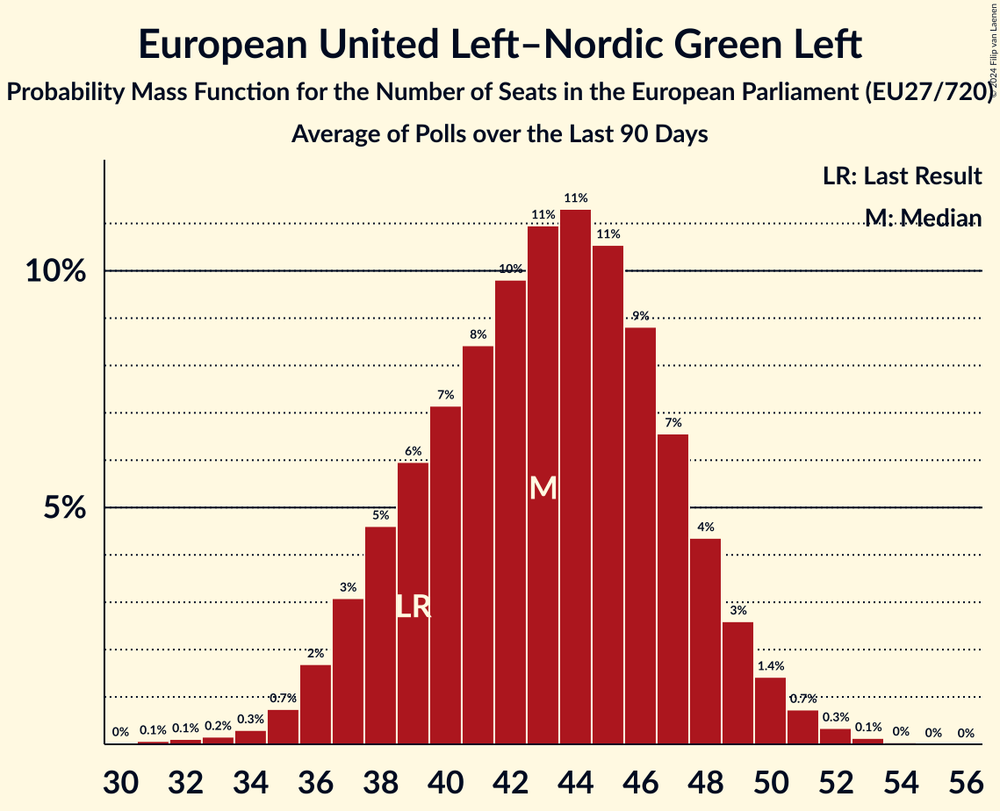

# European United Left–Nordic Green Left

Members registered from **16 countries**:

> AT, BE, CY, CZ, DE, DK, ES, FI, FR, GR, HR, IE, IT, NL, SE, SI

## Seats

Last result: **39** seats (General Election of 26 May 2019)

Current median: **44** seats (+5 seats)

At least one member in **13 countries** have a median of 1 seat or more:

> BE, CY, CZ, DE, DK, ES, FI, FR, GR, IE, IT, NL, SE

### Confidence Intervals

| Party | Area | Last Result | Median | 80% Confidence Interval | 90% Confidence Interval | 95% Confidence Interval | 99% Confidence Interval |
|:-----:|:----:|:-----------:|:------:|:-----------------------:|:-----------------------:|:-----------------------:|:-----------------------:|
| European United Left–Nordic Green Left | EU | 39 | 44 | 39–48 | 38–49 | 37–50 | 35–52 |
| La France insoumise | FR | | 7 | 5–9 | 5–10 | 5–11 | 0–11 |
| Bündnis Sahra Wagenknecht | DE | | 6 | 4–8 | 4–8 | 4–8 | 4–9 |
| Sinn Féin | IE | | 6 | 6 | 6 | 5–6 | 4–6 |
| Die Linke | DE | | 3 | 2–4 | 2–5 | 2–5 | 2–5 |
| Movimiento Sumar–Podemos–Izquierda Unida | ES | | 3 | 3–4 | 3–4 | 2–4 | 2–4 |
| Συνασπισμός Ριζοσπαστικής Αριστεράς | GR | | 3 | 2–3 | 2–3 | 2–4 | 2–4 |
| Parti du Travail de Belgique | BE-FRC | | 2 | 1–2 | 1–2 | 1–2 | 1–2 |
| Vänsterpartiet | SE | | 2 | 2 | 1–2 | 1–2 | 1–3 |
| Ανορθωτικό Κόμμα Εργαζόμενου Λαού | CY | | 2 | 2 | 2 | 1–2 | 1–2 |
| Enhedslisten–De Rød-Grønne | DK | | 1 | 1 | 1 | 0–1 | 0–1 |
| Euskal Herria Bildu | ES | | 1 | 1–2 | 1–2 | 0–2 | 0–2 |
| Partei Mensch Umwelt Tierschutz | DE | | 1 | 1–3 | 0–3 | 0–3 | 0–3 |
| Partij van de Arbeid van België | BE-VLG | | 1 | 1 | 1 | 1 | 1–2 |
| Sinistra Italiana | IT | | 1 | 0–2 | 0–2 | 0–2 | 0–3 |
| Socialistische Partij | NL | | 1 | 0–1 | 0–1 | 0–1 | 0–1 |
| Stačilo! | CZ | | 1 | 1 | 1 | 0–2 | 0–2 |
| Vasemmistoliitto | FI | | 1 | 1 | 1–2 | 1–2 | 1–2 |
| Νέα Αριστερά | GR | | 1 | 0–1 | 0–1 | 0–1 | 0–1 |
| Independents 4 Change | IE | | 0 | 0 | 0 | 0 | 0–2 |
| Kommunistische Partei Österreichs | AT | | 0 | 0 | 0 | 0 | 0 |
| Levica | SI | | 0 | 0–1 | 0–1 | 0–1 | 0–1 |
| Lutte Ouvrière–Nouveau Parti anticapitaliste | FR | | 0 | 0 | 0 | 0 | 0 |
| Parti animaliste | FR | | 0 | 0 | 0 | 0 | 0 |
| Parti communiste français | FR | | 0 | 0 | 0 | 0 | 0 |
| Partij voor de Dieren | NL | | 0 | 0–1 | 0–1 | 0–1 | 0–1 |
| Radnička fronta | HR | | 0 | 0 | 0 | 0 | 0 |
| Solidarity–People Before Profit | IE | | 0 | 0 | 0 | 0 | 0 |
| Unione Popolare | IT | | 0 | 0 | 0 | 0 | 0 |
| Κόμμα για τα Ζώα Κύπρου | CY | | 0 | 0 | 0 | 0 | 0 |
| Μέτωπο Ευρωπαϊκής Ρεαλιστικής Ανυπακοής | GR | | 0 | 0–1 | 0–1 | 0–1 | 0–1 |

### Probability Mass Function

The following table shows the probability mass function per seat for the [poll average](average-2024-03-31.html) for European United Left–Nordic Green Left.

| Number of Seats | Probability | Accumulated | Special Marks |
|:---------------:|:-----------:|:-----------:|:-------------:|
| 31 | 0% | 100% |  |
| 32 | 0.1% | 99.9% |  |
| 33 | 0.1% | 99.8% |  |
| 34 | 0.2% | 99.7% |  |
| 35 | 0.4% | 99.5% |  |
| 36 | 1.1% | 99.1% |  |
| 37 | 2% | 98% |  |
| 38 | 4% | 96% |  |
| 39 | 5% | 92% | Last Result |
| 40 | 7% | 86% |  |
| 41 | 8% | 80% |  |
| 42 | 9% | 72% |  |
| 43 | 11% | 63% |  |
| 44 | 11% | 52% | Median |
| 45 | 11% | 41% |  |
| 46 | 10% | 30% |  |
| 47 | 8% | 20% |  |
| 48 | 5% | 12% |  |
| 49 | 3% | 7% |  |
| 50 | 2% | 4% |  |
| 51 | 1.0% | 2% |  |
| 52 | 0.5% | 0.8% |  |
| 53 | 0.2% | 0.3% |  |
| 54 | 0.1% | 0.1% |  |
| 55 | 0% | 0% |  |

