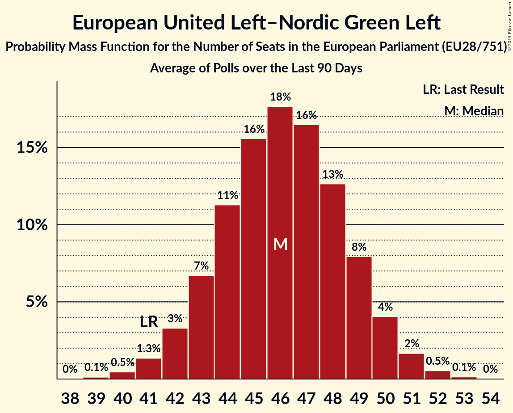

# European United Left–Nordic Green Left

Members registered from **16 countries**:

> BE, CY, CZ, DE, DK, ES, FI, FR, GB, GR, IE, LU, NL, PT, SE, SI

## Seats

Last result: **41** seats (General Election of 25 May 2014)

Current median: **49** seats (+8 seats)

At least one member in **15 countries** have a median of 1 seat or more:

> BE, CY, CZ, DE, DK, ES, FI, FR, GB, GR, IE, NL, PT, SE, SI

### Confidence Intervals

| Party | Area | Last Result | Median | 80% Confidence Interval | 90% Confidence Interval | 95% Confidence Interval | 99% Confidence Interval |
|:-----:|:----:|:-----------:|:------:|:-----------------------:|:-----------------------:|:-----------------------:|:-----------------------:|
| European United Left–Nordic Green Left | EU | 41 | 49 | 46–51 | 45–52 | 45–53 | 43–54 |
| Die Linke | DE | | 9 | 8–10 | 7–11 | 7–11 | 7–12 |
| Unidos Podemos | ES | | 7 | 7–8 | 7–8 | 6–8 | 6–9 |
| La France insoumise | FR | | 6 | 6 | 6 | 6 | 6 |
| Συνασπισμός Ριζοσπαστικής Αριστεράς | GR | | 6 | 5–6 | 5–6 | 5–7 | 5–7 |
| Bloco de Esquerda | PT | | 2 | 2–3 | 2–3 | 2–3 | 1–3 |
| Komunistická strana Čech a Moravy | CZ | | 2 | 1–2 | 1–2 | 0–2 | 0–2 |
| Sinn Féin | IE | | 2 | 1–3 | 0–3 | 0–3 | 0–3 |
| Vänsterpartiet | SE | | 2 | 2 | 2 | 2 | 1–2 |
| Ανορθωτικό Κόμμα Εργαζόμενου Λαού | CY | | 2 | 2 | 2 | 2 | 2 |
| Coligação Democrática Unitária | PT | | 1 | 1–2 | 1–2 | 1–2 | 1–2 |
| Enhedslisten–De Rød-Grønne | DK | | 1 | 1 | 1 | 1 | 0–1 |
| Levica | SI | | 1 | 1–2 | 1–2 | 0–2 | 0–2 |
| Partei Mensch Umwelt Tierschutz | DE | | 1 | 0–1 | 0–1 | 0–1 | 0–2 |
| Parti du Travail de Belgique | BE-FRC | | 1 | 1 | 1–2 | 1–2 | 1–2 |
| Partij van de Arbeid van België | BE-VLG | | 1 | 0–1 | 0–1 | 0–1 | 0–1 |
| Sinn Féin | GB-NIR | | 1 | 1 | 1 | 1 | 1 |
| Socialistische Partij | NL | | 1 | 1–2 | 1–2 | 1–2 | 1–2 |
| Vasemmistoliitto | FI | | 1 | 1 | 1 | 1 | 1 |
| Μέτωπο Ευρωπαϊκής Ρεαλιστικής Ανυπακοής | GR | | 1 | 1 | 0–1 | 0–1 | 0–1 |
| Déi Lénk | LU | | 0 | 0 | 0 | 0 | 0 |
| Euskal Herria Bildu | ES | | 0 | 0 | 0–1 | 0–1 | 0–1 |
| Independents 4 Change | IE | | 0 | 0 | 0 | 0 | 0 |
| Nouveau Parti anticapitaliste | FR | | 0 | 0 | 0 | 0 | 0 |
| Parti communiste français | FR | | 0 | 0 | 0 | 0 | 0 |
| Partij voor de Dieren | NL | | 0 | 0–1 | 0–1 | 0–1 | 0–2 |
| Solidarity–People Before Profit | IE | | 0 | 0 | 0 | 0 | 0 |
| Πλεύση Ελευθερίας | GR | | 0 | 0 | 0 | 0 | 0 |

### Probability Mass Function

The following table shows the probability mass function per seat for the [poll average](average-2019-11-30.html) for European United Left–Nordic Green Left.

| Number of Seats | Probability | Accumulated | Special Marks |
|:---------------:|:-----------:|:-----------:|:-------------:|
| 41 | 0% | 100% | Last Result |
| 42 | 0.1% | 100% |  |
| 43 | 0.5% | 99.9% |  |
| 44 | 2% | 99.4% |  |
| 45 | 4% | 98% |  |
| 46 | 8% | 94% |  |
| 47 | 14% | 85% |  |
| 48 | 18% | 72% |  |
| 49 | 18% | 54% | Median |
| 50 | 16% | 36% |  |
| 51 | 11% | 20% |  |
| 52 | 6% | 9% |  |
| 53 | 2% | 3% |  |
| 54 | 0.8% | 1.0% |  |
| 55 | 0.2% | 0.2% |  |
| 56 | 0% | 0% |  |

