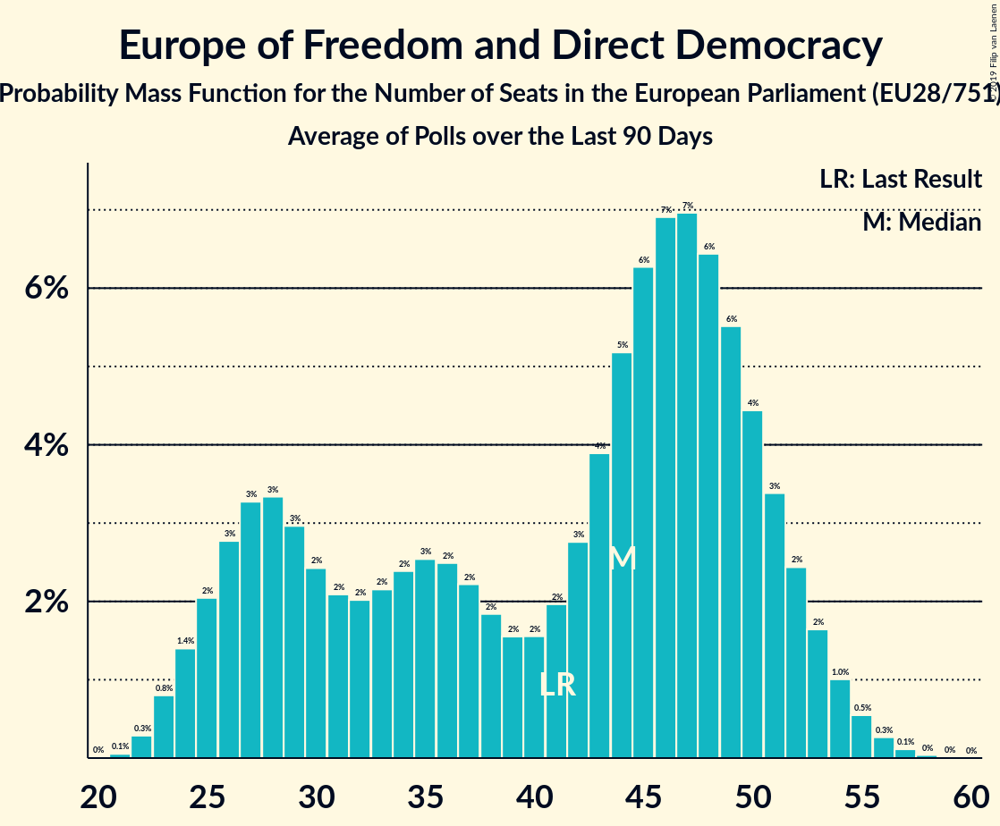

# Europe of Freedom and Direct Democracy

## Seats

Last result: **41** seats (General Election of 25 May 2014)

### Confidence Intervals

| Party | Last Result | Median | 80% Confidence Interval | 90% Confidence Interval | 95% Confidence Interval | 99% Confidence Interval |
|:-----:|:-----------:|:------:|:-----------------------:|:-----------------------:|:-----------------------:|:-----------------------:|
| Europe of Freedom and Direct Democracy | 41 | 20 | 17–23 | 16–24 | 15–25 | 15–26 |
| Movimento 5 Stelle [IT] (EFDD) | | 16 | 15–18 | 14–19 | 14–19 | 13–20 |
| Živi zid [HR] (EFDD) | | 1 | 1 | 1 | 1 | 1–2 |
| KORWiN [PL] (EFDD) | | 0 | 0–3 | 0–3 | 0–3 | 0–4 |
| Kukiz’15 [PL] (EFDD) | | 0 | 0–3 | 0–3 | 0–4 | 0–4 |
| Les Patriotes [FR] (EFDD) | | 0 | 0 | 0 | 0 | 0 |
| Parti Populaire [BE-FRC] (EFDD) | | 0 | 0 | 0 | 0 | 0 |
| Strana svobodných občanů [CZ] (EFDD) | | 0 | 0 | 0 | 0 | 0 |
| Национален фронт за спасение на България [BG] (EFDD) | | 0 | 0 | 0 | 0 | 0 |

### Probability Mass Function

The following table shows the probability mass function per seat for the [poll average](average-2019-05-01.html) for Europe of Freedom and Direct Democracy.

| Number of Seats | Probability | Accumulated | Special Marks |
|:---------------:|:-----------:|:-----------:|:-------------:|
| 14 | 0.4% | 100% |  |
| 15 | 2% | 99.6% |  |
| 16 | 6% | 97% |  |
| 17 | 9% | 91% |  |
| 18 | 12% | 82% |  |
| 19 | 14% | 70% |  |
| 20 | 15% | 55% | Median |
| 21 | 14% | 40% |  |
| 22 | 11% | 27% |  |
| 23 | 8% | 15% |  |
| 24 | 5% | 8% |  |
| 25 | 2% | 3% |  |
| 26 | 0.8% | 1.0% |  |
| 27 | 0.2% | 0.2% |  |
| 28 | 0% | 0% |  |
| 29 | 0% | 0% |  |
| 30 | 0% | 0% |  |
| 31 | 0% | 0% |  |
| 32 | 0% | 0% |  |
| 33 | 0% | 0% |  |
| 34 | 0% | 0% |  |
| 35 | 0% | 0% |  |
| 36 | 0% | 0% |  |
| 37 | 0% | 0% |  |
| 38 | 0% | 0% |  |
| 39 | 0% | 0% |  |
| 40 | 0% | 0% |  |
| 41 | 0% | 0% | Last Result |

