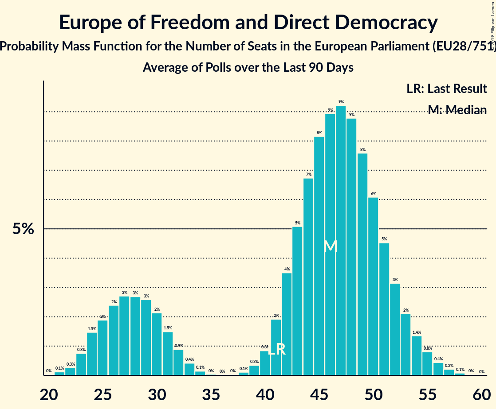

# Europe of Freedom and Direct Democracy

## Seats

Last result: **41** seats (General Election of 25 May 2014)

### Confidence Intervals

| Party | Last Result | Median | 80% Confidence Interval | 90% Confidence Interval | 95% Confidence Interval | 99% Confidence Interval |
|:-----:|:-----------:|:------:|:-----------------------:|:-----------------------:|:-----------------------:|:-----------------------:|
| Europe of Freedom and Direct Democracy | 41 | 48 | 28–56 | 26–57 | 25–58 | 23–59 |
| Brexit Party [GB-GBN] (EFDD) | | 25 | 6–33 | 6–33 | 6–34 | 6–34 |
| Movimento 5 Stelle [IT] (EFDD) | | 17 | 15–19 | 15–19 | 15–20 | 14–21 |
| Kukiz’15 [PL] (EFDD) | | 3 | 0–5 | 0–5 | 0–6 | 0–6 |
| Partija tvarka ir teisingumas [LT] (EFDD) | | 1 | 0–1 | 0–1 | 0–1 | 0–1 |
| Živi zid [HR] (EFDD) | | 1 | 1 | 1 | 1 | 0–2 |
| KORWiN [PL] (EFDD) | | 0 | 0–2 | 0–3 | 0–3 | 0–3 |
| Les Patriotes [FR] (EFDD) | | 0 | 0 | 0 | 0 | 0 |
| Liike Nyt [FI] (EFDD) | | 0 | 0 | 0 | 0 | 0 |
| Parti Populaire [BE-FRC] (EFDD) | | 0 | 0 | 0 | 0 | 0 |
| Strana svobodných občanů [CZ] (EFDD) | | 0 | 0 | 0 | 0 | 0 |
| Национален фронт за спасение на България [BG] (EFDD) | | 0 | 0 | 0 | 0 | 0 |

### Probability Mass Function

The following table shows the probability mass function per seat for the [poll average](average-2019-05-21.html) for Europe of Freedom and Direct Democracy.

| Number of Seats | Probability | Accumulated | Special Marks |
|:---------------:|:-----------:|:-----------:|:-------------:|
| 22 | 0.2% | 100% |  |
| 23 | 0.5% | 99.8% |  |
| 24 | 1.1% | 99.3% |  |
| 25 | 2% | 98% |  |
| 26 | 2% | 96% |  |
| 27 | 3% | 94% |  |
| 28 | 3% | 92% |  |
| 29 | 3% | 89% |  |
| 30 | 2% | 86% |  |
| 31 | 2% | 84% |  |
| 32 | 1.1% | 82% |  |
| 33 | 0.5% | 81% |  |
| 34 | 0.2% | 80% |  |
| 35 | 0% | 80% |  |
| 36 | 0% | 80% |  |
| 37 | 0% | 80% |  |
| 38 | 0.1% | 80% |  |
| 39 | 0.3% | 80% |  |
| 40 | 0.8% | 80% |  |
| 41 | 2% | 79% | Last Result |
| 42 | 3% | 77% |  |
| 43 | 4% | 75% |  |
| 44 | 4% | 71% |  |
| 45 | 5% | 67% |  |
| 46 | 5% | 62% |  |
| 47 | 5% | 56% |  |
| 48 | 5% | 51% | Median |
| 49 | 5% | 46% |  |
| 50 | 5% | 42% |  |
| 51 | 5% | 37% |  |
| 52 | 5% | 32% |  |
| 53 | 5% | 27% |  |
| 54 | 5% | 21% |  |
| 55 | 5% | 16% |  |
| 56 | 4% | 11% |  |
| 57 | 3% | 6% |  |
| 58 | 2% | 3% |  |
| 59 | 0.9% | 1.4% |  |
| 60 | 0.4% | 0.5% |  |
| 61 | 0.1% | 0.1% |  |
| 62 | 0% | 0% |  |

