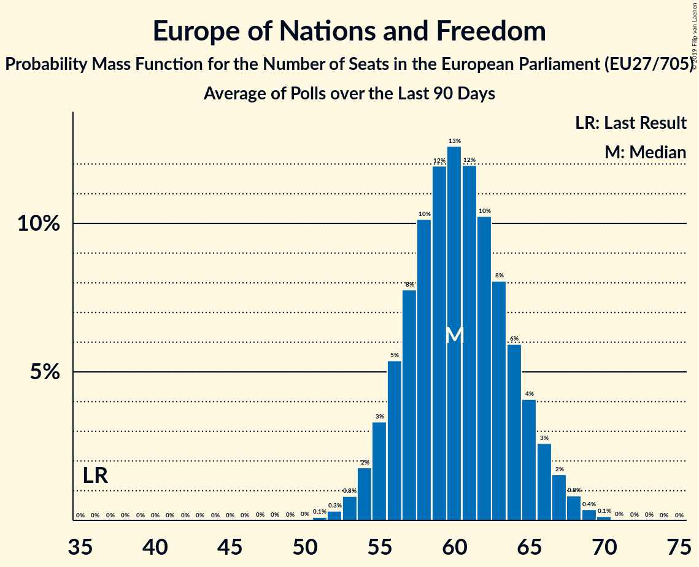

# Europe of Nations and Freedom

## Seats

Last result: **36** seats (General Election of 25 May 2014)

### Confidence Intervals

| Party | Last Result | Median | 80% Confidence Interval | 90% Confidence Interval | 95% Confidence Interval | 99% Confidence Interval |
|:-----:|:-----------:|:------:|:-----------------------:|:-----------------------:|:-----------------------:|:-----------------------:|
| Europe of Nations and Freedom | 36 | 60 | 56–64 | 55–65 | 54–66 | 53–68 |
| Lega Nord (ENF) | | 26 | 24–29 | 23–30 | 23–31 | 22–32 |
| Rassemblement national (ENF) | | 22 | 19–23 | 19–24 | 18–24 | 17–25 |
| Freiheitliche Partei Österreichs (ENF) | | 5 | 4–5 | 4–5 | 4–5 | 3–6 |
| Partij voor de Vrijheid (ENF) | | 3 | 2–4 | 2–5 | 2–5 | 1–5 |
| Svoboda a přímá demokracie (ENF) | | 2 | 0–2 | 0–2 | 0–2 | 0–3 |
| SME RODINA (ENF) | | 1 | 1–2 | 1–2 | 1–2 | 1–2 |
| Slovenská národná strana (ENF) | | 1 | 1 | 1 | 1 | 0–1 |
| Vlaams Belang (ENF) | | 1 | 1 | 1–2 | 0–2 | 0–2 |

### Probability Mass Function

The following table shows the probability mass function per seat for the [poll average](average-2019-04-09.html) for Europe of Nations and Freedom.

| Number of Seats | Probability | Accumulated | Special Marks |
|:---------------:|:-----------:|:-----------:|:-------------:|
| 36 | 0% | 100% | Last Result |
| 37 | 0% | 100% |  |
| 38 | 0% | 100% |  |
| 39 | 0% | 100% |  |
| 40 | 0% | 100% |  |
| 41 | 0% | 100% |  |
| 42 | 0% | 100% |  |
| 43 | 0% | 100% |  |
| 44 | 0% | 100% |  |
| 45 | 0% | 100% |  |
| 46 | 0% | 100% |  |
| 47 | 0% | 100% |  |
| 48 | 0% | 100% |  |
| 49 | 0% | 100% |  |
| 50 | 0% | 100% |  |
| 51 | 0.1% | 100% |  |
| 52 | 0.3% | 99.8% |  |
| 53 | 0.8% | 99.5% |  |
| 54 | 2% | 98.7% |  |
| 55 | 3% | 97% |  |
| 56 | 5% | 94% |  |
| 57 | 8% | 88% |  |
| 58 | 10% | 80% |  |
| 59 | 12% | 70% |  |
| 60 | 13% | 58% | Median |
| 61 | 12% | 45% |  |
| 62 | 10% | 33% |  |
| 63 | 8% | 23% |  |
| 64 | 6% | 14% |  |
| 65 | 4% | 9% |  |
| 66 | 2% | 5% |  |
| 67 | 1.3% | 2% |  |
| 68 | 0.6% | 1.1% |  |
| 69 | 0.3% | 0.4% |  |
| 70 | 0.1% | 0.1% |  |
| 71 | 0% | 0% |  |

