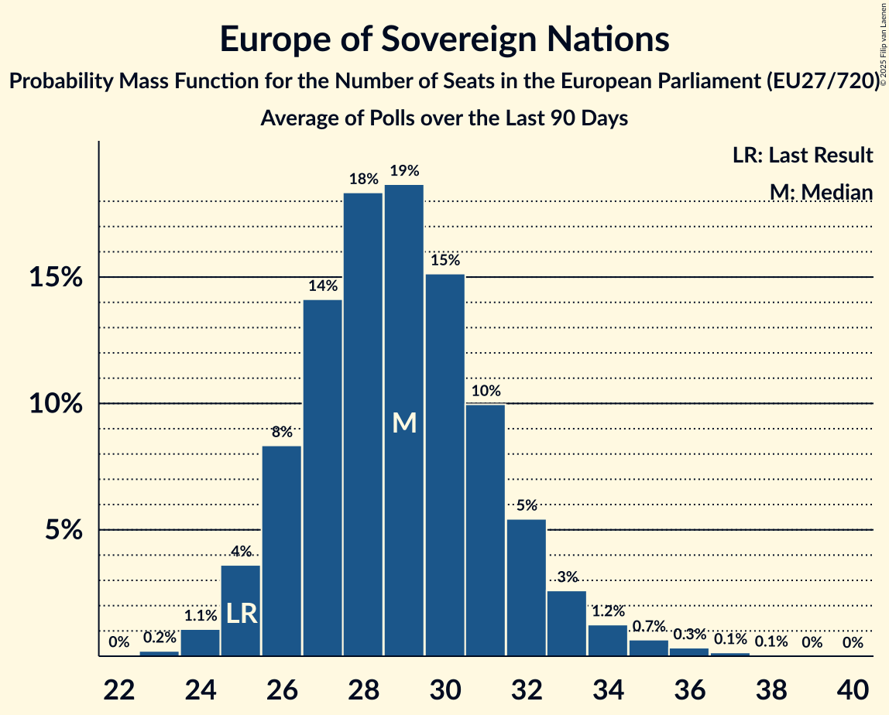

# Europe of Sovereign Nations

Members registered from **9 countries**:

> BG, CZ, DE, FR, HU, LT, NL, PL, SK

## Seats

Last result: **25** seats (General Election of 26 May 2019)

Current median: **29** seats (+4 seats)

At least one member in **6 countries** have a median of 1 seat or more:

> BG, CZ, DE, HU, PL, SK

### Confidence Intervals

| Party | Area | Last Result | Median | 80% Confidence Interval | 90% Confidence Interval | 95% Confidence Interval | 99% Confidence Interval |
|:-----:|:----:|:-----------:|:------:|:-----------------------:|:-----------------------:|:-----------------------:|:-----------------------:|
| Europe of Sovereign Nations | EU | 25 | 29 | 26–31 | 25–32 | 25–33 | 24–35 |
| Alternative für Deutschland | DE | | 18 | 16–20 | 16–20 | 16–20 | 15–20 |
| Nowa Nadzieja | PL | | 3 | 2–4 | 2–5 | 2–5 | 2–5 |
| Възраждане | BG | | 3 | 3 | 3 | 3 | 3 |
| REPUBLIKA | SK | | 2 | 1–2 | 1–2 | 1–2 | 1–2 |
| Svoboda a přímá demokracie | CZ | | 2 | 1–3 | 0–3 | 0–3 | 0–3 |
| Mi Hazánk Mozgalom | HU | | 1 | 0–2 | 0–2 | 0–2 | 0–2 |
| Forum voor Democratie | NL | | 0 | 0 | 0–1 | 0–1 | 0–1 |
| Reconquête | FR | | 0 | 0 | 0 | 0–4 | 0–5 |
| Tautos ir teisingumo sąjunga (centristai, tautininkai) | LT | | 0 | 0 | 0 | 0 | 0 |
| Trikolóra hnutí občanů | CZ | | 0 | 0 | 0 | 0 | 0 |

### Probability Mass Function

The following table shows the probability mass function per seat for the [poll average](average-2024-12-31.html) for Europe of Sovereign Nations.

| Number of Seats | Probability | Accumulated | Special Marks |
|:---------------:|:-----------:|:-----------:|:-------------:|
| 23 | 0.2% | 100% |  |
| 24 | 1.1% | 99.7% |  |
| 25 | 4% | 98.6% | Last Result |
| 26 | 9% | 95% |  |
| 27 | 15% | 86% |  |
| 28 | 19% | 71% |  |
| 29 | 19% | 53% | Median |
| 30 | 15% | 34% |  |
| 31 | 10% | 19% |  |
| 32 | 5% | 9% |  |
| 33 | 2% | 4% |  |
| 34 | 1.0% | 2% |  |
| 35 | 0.6% | 1.0% |  |
| 36 | 0.3% | 0.5% |  |
| 37 | 0.1% | 0.2% |  |
| 38 | 0% | 0% |  |

