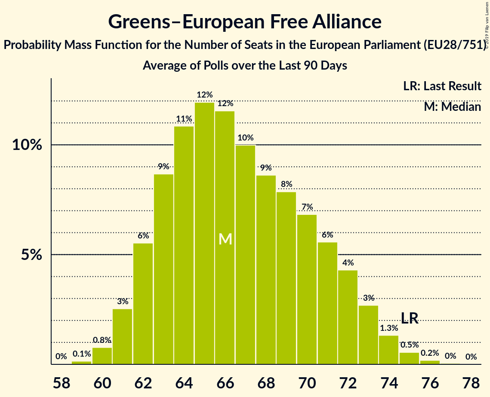

# Greens–European Free Alliance

## Seats

Last result: **52** seats (General Election of 25 May 2014)

### Confidence Intervals

| Party | Last Result | Median | 80% Confidence Interval | 90% Confidence Interval | 95% Confidence Interval | 99% Confidence Interval |
|:-----:|:-----------:|:------:|:-----------------------:|:-----------------------:|:-----------------------:|:-----------------------:|
| Greens–European Free Alliance | 52 | 41 | 39–43 | 38–44 | 38–45 | 37–46 |
| Bündnis 90/Die Grünen [DE] | | 25 | 24–26 | 24–27 | 24–28 | 23–28 |
| Česká pirátská strana [CZ] | | 4 | 4–5 | 4–5 | 4–5 | 4–5 |
| GroenLinks [NL] | | 3 | 2–3 | 2–3 | 2–3 | 2–3 |
| Die Grünen–Die Grüne Alternative [AT] | | 2 | 1–2 | 1–2 | 1–2 | 1–2 |
| Vihreä liitto [FI] | | 2 | 2 | 1–2 | 1–2 | 1–2 |
| Die PARTEI [DE] | | 1 | 1–2 | 1–2 | 1–2 | 1–3 |
| Miljöpartiet de gröna [SE] | | 1 | 1 | 1 | 0–1 | 0–1 |
| Socialistisk Folkeparti [DK] | | 1 | 1 | 1 | 1 | 1–2 |
| déi gréng [LU] | | 1 | 1 | 1 | 1 | 1 |
| Ökologisch-Demokratische Partei [DE] | | 1 | 0–1 | 0–1 | 0–1 | 0–1 |
| Alternativet [DK] | | 0 | 0 | 0 | 0–1 | 0–1 |
| Erakond Eestimaa Rohelised [EE] | | 0 | 0 | 0 | 0 | 0 |
| JETZT–Liste Pilz [AT] | | 0 | 0 | 0 | 0 | 0 |
| Latvijas Krievu savienība [LV] | | 0 | 0 | 0 | 0 | 0–1 |
| Piratenpartei Deutschland [DE] | | 0 | 0–1 | 0–1 | 0–1 | 0–1 |
| Strana zelených [CZ] | | 0 | 0 | 0 | 0 | 0 |
| Volt Europa [DE] | | 0 | 0–1 | 0–1 | 0–1 | 0–1 |

### Probability Mass Function

The following table shows the probability mass function per seat for the [poll average](average-2019-06-30.html) for Greens–European Free Alliance.

| Number of Seats | Probability | Accumulated | Special Marks |
|:---------------:|:-----------:|:-----------:|:-------------:|
| 36 | 0.1% | 100% |  |
| 37 | 1.4% | 99.8% |  |
| 38 | 5% | 98% |  |
| 39 | 8% | 93% |  |
| 40 | 13% | 85% |  |
| 41 | 22% | 72% | Median |
| 42 | 25% | 50% |  |
| 43 | 16% | 25% |  |
| 44 | 7% | 9% |  |
| 45 | 2% | 3% |  |
| 46 | 0.5% | 0.5% |  |
| 47 | 0.1% | 0.1% |  |
| 48 | 0% | 0% |  |
| 49 | 0% | 0% |  |
| 50 | 0% | 0% |  |
| 51 | 0% | 0% |  |
| 52 | 0% | 0% | Last Result |

