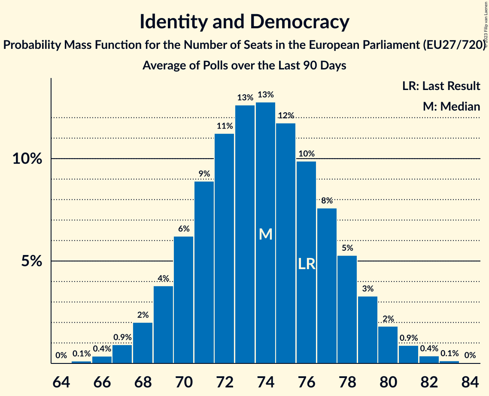

# Identity and Democracy

Members registered from **11 countries**:

> AT, BE, CZ, DE, DK, EE, FR, IT, NL, PT, SK

## Seats

Last result: **76** seats (General Election of 26 May 2019)

Current median: **74** seats (-2 seats)

At least one member in **9 countries** have a median of 1 seat or more:

> AT, BE, CZ, DE, EE, FR, IT, NL, PT

### Confidence Intervals

| Party | Area | Last Result | Median | 80% Confidence Interval | 90% Confidence Interval | 95% Confidence Interval | 99% Confidence Interval |
|:-----:|:----:|:-----------:|:------:|:-----------------------:|:-----------------------:|:-----------------------:|:-----------------------:|
| Identity and Democracy | EU | 76 | 74 | 70–78 | 69–79 | 68–80 | 66–81 |
| Rassemblement national | FR | | 23 | 22–26 | 21–26 | 20–26 | 20–27 |
| Alternative für Deutschland | DE | | 20 | 18–23 | 17–23 | 17–23 | 16–24 |
| Lega Nord | IT | | 8 | 7–9 | 6–10 | 6–10 | 6–11 |
| Freiheitliche Partei Österreichs | AT | | 6 | 6–7 | 5–7 | 5–8 | 5–8 |
| Partij voor de Vrijheid | NL | | 4 | 4–5 | 4–5 | 4–5 | 4–5 |
| Vlaams Belang | BE-VLG | | 4 | 3–4 | 3–4 | 3–4 | 3–4 |
| Chega | PT | | 3 | 2–3 | 2–4 | 2–4 | 2–4 |
| Svoboda a přímá demokracie | CZ | | 3 | 2–3 | 2–3 | 2–3 | 2–4 |
| Eesti Konservatiivne Rahvaerakond | EE | | 2 | 2 | 2 | 1–2 | 1–2 |
| Dansk Folkeparti | DK | | 0 | 0–1 | 0–1 | 0–1 | 0–1 |
| SME RODINA | SK | | 0 | 0–1 | 0–1 | 0–1 | 0–1 |
| Trikolóra hnutí občanů | CZ | | 0 | 0 | 0 | 0 | 0 |

### Probability Mass Function

The following table shows the probability mass function per seat for the [poll average](average-2023-10-31.html) for Identity and Democracy.

| Number of Seats | Probability | Accumulated | Special Marks |
|:---------------:|:-----------:|:-----------:|:-------------:|
| 65 | 0.1% | 100% |  |
| 66 | 0.4% | 99.8% |  |
| 67 | 0.9% | 99.5% |  |
| 68 | 2% | 98.5% |  |
| 69 | 4% | 97% |  |
| 70 | 6% | 93% |  |
| 71 | 9% | 86% |  |
| 72 | 11% | 77% |  |
| 73 | 13% | 66% |  |
| 74 | 13% | 53% | Median |
| 75 | 12% | 40% |  |
| 76 | 10% | 28% | Last Result |
| 77 | 8% | 18% |  |
| 78 | 5% | 11% |  |
| 79 | 3% | 6% |  |
| 80 | 2% | 3% |  |
| 81 | 0.7% | 1.2% |  |
| 82 | 0.3% | 0.4% |  |
| 83 | 0.1% | 0.1% |  |
| 84 | 0% | 0% |  |

