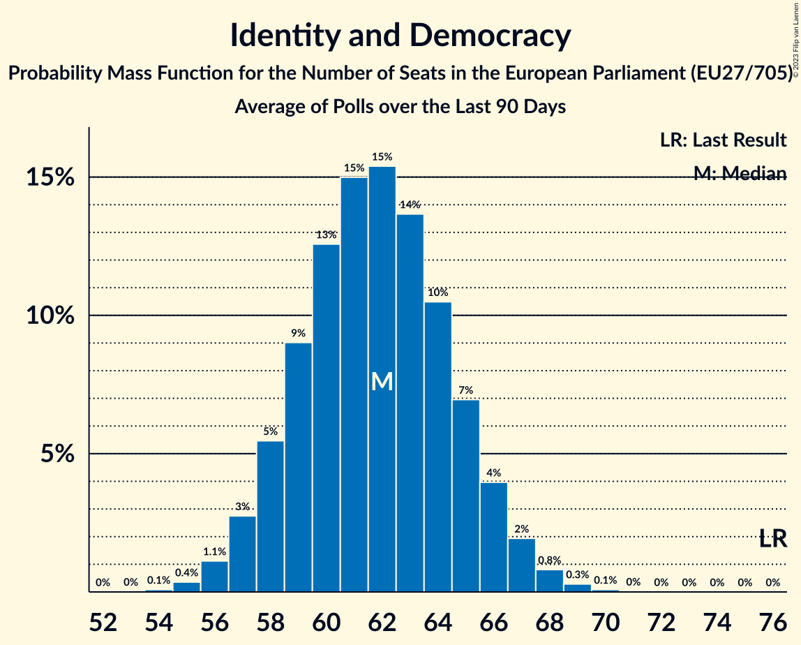

# Identity and Democracy

Members registered from **12 countries**:

> AT, BE, CZ, DE, DK, EE, FI, FR, IT, NL, PT, SK

## Seats

Last result: **76** seats (General Election of 26 May 2019)

Current median: **63** seats (-13 seats)

At least one member in **11 countries** have a median of 1 seat or more:

> AT, BE, CZ, DE, EE, FI, FR, IT, NL, PT, SK

### Confidence Intervals

| Party | Area | Last Result | Median | 80% Confidence Interval | 90% Confidence Interval | 95% Confidence Interval | 99% Confidence Interval |
|:-----:|:----:|:-----------:|:------:|:-----------------------:|:-----------------------:|:-----------------------:|:-----------------------:|
| Identity and Democracy | EU | 76 | 63 | 60–66 | 59–67 | 59–68 | 57–69 |
| Rassemblement national | FR | | 17 | 16–19 | 16–19 | 16–19 | 15–20 |
| Alternative für Deutschland | DE | | 15 | 13–16 | 12–16 | 12–17 | 11–18 |
| Lega Nord | IT | | 7 | 6–9 | 6–9 | 6–9 | 5–10 |
| Freiheitliche Partei Österreichs | AT | | 6 | 5–6 | 5–6 | 5–6 | 5–7 |
| Partij voor de Vrijheid | NL | | 4 | 4–5 | 4–5 | 3–5 | 3–5 |
| Chega | PT | | 3 | 2–4 | 2–4 | 2–4 | 2–4 |
| Perussuomalaiset | FI | | 3 | 3–4 | 3–4 | 3–4 | 3–4 |
| Vlaams Belang | BE-VLG | | 3 | 3–4 | 3–4 | 3–4 | 3–4 |
| Svoboda a přímá demokracie | CZ | | 2 | 2–3 | 2–3 | 1–3 | 1–3 |
| Eesti Konservatiivne Rahvaerakond | EE | | 1 | 1–2 | 1–2 | 1–2 | 1–2 |
| SME RODINA | SK | | 1 | 1–2 | 1–2 | 1–2 | 1–2 |
| Dansk Folkeparti | DK | | 0 | 0 | 0 | 0 | 0 |
| Trikolóra hnutí občanů | CZ | | 0 | 0 | 0 | 0 | 0 |

### Probability Mass Function

The following table shows the probability mass function per seat for the [poll average](average-2023-03-31.html) for Identity and Democracy.

| Number of Seats | Probability | Accumulated | Special Marks |
|:---------------:|:-----------:|:-----------:|:-------------:|
| 56 | 0.1% | 100% |  |
| 57 | 0.6% | 99.8% |  |
| 58 | 2% | 99.3% |  |
| 59 | 4% | 98% |  |
| 60 | 7% | 94% |  |
| 61 | 12% | 86% |  |
| 62 | 15% | 75% |  |
| 63 | 17% | 59% | Median |
| 64 | 15% | 43% |  |
| 65 | 12% | 27% |  |
| 66 | 8% | 15% |  |
| 67 | 4% | 8% |  |
| 68 | 2% | 3% |  |
| 69 | 0.8% | 1.1% |  |
| 70 | 0.3% | 0.4% |  |
| 71 | 0.1% | 0.1% |  |
| 72 | 0% | 0% |  |
| 73 | 0% | 0% |  |
| 74 | 0% | 0% |  |
| 75 | 0% | 0% |  |
| 76 | 0% | 0% | Last Result |

