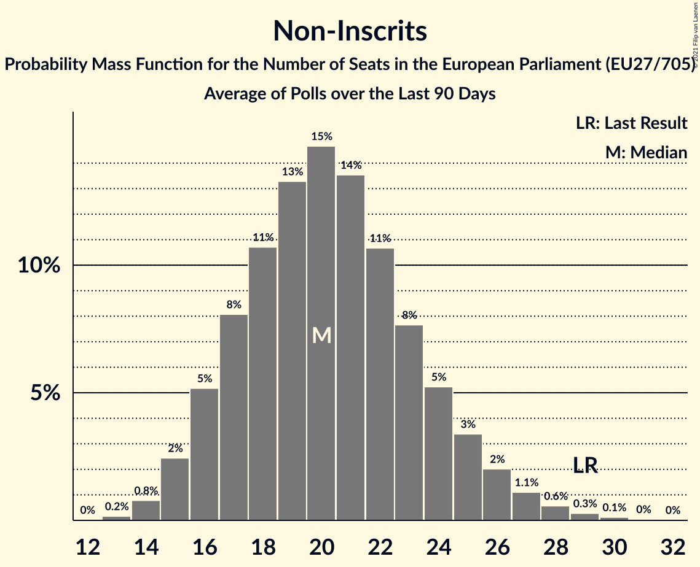

# Non-Inscrits

Members registered from **11 countries**:

> CY, CZ, ES, FI, GR, HR, HU, IT, PL, SI, SK

## Seats

Last result: **29** seats (General Election of 26 May 2019)

Current median: **20** seats (-9 seats)

At least one member in **6 countries** have a median of 1 seat or more:

> ES, GR, HU, IT, PL, SK

### Confidence Intervals

| Party | Area | Last Result | Median | 80% Confidence Interval | 90% Confidence Interval | 95% Confidence Interval | 99% Confidence Interval |
|:-----:|:----:|:-----------:|:------:|:-----------------------:|:-----------------------:|:-----------------------:|:-----------------------:|
| Non-Inscrits | EU | 29 | 20 | 17–24 | 16–25 | 15–27 | 14–29 |
| Movimento 5 Stelle | IT | | 13 | 11–14 | 11–15 | 10–16 | 10–17 |
| Konfederacja | PL | | 3 | 0–4 | 0–5 | 0–5 | 0–6 |
| Jobbik | HU | | 2 | 1–3 | 1–4 | 1–4 | 1–4 |
| Kotleba–Ľudová strana Naše Slovensko | SK | | 1 | 0–2 | 0–2 | 0–2 | 0–2 |
| Partit Demòcrata Europeu Català | ES | | 1 | 1–2 | 0–2 | 0–2 | 0–2 |
| Κομμουνιστικό Κόμμα Ελλάδας | GR | | 1 | 1 | 1–2 | 1–2 | 1–2 |
| Kukiz’15 | PL | | 0 | 0 | 0–3 | 0–3 | 0–3 |
| Liike Nyt | FI | | 0 | 0 | 0 | 0 | 0 |
| Magyar Kétfarkú Kutya Párt | HU | | 0 | 0–1 | 0–1 | 0–2 | 0–2 |
| Mi Hazánk Mozgalom | HU | | 0 | 0 | 0 | 0–1 | 0–1 |
| Slovenska nacionalna stranka | SI | | 0 | 0 | 0 | 0 | 0 |
| Strana svobodných občanů | CZ | | 0 | 0 | 0 | 0 | 0 |
| Živi zid | HR | | 0 | 0 | 0 | 0 | 0 |
| Εθνικό Λαϊκό Μέτωπο | CY | | 0 | 0–1 | 0–1 | 0–1 | 0–1 |
| Χρυσή Αυγή | GR | | 0 | 0 | 0 | 0 | 0 |

### Probability Mass Function

The following table shows the probability mass function per seat for the [poll average](average-2021-01-31.html) for Non-Inscrits.

| Number of Seats | Probability | Accumulated | Special Marks |
|:---------------:|:-----------:|:-----------:|:-------------:|
| 13 | 0.1% | 100% |  |
| 14 | 0.7% | 99.8% |  |
| 15 | 2% | 99.1% |  |
| 16 | 5% | 97% |  |
| 17 | 7% | 92% |  |
| 18 | 10% | 85% |  |
| 19 | 13% | 75% |  |
| 20 | 14% | 62% | Median |
| 21 | 14% | 48% |  |
| 22 | 11% | 34% |  |
| 23 | 8% | 23% |  |
| 24 | 6% | 14% |  |
| 25 | 4% | 9% |  |
| 26 | 2% | 5% |  |
| 27 | 1.3% | 3% |  |
| 28 | 0.7% | 1.3% |  |
| 29 | 0.3% | 0.6% | Last Result |
| 30 | 0.2% | 0.3% |  |
| 31 | 0.1% | 0.1% |  |
| 32 | 0% | 0% |  |

