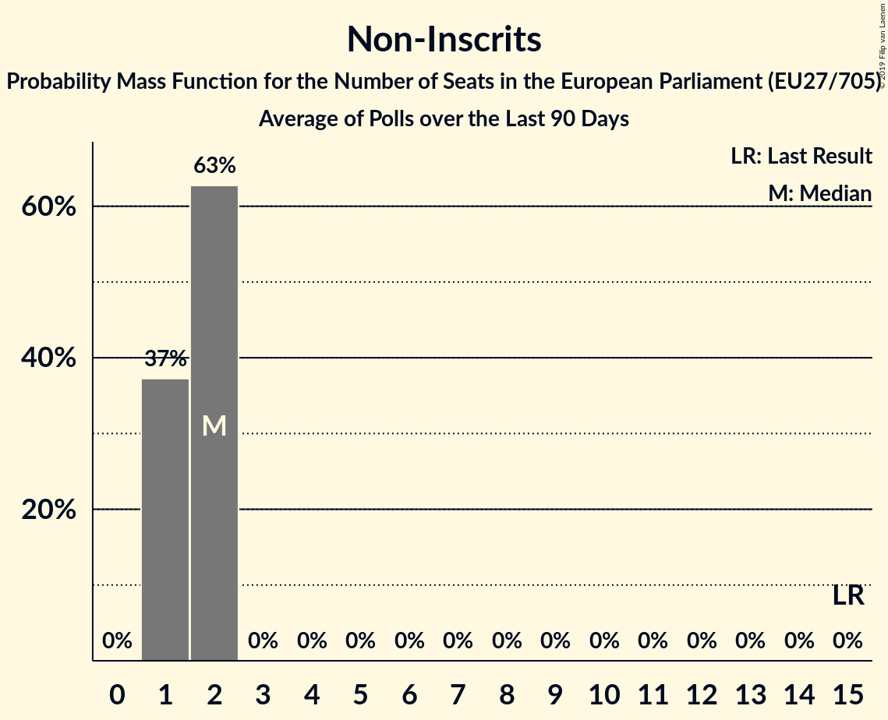

# Non-Inscrits

## Seats

Last result: **15** seats (General Election of 25 May 2014)

### Confidence Intervals

| Party | Last Result | Median | 80% Confidence Interval | 90% Confidence Interval | 95% Confidence Interval | 99% Confidence Interval |
|:-----:|:-----------:|:------:|:-----------------------:|:-----------------------:|:-----------------------:|:-----------------------:|
| Non-Inscrits | 15 | 9 | 8–11 | 7–11 | 7–12 | 7–13 |
| Jobbik (NI) | | 3 | 2–4 | 2–4 | 2–4 | 2–4 |
| Kotleba–Ľudová strana Naše Slovensko (NI) | | 2 | 1–2 | 1–2 | 1–2 | 1–2 |
| Χρυσή Αυγή (NI) | | 2 | 1–2 | 1–2 | 1–2 | 1–2 |
| Die PARTEI (NI) | | 1 | 1–2 | 1–2 | 1–2 | 0–2 |
| Κομμουνιστικό Κόμμα Ελλάδας (NI) | | 1 | 1–2 | 1–2 | 1–2 | 1–2 |
| MKKP (NI) | | 0 | 0–1 | 0–1 | 0–1 | 0–1 |
| Mi Hazánk Mozgalom (NI) | | 0 | 0 | 0 | 0 | 0 |

### Probability Mass Function

The following table shows the probability mass function per seat for the [poll average](average-2019-03-31.html) for Non-Inscrits.

| Number of Seats | Probability | Accumulated | Special Marks |
|:---------------:|:-----------:|:-----------:|:-------------:|
| 6 | 0.4% | 100% |  |
| 7 | 5% | 99.6% |  |
| 8 | 18% | 95% |  |
| 9 | 30% | 77% | Median |
| 10 | 28% | 46% |  |
| 11 | 14% | 19% |  |
| 12 | 4% | 5% |  |
| 13 | 0.6% | 0.6% |  |
| 14 | 0% | 0% |  |
| 15 | 0% | 0% | Last Result |

