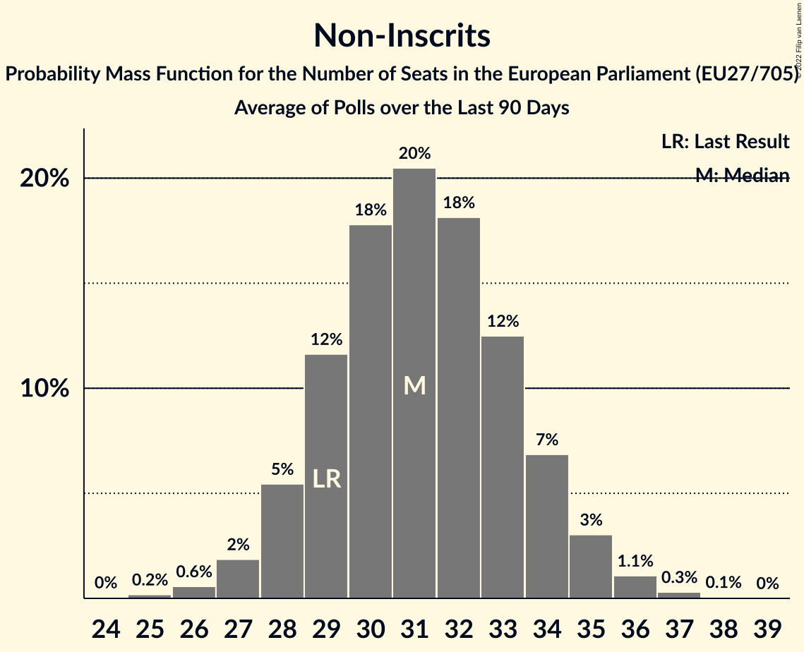

# Non-Inscrits

Members registered from **12 countries**:

> CY, DK, ES, FI, FR, GR, HU, IT, LT, PL, SI, SK

## Seats

Last result: **29** seats (General Election of 26 May 2019)

Current median: **43** seats (+14 seats)

At least one member in **8 countries** have a median of 1 seat or more:

> CY, ES, GR, HU, IT, LT, PL, SK

### Confidence Intervals

| Party | Area | Last Result | Median | 80% Confidence Interval | 90% Confidence Interval | 95% Confidence Interval | 99% Confidence Interval |
|:-----:|:----:|:-----------:|:------:|:-----------------------:|:-----------------------:|:-----------------------:|:-----------------------:|
| Non-Inscrits | EU | 29 | 43 | 40–46 | 39–47 | 38–48 | 36–49 |
| Fidesz–Kereszténydemokrata Néppárt | HU | | 14 | 13–15 | 13–15 | 13–16 | 12–16 |
| Movimento 5 Stelle | IT | | 9 | 7–10 | 7–10 | 7–11 | 6–12 |
| Konfederacja | PL | | 4 | 3–5 | 3–5 | 3–5 | 0–6 |
| Darbo Partija | LT | | 1 | 0–1 | 0–1 | 0–1 | 0–1 |
| Jobbik | HU | | 1 | 0–1 | 0–1 | 0–1 | 0–2 |
| Magyar Kétfarkú Kutya Párt | HU | | 1 | 0–2 | 0–2 | 0–2 | 0–2 |
| Mi Hazánk Mozgalom | HU | | 1 | 1–2 | 0–2 | 0–2 | 0–2 |
| Partit Demòcrata Europeu Català | ES | | 1 | 0–1 | 0–1 | 0–2 | 0–2 |
| REPUBLIKA | SK | | 1 | 0–1 | 0–1 | 0–1 | 0–2 |
| Εθνικό Λαϊκό Μέτωπο | CY | | 1 | 1 | 1 | 1 | 1 |
| Κομμουνιστικό Κόμμα Ελλάδας | GR | | 1 | 1 | 1–2 | 1–2 | 1–2 |
| Insieme per il Futuro | IT | | 0 | 0 | 0–3 | 0–4 | 0–4 |
| Kotleba–Ľudová strana Naše Slovensko | SK | | 0 | 0 | 0 | 0 | 0–1 |
| Kukiz’15 | PL | | 0 | 0 | 0 | 0 | 0–2 |
| Liike Nyt | FI | | 0 | 0 | 0 | 0 | 0 |
| Nye Borgerlige | DK | | 0 | 0–1 | 0–1 | 0–1 | 0–1 |
| Reconquête | FR | | 0 | 0 | 0 | 0 | 0 |
| Slovenska nacionalna stranka | SI | | 0 | 0 | 0 | 0 | 0 |

### Probability Mass Function

The following table shows the probability mass function per seat for the [poll average](average-2022-07-31.html) for Non-Inscrits.

| Number of Seats | Probability | Accumulated | Special Marks |
|:---------------:|:-----------:|:-----------:|:-------------:|
| 29 | 0% | 100% | Last Result |
| 30 | 0% | 100% |  |
| 31 | 0% | 100% |  |
| 32 | 0% | 100% |  |
| 33 | 0% | 100% |  |
| 34 | 0% | 100% |  |
| 35 | 0.1% | 100% |  |
| 36 | 0.4% | 99.8% |  |
| 37 | 1.0% | 99.5% |  |
| 38 | 2% | 98% |  |
| 39 | 5% | 96% |  |
| 40 | 9% | 91% |  |
| 41 | 13% | 82% |  |
| 42 | 16% | 70% |  |
| 43 | 17% | 53% | Median |
| 44 | 14% | 37% |  |
| 45 | 10% | 22% |  |
| 46 | 6% | 12% |  |
| 47 | 3% | 6% |  |
| 48 | 2% | 3% |  |
| 49 | 0.7% | 1.2% |  |
| 50 | 0.3% | 0.4% |  |
| 51 | 0.1% | 0.1% |  |
| 52 | 0% | 0% |  |

