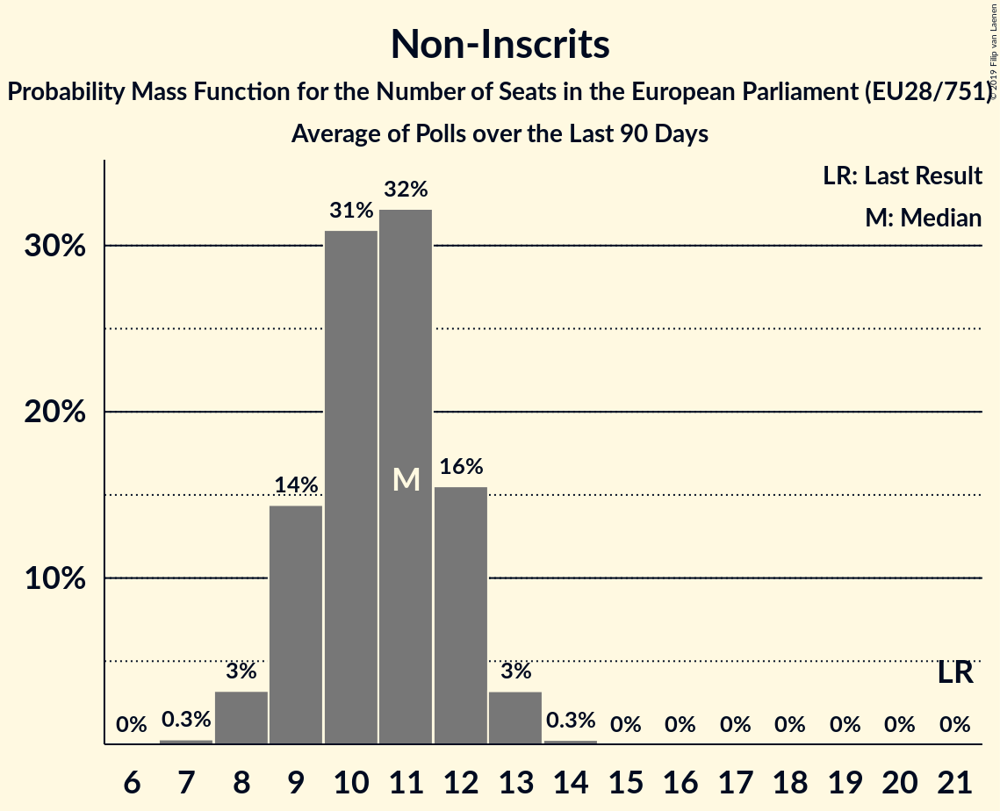

# Non-Inscrits

## Seats

Last result: **15** seats (General Election of 25 May 2014)

### Confidence Intervals

| Party | Last Result | Median | 80% Confidence Interval | 90% Confidence Interval | 95% Confidence Interval | 99% Confidence Interval |
|:-----:|:-----------:|:------:|:-----------------------:|:-----------------------:|:-----------------------:|:-----------------------:|
| Non-Inscrits | 15 | 11 | 9–13 | 9–13 | 8–13 | 8–14 |
| Jobbik [HU] (NI) | | 3 | 2–4 | 2–4 | 2–4 | 2–4 |
| Democratic Unionist Party [GB-NIR] (NI) | | 2 | 1–2 | 1–2 | 1–2 | 1–2 |
| Kotleba–Ľudová strana Naše Slovensko [SK] (NI) | | 2 | 1–2 | 1–2 | 1–2 | 1–2 |
| Χρυσή Αυγή [GR] (NI) | | 2 | 1–2 | 1–2 | 1–2 | 1–2 |
| Die PARTEI [DE] (NI) | | 1 | 1–2 | 1–2 | 0–2 | 0–2 |
| Κομμουνιστικό Κόμμα Ελλάδας [GR] (NI) | | 1 | 1–2 | 1–2 | 1–2 | 1–2 |
| MKKP [HU] (NI) | | 0 | 0–1 | 0–1 | 0–1 | 0–1 |
| Mi Hazánk Mozgalom [HU] (NI) | | 0 | 0 | 0 | 0 | 0 |

### Probability Mass Function

The following table shows the probability mass function per seat for the [poll average](average-2019-04-15.html) for Non-Inscrits.

| Number of Seats | Probability | Accumulated | Special Marks |
|:---------------:|:-----------:|:-----------:|:-------------:|
| 7 | 0.2% | 100% |  |
| 8 | 3% | 99.8% |  |
| 9 | 13% | 97% |  |
| 10 | 26% | 84% |  |
| 11 | 29% | 58% | Median |
| 12 | 19% | 29% |  |
| 13 | 8% | 10% |  |
| 14 | 2% | 2% |  |
| 15 | 0.2% | 0.2% | Last Result |
| 16 | 0% | 0% |  |

