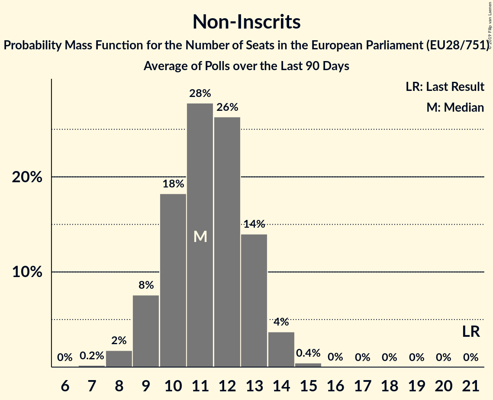

# Non-Inscrits

## Seats

Last result: **21** seats (General Election of 25 May 2014)

### Confidence Intervals

| Party | Last Result | Median | 80% Confidence Interval | 90% Confidence Interval | 95% Confidence Interval | 99% Confidence Interval |
|:-----:|:-----------:|:------:|:-----------------------:|:-----------------------:|:-----------------------:|:-----------------------:|
| Non-Inscrits | 21 | 11 | 10–15 | 9–15 | 9–16 | 8–17 |
| Jobbik [HU] (NI) | | 3 | 2–3 | 2–3 | 2–4 | 2–4 |
| Kotleba–Ľudová strana Naše Slovensko [SK] (NI) | | 2 | 1–2 | 1–2 | 1–2 | 1–2 |
| Χρυσή Αυγή [GR] (NI) | | 2 | 1–2 | 1–2 | 1–2 | 1–2 |
| Democratic Unionist Party [GB-NIR] (NI) | | 1 | 1 | 1 | 1 | 1 |
| Die PARTEI [DE] (NI) | | 1 | 1–2 | 1–2 | 0–3 | 0–3 |
| Εθνικό Λαϊκό Μέτωπο [CY] (NI) | | 1 | 0–1 | 0–1 | 0–1 | 0–1 |
| Κομμουνιστικό Κόμμα Ελλάδας [GR] (NI) | | 1 | 1–2 | 1–2 | 1–2 | 1–2 |
| MKKP [HU] (NI) | | 0 | 0–1 | 0–1 | 0–1 | 0–1 |
| Mi Hazánk Mozgalom [HU] (NI) | | 0 | 0 | 0 | 0 | 0 |
| Slovenska nacionalna stranka [SI] (NI) | | 0 | 0 | 0 | 0–1 | 0–1 |
| Атака [BG] (NI) | | 0 | 0–4 | 0–4 | 0–4 | 0–4 |

### Probability Mass Function

The following table shows the probability mass function per seat for the [poll average](average-2019-05-21.html) for Non-Inscrits.

| Number of Seats | Probability | Accumulated | Special Marks |
|:---------------:|:-----------:|:-----------:|:-------------:|
| 7 | 0.2% | 100% |  |
| 8 | 2% | 99.8% |  |
| 9 | 8% | 98% |  |
| 10 | 19% | 90% |  |
| 11 | 24% | 71% | Median |
| 12 | 18% | 47% |  |
| 13 | 11% | 29% |  |
| 14 | 8% | 19% |  |
| 15 | 6% | 11% |  |
| 16 | 3% | 4% |  |
| 17 | 0.9% | 1.1% |  |
| 18 | 0.2% | 0.2% |  |
| 19 | 0% | 0% |  |
| 20 | 0% | 0% |  |
| 21 | 0% | 0% | Last Result |

