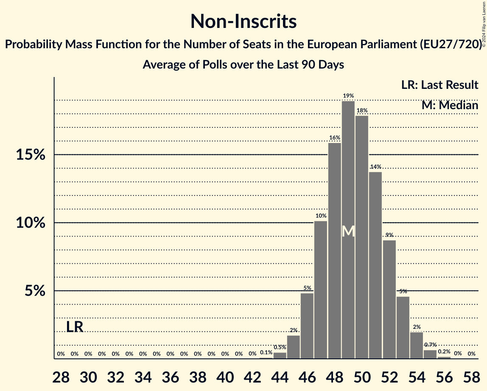

# Non-Inscrits

Members registered from **14 countries**:

> BG, CZ, DE, DK, ES, FR, GR, HU, IT, LT, LV, NL, PL, SK

## Seats

Last result: **29** seats (General Election of 26 May 2019)

Current median: **53** seats (+24 seats)

At least one member in **11 countries** have a median of 1 seat or more:

> BG, DE, DK, ES, GR, HU, IT, LT, LV, PL, SK

### Confidence Intervals

| Party | Area | Last Result | Median | 80% Confidence Interval | 90% Confidence Interval | 95% Confidence Interval | 99% Confidence Interval |
|:-----:|:----:|:-----------:|:------:|:-----------------------:|:-----------------------:|:-----------------------:|:-----------------------:|
| Non-Inscrits | EU | 29 | 53 | 50–57 | 49–59 | 48–60 | 47–61 |
| Movimento 5 Stelle | IT | | 13 | 12–16 | 12–16 | 11–16 | 10–17 |
| Fidesz | HU | | 10 | 10–11 | 10–12 | 9–12 | 9–12 |
| Bündnis Sahra Wagenknecht | DE | | 6 | 4–8 | 4–8 | 4–8 | 4–9 |
| SMER–sociálna demokracia | SK | | 5 | 4–6 | 4–6 | 4–6 | 4–6 |
| Nowa Nadzieja | PL | | 3 | 3–4 | 3–4 | 3–4 | 3–4 |
| Възраждане | BG | | 3 | 2–3 | 2–3 | 2–3 | 2–4 |
| Κομμουνιστικό Κόμμα Ελλάδας | GR | | 2 | 2–3 | 1–3 | 1–3 | 1–3 |
| Danmarksdemokraterne | DK | | 1 | 1 | 1 | 1 | 1 |
| Darbo Partija | LT | | 1 | 0–1 | 0–1 | 0–1 | 0–1 |
| Die PARTEI | DE | | 1 | 1–3 | 1–3 | 1–3 | 0–3 |
| Latvija pirmajā vietā | LV | | 1 | 1 | 1 | 1 | 1 |
| Lewica Razem | PL | | 1 | 1 | 1 | 1 | 0–2 |
| Mi Hazánk Mozgalom | HU | | 1 | 1–2 | 1–2 | 1–3 | 1–3 |
| Partit Demòcrata Europeu Català | ES | | 1 | 1–2 | 1–2 | 1–2 | 1–2 |
| REPUBLIKA | SK | | 1 | 1 | 1 | 1 | 0–1 |
| Stabilitātei! | LV | | 1 | 1 | 1 | 1 | 0–1 |
| Centra partija | LV | | 0 | 0 | 0 | 0 | 0 |
| Democrazia Sovrana e Popolare | IT | | 0 | 0 | 0 | 0 | 0 |
| Forum voor Democratie | NL | | 0 | 0–1 | 0–1 | 0–1 | 0–1 |
| Inicjatywa Polska | PL | | 0 | 0 | 0 | 0 | 0 |
| Jobbik | HU | | 0 | 0 | 0 | 0–1 | 0–1 |
| Kotleba–Ľudová strana Naše Slovensko | SK | | 0 | 0 | 0 | 0 | 0 |
| Les Patriotes | FR | | 0 | 0 | 0 | 0 | 0 |
| Strana svobodných občanů | CZ | | 0 | 0 | 0 | 0 | 0 |
| Български възход | BG | | 0 | 0 | 0 | 0–1 | 0–1 |

### Probability Mass Function

The following table shows the probability mass function per seat for the [poll average](average-2024-04-15.html) for Non-Inscrits.

| Number of Seats | Probability | Accumulated | Special Marks |
|:---------------:|:-----------:|:-----------:|:-------------:|
| 29 | 0% | 100% | Last Result |
| 30 | 0% | 100% |  |
| 31 | 0% | 100% |  |
| 32 | 0% | 100% |  |
| 33 | 0% | 100% |  |
| 34 | 0% | 100% |  |
| 35 | 0% | 100% |  |
| 36 | 0% | 100% |  |
| 37 | 0% | 100% |  |
| 38 | 0% | 100% |  |
| 39 | 0% | 100% |  |
| 40 | 0% | 100% |  |
| 41 | 0% | 100% |  |
| 42 | 0% | 100% |  |
| 43 | 0% | 100% |  |
| 44 | 0% | 100% |  |
| 45 | 0.1% | 100% |  |
| 46 | 0.3% | 99.9% |  |
| 47 | 0.9% | 99.7% |  |
| 48 | 3% | 98.7% |  |
| 49 | 5% | 96% |  |
| 50 | 9% | 91% |  |
| 51 | 11% | 82% |  |
| 52 | 13% | 71% |  |
| 53 | 12% | 58% | Median |
| 54 | 11% | 46% |  |
| 55 | 10% | 34% |  |
| 56 | 8% | 24% |  |
| 57 | 6% | 16% |  |
| 58 | 4% | 10% |  |
| 59 | 3% | 6% |  |
| 60 | 2% | 3% |  |
| 61 | 0.7% | 1.2% |  |
| 62 | 0.3% | 0.5% |  |
| 63 | 0.1% | 0.2% |  |
| 64 | 0% | 0% |  |

