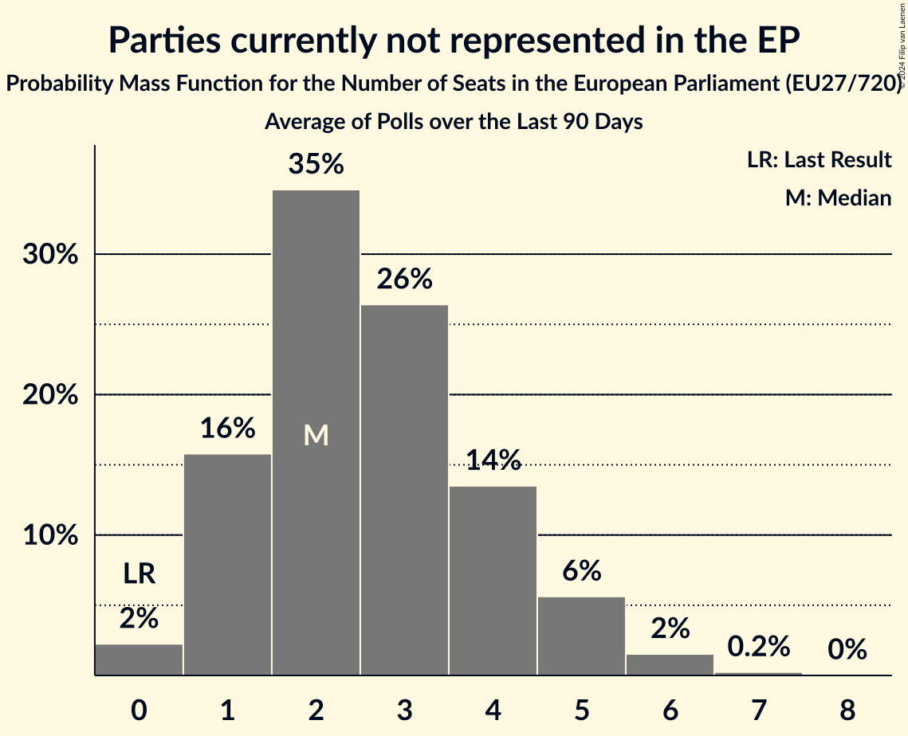

# Parties currently not represented in the EP

Members registered from **18 countries**:

> BE, BG, CZ, DE, EE, ES, FR, GR, HU, IE, IT, LT, LU, LV, MT, PL, SI, SK

## Seats

Last result: **0** seats (General Election of 26 May 2019)

Current median: **2** seats (+2 seats)

At least one member in **2 countries** have a median of 1 seat or more:

> ES, GR

### Confidence Intervals

| Party | Area | Last Result | Median | 80% Confidence Interval | 90% Confidence Interval | 95% Confidence Interval | 99% Confidence Interval |
|:-----:|:----:|:-----------:|:------:|:-----------------------:|:-----------------------:|:-----------------------:|:-----------------------:|
| Parties currently not represented in the EP | EU | 0 | 2 | 1–4 | 1–4 | 0–5 | 0–5 |
| Se Acabó La Fiesta [ES] (*) | ES | | 1 | 0–2 | 0–3 | 0–3 | 0–3 |
| Πλεύση Ελευθερίας [GR] (*) | GR | | 1 | 0–1 | 0–2 | 0–2 | 0–2 |
| Alliance Rurale [FR] (*) | FR | | 0 | 0 | 0 | 0 | 0 |
| Aontú [IE] (*) | IE | | 0 | 0 | 0 | 0 | 0 |
| Apvienība Jaunlatvieši [LV] (*) | LV | | 0 | 0 | 0 | 0 | 0 |
| Basisdemokratische Partei Deutschland [DE] (*) | DE | | 0 | 0–1 | 0–1 | 0–1 | 0–1 |
| Bezpartyjni Samorządowcy [PL] (*) | PL | | 0 | 0 | 0 | 0 | 0 |
| Centrum dla Polski [PL] (*) | PL | | 0 | 0 | 0 | 0–1 | 0–1 |
| DéFI [BE-FRC] (*) | BE-FRC | | 0 | 0 | 0 | 0 | 0 |
| Imperium Europa [MT] (*) | MT | | 0 | 0 | 0 | 0 | 0 |
| Kommunistesch Partei Lëtzebuerg [LU] (*) | LU | | 0 | 0 | 0 | 0 | 0 |
| Koos [EE] (*) | EE | | 0 | 0 | 0 | 0 | 0 |
| Libertà [IT] (*) | IT | | 0 | 0 | 0 | 0 | 0 |
| Lutte Ouvrière [FR] (*) | FR | | 0 | 0 | 0 | 0 | 0 |
| Második Reformkor [HU] (*) | HU | | 0 | 0 | 0 | 0 | 0–1 |
| Nacionalinis Susivienijimas [LT] (*) | LT | | 0 | 0 | 0 | 0 | 0 |
| Nép Pártján [HU] (*) | HU | | 0 | 0 | 0 | 0 | 0 |
| Partito Progressista [IT] (*) | IT | | 0 | 0 | 0 | 0–1 | 0–1 |
| Právo Respekt Odbornost [CZ] (*) | CZ | | 0 | 0 | 0 | 0 | 0 |
| Resni.ca [SI] (*) | SI | | 0 | 0 | 0 | 0 | 0 |
| Suverēnā vara [LV] (*) | LV | | 0 | 0 | 0 | 0 | 0 |
| Union populaire républicaine [FR] (*) | FR | | 0 | 0 | 0 | 0 | 0 |
| ZDRAVÝ ROZUM [SK] (*) | SK | | 0 | 0 | 0 | 0 | 0 |
| Δημιουργία, Ξανά [GR] (*) | GR | | 0 | 0 | 0 | 0 | 0 |
| Φωνή Λογικής [GR] (*) | GR | | 0 | 0 | 0 | 0 | 0–1 |
| Левицата! [BG] (*) | BG | | 0 | 0 | 0 | 0 | 0 |

### Probability Mass Function

The following table shows the probability mass function per seat for the [poll average](average-2024-05-31.html) for Parties currently not represented in the EP.

| Number of Seats | Probability | Accumulated | Special Marks |
|:---------------:|:-----------:|:-----------:|:-------------:|
| 0 | 5% | 100% | Last Result |
| 1 | 35% | 95% |  |
| 2 | 26% | 60% | Median |
| 3 | 18% | 34% |  |
| 4 | 12% | 16% |  |
| 5 | 3% | 4% |  |
| 6 | 0.4% | 0.4% |  |
| 7 | 0% | 0% |  |

