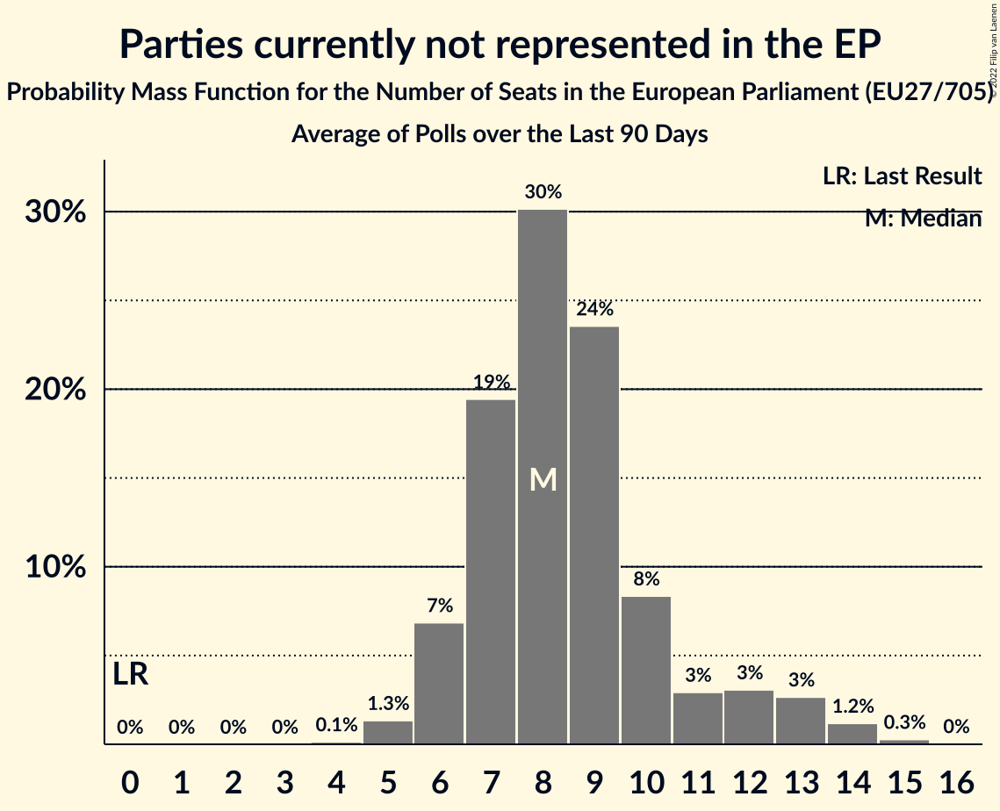

# Parties currently not represented in the EP

Members registered from **13 countries**:

> AT, BE, BG, CY, CZ, DK, FR, IE, LU, LV, NL, SI, SK

## Seats

Last result: **0** seats (General Election of 26 May 2019)

Current median: **5** seats (+5 seats)

At least one member in **4 countries** have a median of 1 seat or more:

> AT, BG, LV, NL

### Confidence Intervals

| Party | Area | Last Result | Median | 80% Confidence Interval | 90% Confidence Interval | 95% Confidence Interval | 99% Confidence Interval |
|:-----:|:----:|:-----------:|:------:|:-----------------------:|:-----------------------:|:-----------------------:|:-----------------------:|
| Parties currently not represented in the EP | EU | 0 | 5 | 3–10 | 3–11 | 2–11 | 2–12 |
| Има такъв народ [BG] (*) | BG | | 2 | 2 | 2 | 2 | 2 |
| BoerBurgerBeweging [NL] (*) | NL | | 1 | 0–2 | 0–2 | 0–2 | 0–2 |
| Likums un kārtība [LV] (*) | LV | | 1 | 0–1 | 0–1 | 0–1 | 0–1 |
| MFG–Österreich Menschen–Freiheit–Grundrechte [AT] (*) | AT | | 1 | 0–1 | 0–1 | 0–1 | 0–1 |
| Andrej Čuš in Zeleni Slovenije [SI] (*) | SI | | 0 | 0 | 0 | 0 | 0 |
| Aontú [IE] (*) | IE | | 0 | 0 | 0 | 0 | 0 |
| Belang van Nederland [NL] (*) | NL | | 0 | 0 | 0 | 0 | 0 |
| Bij1 [NL] (*) | NL | | 0 | 0 | 0 | 0 | 0 |
| DENK [NL] (*) | NL | | 0 | 0 | 0 | 0 | 0 |
| Dobra država [SI] (*) | SI | | 0 | 0 | 0 | 0 | 0 |
| Dobrá voľba [SK] (*) | SK | | 0 | 0 | 0 | 0 | 0 |
| DéFI [BE-FRC] (*) | BE-FRC | | 0 | 0 | 0 | 0 | 0 |
| Frie Grønne [DK] (*) | DK | | 0 | 0 | 0 | 0 | 0 |
| Independents [IE] (*) | IE | | 0 | 0 | 0–1 | 0–1 | 0–1 |
| Kommunistesch Partei Lëtzebuerg [LU] (*) | LU | | 0 | 0 | 0 | 0 | 0 |
| Latvija pirmajā vietā [LV] (*) | LV | | 0 | 0 | 0 | 0 | 0–1 |
| Lutte Ouvrière [FR] (*) | FR | | 0 | 0 | 0 | 0 | 0 |
| Moderaterne [DK] (*) | DK | | 0 | 0 | 0 | 0 | 0 |
| Přísaha [CZ] (*) | CZ | | 0 | 0 | 0–1 | 0–1 | 0–1 |
| Republika [LV] (*) | LV | | 0 | 0 | 0 | 0 | 0 |
| Résistons! [FR] (*) | FR | | 0 | 0 | 0 | 0 | 0 |
| Union populaire républicaine [FR] (*) | FR | | 0 | 0 | 0 | 0 | 0 |
| Veganerpartiet [DK] (*) | DK | | 0 | 0 | 0 | 0 | 0 |
| Walwari [FR] (*) | FR | | 0 | 0–5 | 0–6 | 0–6 | 0–7 |
| Ανεξάρτητοι [CY] (*) | CY | | 0 | 0 | 0 | 0 | 0 |
| Възраждане [BG] (*) | BG | | 0 | 0 | 0 | 0 | 0 |

### Probability Mass Function

The following table shows the probability mass function per seat for the [poll average](average-2022-02-28.html) for Parties currently not represented in the EP.

| Number of Seats | Probability | Accumulated | Special Marks |
|:---------------:|:-----------:|:-----------:|:-------------:|
| 0 | 0% | 100% | Last Result |
| 1 | 0% | 100% |  |
| 2 | 4% | 100% |  |
| 3 | 13% | 96% |  |
| 4 | 19% | 83% |  |
| 5 | 14% | 63% | Median |
| 6 | 5% | 49% |  |
| 7 | 4% | 45% |  |
| 8 | 10% | 40% |  |
| 9 | 14% | 30% |  |
| 10 | 11% | 16% |  |
| 11 | 4% | 6% |  |
| 12 | 1.0% | 1.3% |  |
| 13 | 0.2% | 0.2% |  |
| 14 | 0% | 0% |  |

