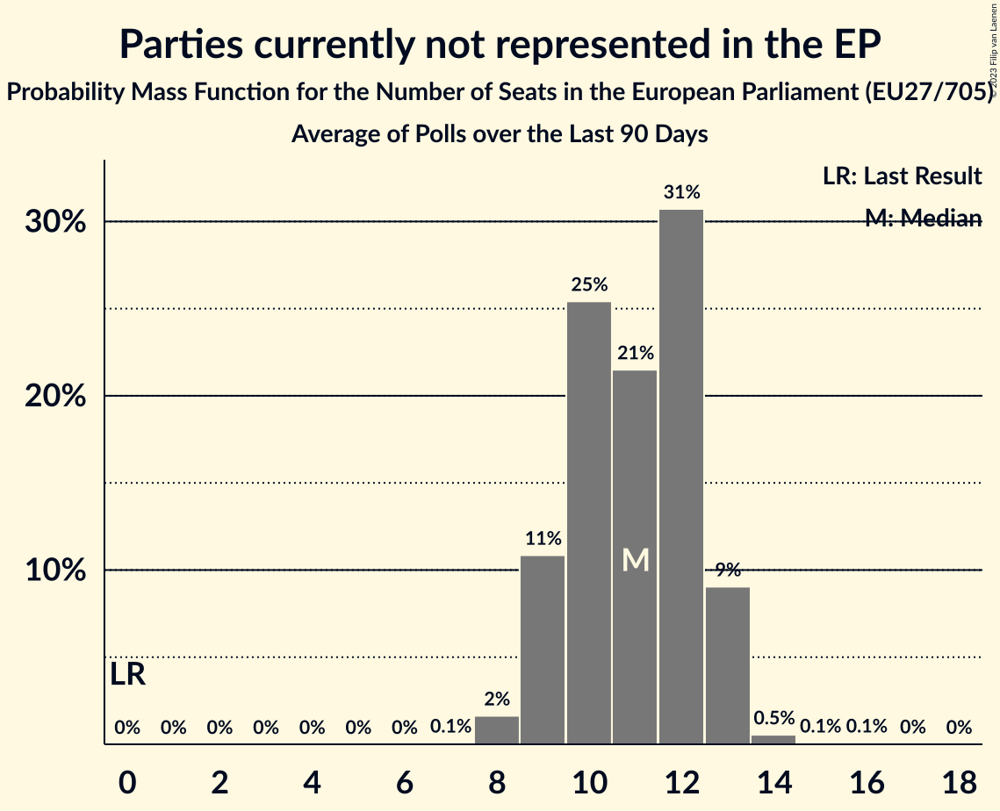

# Parties currently not represented in the EP

Members registered from **17 countries**:

> BE, BG, CY, CZ, DE, EE, ES, FR, GR, HR, IE, IT, LU, LV, NL, PL, SI

## Seats

Last result: **0** seats (General Election of 26 May 2019)

Current median: **11** seats (+11 seats)

At least one member in **5 countries** have a median of 1 seat or more:

> DE, GR, IE, LV, NL

### Confidence Intervals

| Party | Area | Last Result | Median | 80% Confidence Interval | 90% Confidence Interval | 95% Confidence Interval | 99% Confidence Interval |
|:-----:|:----:|:-----------:|:------:|:-----------------------:|:-----------------------:|:-----------------------:|:-----------------------:|
| Parties currently not represented in the EP | EU | 0 | 11 | 9–12 | 9–13 | 9–13 | 8–14 |
| BoerBurgerBeweging [NL] (*) | NL | | 6 | 4–7 | 4–7 | 4–7 | 4–7 |
| Basisdemokratische Partei Deutschland [DE] (*) | DE | | 1 | 0–1 | 0–1 | 0–2 | 0–2 |
| Independents [IE] (*) | IE | | 1 | 0–1 | 0–1 | 0–1 | 0–1 |
| Stabilitātei! [LV] (*) | LV | | 1 | 1 | 1 | 1 | 1 |
| Δημοκρατικό Πατριωτικό Κίνημα ΝΙΚΗ [GR] (*) | GR | | 1 | 1 | 1 | 1 | 1 |
| Πλεύση Ελευθερίας [GR] (*) | GR | | 1 | 1 | 1 | 1 | 1 |
| Σπαρτιάτες [GR] (*) | GR | | 1 | 1 | 1 | 1 | 1 |
| AGROunia [PL] (*) | PL | | 0 | 0 | 0 | 0 | 0 |
| Aontú [IE] (*) | IE | | 0 | 0 | 0 | 0 | 0 |
| Belang van Nederland [NL] (*) | NL | | 0 | 0 | 0 | 0 | 0 |
| Bezpartyjni Samorządowcy [PL] (*) | PL | | 0 | 0 | 0 | 0 | 0 |
| Bij1 [NL] (*) | NL | | 0 | 0 | 0 | 0 | 0 |
| DENK [NL] (*) | NL | | 0 | 0 | 0 | 0 | 0–1 |
| DéFI [BE-FRC] (*) | BE-FRC | | 0 | 0 | 0 | 0 | 0 |
| Erakond Parempoolsed [EE] (*) | EE | | 0 | 0 | 0 | 0 | 0 |
| Fokus na bitno [HR] (*) | HR | | 0 | 0 | 0 | 0 | 0 |
| Hrvatska stranka umirovljenika [HR] (*) | HR | | 0 | 0 | 0 | 0 | 0 |
| Italexit–Per l’Italia con Paragone [IT] (*) | IT | | 0 | 0 | 0 | 0 | 0 |
| Kommunistesch Partei Lëtzebuerg [LU] (*) | LU | | 0 | 0 | 0 | 0 | 0 |
| Likums un kārtība [LV] (*) | LV | | 0 | 0 | 0 | 0 | 0 |
| Lutte Ouvrière [FR] (*) | FR | | 0 | 0 | 0 | 0 | 0 |
| Naša dežela [SI] (*) | SI | | 0 | 0 | 0 | 0 | 0 |
| Právo Respekt Odbornost [CZ] (*) | CZ | | 0 | 0 | 0 | 0 | 0 |
| Přísaha [CZ] (*) | CZ | | 0 | 0 | 0 | 0 | 0 |
| Resni.ca [SI] (*) | SI | | 0 | 0 | 0 | 0 | 0 |
| Suverēnā vara [LV] (*) | LV | | 0 | 0 | 0 | 0 | 0 |
| Unión del Pueblo Navarro [ES] (*) | ES | | 0 | 0 | 0 | 0 | 0 |
| Ανεξάρτητοι [CY] (*) | CY | | 0 | 0 | 0 | 0 | 0 |
| ΕΑΝ… [GR] (*) | GR | | 0 | 0 | 0 | 0 | 0 |
| Εθνικό Κόμμα – Έλληνες [GR] (*) | GR | | 0 | 0 | 0 | 0 | 0 |
| Левицата! [BG] (*) | BG | | 0 | 0 | 0 | 0 | 0 |

### Probability Mass Function

The following table shows the probability mass function per seat for the [poll average](average-2023-07-31.html) for Parties currently not represented in the EP.

| Number of Seats | Probability | Accumulated | Special Marks |
|:---------------:|:-----------:|:-----------:|:-------------:|
| 0 | 0% | 100% | Last Result |
| 1 | 0% | 100% |  |
| 2 | 0% | 100% |  |
| 3 | 0% | 100% |  |
| 4 | 0% | 100% |  |
| 5 | 0% | 100% |  |
| 6 | 0% | 100% |  |
| 7 | 0% | 100% |  |
| 8 | 2% | 100% |  |
| 9 | 13% | 98% |  |
| 10 | 24% | 85% |  |
| 11 | 23% | 61% | Median |
| 12 | 29% | 37% |  |
| 13 | 8% | 9% |  |
| 14 | 0.5% | 0.6% |  |
| 15 | 0.1% | 0.2% |  |
| 16 | 0.1% | 0.1% |  |
| 17 | 0% | 0% |  |

