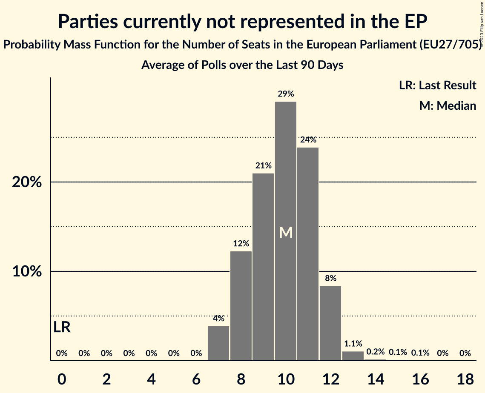

# Parties currently not represented in the EP

Members registered from **19 countries**:

> BE, BG, CY, CZ, DE, DK, EE, ES, FR, GR, HR, IE, IT, LU, LV, NL, PL, SI, SK

## Seats

Last result: **0** seats (General Election of 26 May 2019)

Current median: **10** seats (+10 seats)

At least one member in **4 countries** have a median of 1 seat or more:

> DE, GR, LV, NL

### Confidence Intervals

| Party | Area | Last Result | Median | 80% Confidence Interval | 90% Confidence Interval | 95% Confidence Interval | 99% Confidence Interval |
|:-----:|:----:|:-----------:|:------:|:-----------------------:|:-----------------------:|:-----------------------:|:-----------------------:|
| Parties currently not represented in the EP | EU | 0 | 10 | 9–12 | 9–12 | 8–13 | 8–13 |
| BoerBurgerBeweging [NL] (*) | NL | | 8 | 7–9 | 7–9 | 7–9 | 6–9 |
| Basisdemokratische Partei Deutschland [DE] (*) | DE | | 1 | 0–1 | 0–1 | 0–1 | 0–1 |
| Stabilitātei! [LV] (*) | LV | | 1 | 1 | 1 | 1 | 1 |
| Εθνικό Κόμμα – Έλληνες [GR] (*) | GR | | 1 | 1 | 0–1 | 0–1 | 0–1 |
| AGROunia [PL] (*) | PL | | 0 | 0 | 0 | 0 | 0 |
| Aontú [IE] (*) | IE | | 0 | 0 | 0 | 0 | 0 |
| Belang van Nederland [NL] (*) | NL | | 0 | 0 | 0 | 0 | 0 |
| Bezpartyjni Samorządowcy [PL] (*) | PL | | 0 | 0 | 0 | 0 | 0 |
| Bij1 [NL] (*) | NL | | 0 | 0 | 0 | 0 | 0 |
| DENK [NL] (*) | NL | | 0 | 0 | 0 | 0 | 0 |
| Dobrá voľba [SK] (*) | SK | | 0 | 0 | 0 | 0 | 0 |
| DéFI [BE-FRC] (*) | BE-FRC | | 0 | 0 | 0 | 0 | 0 |
| Erakond Parempoolsed [EE] (*) | EE | | 0 | 0 | 0 | 0 | 0–1 |
| Fokus na bitno [HR] (*) | HR | | 0 | 0 | 0 | 0 | 0 |
| Frie Grønne [DK] (*) | DK | | 0 | 0 | 0 | 0 | 0 |
| Hrvatska stranka umirovljenika [HR] (*) | HR | | 0 | 0 | 0 | 0 | 0 |
| Independents [IE] (*) | IE | | 0 | 0–1 | 0–1 | 0–1 | 0–1 |
| Italexit–Per l’Italia con Paragone [IT] (*) | IT | | 0 | 0 | 0 | 0 | 0 |
| Kommunistesch Partei Lëtzebuerg [LU] (*) | LU | | 0 | 0 | 0 | 0 | 0 |
| Lutte Ouvrière [FR] (*) | FR | | 0 | 0 | 0 | 0 | 0 |
| Naša dežela [SI] (*) | SI | | 0 | 0 | 0 | 0 | 0 |
| Přísaha [CZ] (*) | CZ | | 0 | 0 | 0 | 0 | 0–1 |
| Resni.ca [SI] (*) | SI | | 0 | 0 | 0 | 0 | 0 |
| Unión del Pueblo Navarro [ES] (*) | ES | | 0 | 0 | 0 | 0 | 0 |
| Ανεξάρτητοι [CY] (*) | CY | | 0 | 0 | 0 | 0 | 0 |
| Левицата! [BG] (*) | BG | | 0 | 0 | 0 | 0 | 0 |

### Probability Mass Function

The following table shows the probability mass function per seat for the [poll average](average-2023-05-31.html) for Parties currently not represented in the EP.

| Number of Seats | Probability | Accumulated | Special Marks |
|:---------------:|:-----------:|:-----------:|:-------------:|
| 0 | 0% | 100% | Last Result |
| 1 | 0% | 100% |  |
| 2 | 0% | 100% |  |
| 3 | 0% | 100% |  |
| 4 | 0% | 100% |  |
| 5 | 0% | 100% |  |
| 6 | 0% | 100% |  |
| 7 | 0.1% | 100% |  |
| 8 | 3% | 99.9% |  |
| 9 | 16% | 97% |  |
| 10 | 33% | 81% | Median |
| 11 | 32% | 49% |  |
| 12 | 14% | 17% |  |
| 13 | 3% | 3% |  |
| 14 | 0.2% | 0.3% |  |
| 15 | 0.1% | 0.2% |  |
| 16 | 0% | 0% |  |

