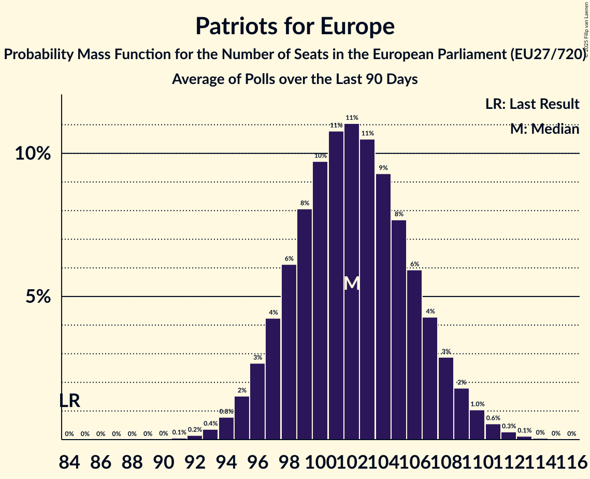

# Patriots for Europe

Members registered from **16 countries**:

> AT, BE, CZ, DK, EE, ES, FR, GR, HU, IT, LV, NL, PL, PT, SI, SK

## Seats

Last result: **84** seats (General Election of 26 May 2019)

Current median: **102** seats (+18 seats)

At least one member in **14 countries** have a median of 1 seat or more:

> AT, BE, CZ, DK, EE, ES, FR, GR, HU, IT, LV, NL, PL, PT

### Confidence Intervals

| Party | Area | Last Result | Median | 80% Confidence Interval | 90% Confidence Interval | 95% Confidence Interval | 99% Confidence Interval |
|:-----:|:----:|:-----------:|:------:|:-----------------------:|:-----------------------:|:-----------------------:|:-----------------------:|
| Patriots for Europe | EU | 84 | 102 | 97–107 | 96–108 | 95–109 | 93–111 |
| Rassemblement national | FR | | 31 | 28–34 | 27–35 | 26–35 | 26–36 |
| Vox | ES | | 12 | 10–14 | 9–14 | 9–14 | 9–15 |
| Fidesz–Kereszténydemokrata Néppárt | HU | | 10 | 8–11 | 8–12 | 7–12 | 7–12 |
| ANO 2011 | CZ | | 8 | 7–9 | 7–9 | 7–9 | 6–10 |
| Freiheitliche Partei Österreichs | AT | | 8 | 7–9 | 7–9 | 7–9 | 6–9 |
| Partij voor de Vrijheid | NL | | 8 | 7–9 | 7–10 | 7–10 | 6–10 |
| Lega Nord | IT | | 7 | 6–8 | 6–9 | 6–9 | 5–9 |
| Chega | PT | | 6 | 5–7 | 5–7 | 4–7 | 4–7 |
| Vlaams Belang | BE-VLG | | 4 | 4 | 3–4 | 3–4 | 3–5 |
| Ruch Narodowy | PL | | 3 | 3–4 | 3–5 | 2–5 | 2–5 |
| Dansk Folkeparti | DK | | 2 | 1–2 | 1–2 | 1–2 | 1–2 |
| Latvija pirmajā vietā | LV | | 2 | 1–2 | 1–2 | 1–2 | 1–2 |
| Eesti Konservatiivne Rahvaerakond | EE | | 1 | 1 | 1–2 | 1–2 | 1–2 |
| Motoristé sobě | CZ | | 1 | 0–1 | 0–2 | 0–2 | 0–2 |
| Φωνή Λογικής | GR | | 1 | 1 | 0–1 | 0–2 | 0–2 |
| Chez Nous | BE-FRC | | 0 | 0 | 0 | 0 | 0 |
| Přísaha | CZ | | 0 | 0 | 0 | 0 | 0 |
| SME RODINA | SK | | 0 | 0 | 0 | 0 | 0 |
| Slovenska nacionalna stranka | SI | | 0 | 0 | 0 | 0 | 0 |
| Slovenská národná strana | SK | | 0 | 0 | 0 | 0–1 | 0–1 |

### Probability Mass Function

The following table shows the probability mass function per seat for the [poll average](average-2025-10-31.html) for Patriots for Europe.

| Number of Seats | Probability | Accumulated | Special Marks |
|:---------------:|:-----------:|:-----------:|:-------------:|
| 84 | 0% | 100% | Last Result |
| 85 | 0% | 100% |  |
| 86 | 0% | 100% |  |
| 87 | 0% | 100% |  |
| 88 | 0% | 100% |  |
| 89 | 0% | 100% |  |
| 90 | 0% | 100% |  |
| 91 | 0.1% | 100% |  |
| 92 | 0.2% | 99.9% |  |
| 93 | 0.4% | 99.7% |  |
| 94 | 0.9% | 99.3% |  |
| 95 | 2% | 98% |  |
| 96 | 3% | 97% |  |
| 97 | 4% | 94% |  |
| 98 | 6% | 90% |  |
| 99 | 8% | 83% |  |
| 100 | 10% | 75% |  |
| 101 | 11% | 65% |  |
| 102 | 11% | 55% | Median |
| 103 | 10% | 44% |  |
| 104 | 9% | 33% |  |
| 105 | 8% | 24% |  |
| 106 | 6% | 17% |  |
| 107 | 4% | 11% |  |
| 108 | 3% | 7% |  |
| 109 | 2% | 4% |  |
| 110 | 1.0% | 2% |  |
| 111 | 0.5% | 1.0% |  |
| 112 | 0.3% | 0.5% |  |
| 113 | 0.1% | 0.2% |  |
| 114 | 0% | 0.1% |  |
| 115 | 0% | 0% |  |

