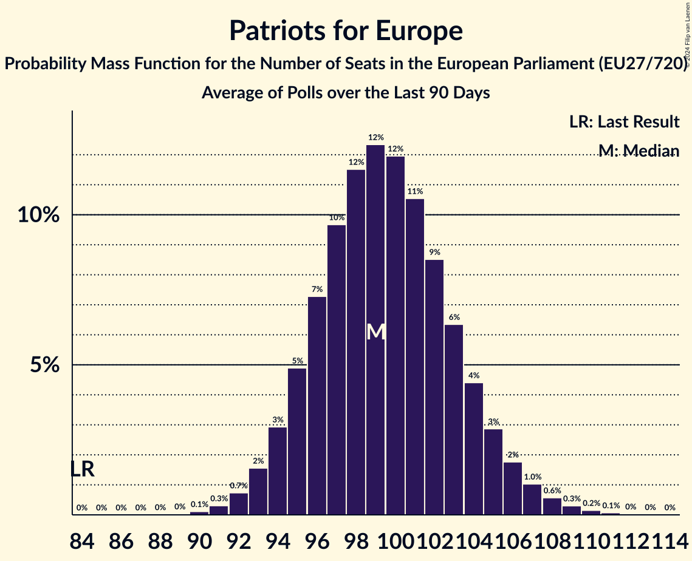

# Patriots for Europe

Members registered from **16 countries**:

> AT, BE, CZ, DK, EE, ES, FR, GR, HU, IT, LV, NL, PL, PT, SI, SK

## Seats

Last result: **84** seats (General Election of 26 May 2019)

Current median: **99** seats (+15 seats)

At least one member in **14 countries** have a median of 1 seat or more:

> AT, BE, CZ, DK, EE, ES, FR, GR, HU, IT, LV, NL, PL, PT

### Confidence Intervals

| Party | Area | Last Result | Median | 80% Confidence Interval | 90% Confidence Interval | 95% Confidence Interval | 99% Confidence Interval |
|:-----:|:----:|:-----------:|:------:|:-----------------------:|:-----------------------:|:-----------------------:|:-----------------------:|
| Patriots for Europe | EU | 84 | 99 | 95–103 | 94–104 | 93–105 | 92–108 |
| Rassemblement national | FR | | 32 | 30–35 | 30–36 | 30–37 | 29–40 |
| ANO 2011 | CZ | | 10 | 8–11 | 8–12 | 8–12 | 7–12 |
| Fidesz–Kereszténydemokrata Néppárt | HU | | 10 | 9–11 | 9–11 | 9–12 | 8–12 |
| Partij voor de Vrijheid | NL | | 10 | 9–11 | 9–12 | 9–12 | 9–12 |
| Lega Nord | IT | | 8 | 7–9 | 6–9 | 6–9 | 6–10 |
| Vox | ES | | 8 | 6–9 | 6–9 | 6–10 | 6–10 |
| Freiheitliche Partei Österreichs | AT | | 7 | 7–8 | 7–8 | 7–8 | 7–8 |
| Chega | PT | | 3 | 3–4 | 3–4 | 3–4 | 2–4 |
| Vlaams Belang | BE-VLG | | 3 | 3–4 | 3–4 | 3–4 | 3–4 |
| Ruch Narodowy | PL | | 2 | 2–3 | 2–3 | 1–4 | 1–4 |
| Dansk Folkeparti | DK | | 1 | 0–1 | 0–1 | 0–1 | 0–1 |
| Eesti Konservatiivne Rahvaerakond | EE | | 1 | 1 | 1 | 0–1 | 0–1 |
| Latvija pirmajā vietā | LV | | 1 | 1 | 1 | 1 | 1 |
| Φωνή Λογικής | GR | | 1 | 1 | 1–2 | 1–2 | 0–2 |
| Motoristé sobě | CZ | | 0 | 0 | 0 | 0 | 0 |
| Přísaha | CZ | | 0 | 0–1 | 0–1 | 0–1 | 0–2 |
| SME RODINA | SK | | 0 | 0 | 0 | 0 | 0–1 |
| Slovenska nacionalna stranka | SI | | 0 | 0 | 0 | 0 | 0 |
| Slovenská národná strana | SK | | 0 | 0–1 | 0–1 | 0–1 | 0–1 |

### Probability Mass Function

The following table shows the probability mass function per seat for the [poll average](average-2024-11-30.html) for Patriots for Europe.

| Number of Seats | Probability | Accumulated | Special Marks |
|:---------------:|:-----------:|:-----------:|:-------------:|
| 84 | 0% | 100% | Last Result |
| 85 | 0% | 100% |  |
| 86 | 0% | 100% |  |
| 87 | 0% | 100% |  |
| 88 | 0% | 100% |  |
| 89 | 0% | 100% |  |
| 90 | 0.1% | 100% |  |
| 91 | 0.3% | 99.8% |  |
| 92 | 0.9% | 99.5% |  |
| 93 | 2% | 98.6% |  |
| 94 | 4% | 97% |  |
| 95 | 6% | 93% |  |
| 96 | 9% | 87% |  |
| 97 | 12% | 78% |  |
| 98 | 13% | 66% |  |
| 99 | 13% | 52% | Median |
| 100 | 12% | 39% |  |
| 101 | 9% | 28% |  |
| 102 | 7% | 18% |  |
| 103 | 5% | 11% |  |
| 104 | 3% | 7% |  |
| 105 | 2% | 4% |  |
| 106 | 1.0% | 2% |  |
| 107 | 0.5% | 1.1% |  |
| 108 | 0.3% | 0.5% |  |
| 109 | 0.1% | 0.2% |  |
| 110 | 0.1% | 0.1% |  |
| 111 | 0% | 0% |  |

