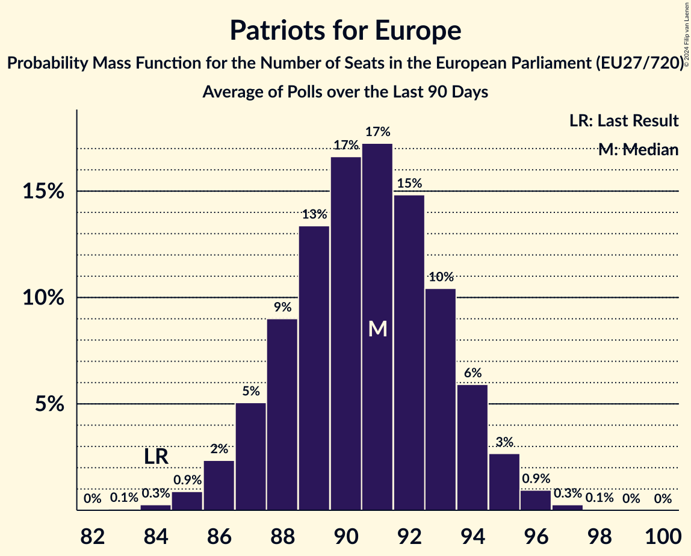

# Patriots for Europe

Members registered from **14 countries**:

> AT, BE, CZ, DK, EE, ES, GR, HU, IT, LV, NL, PT, SI, SK

## Seats

Last result: **84** seats (General Election of 26 May 2019)

Current median: **62** seats (-22 seats)

At least one member in **11 countries** have a median of 1 seat or more:

> AT, BE, CZ, EE, ES, GR, HU, IT, LV, NL, PT

### Confidence Intervals

| Party | Area | Last Result | Median | 80% Confidence Interval | 90% Confidence Interval | 95% Confidence Interval | 99% Confidence Interval |
|:-----:|:----:|:-----------:|:------:|:-----------------------:|:-----------------------:|:-----------------------:|:-----------------------:|
| Patriots for Europe | EU | 84 | 62 | 59–64 | 59–65 | 58–66 | 57–67 |
| Fidesz–Kereszténydemokrata Néppárt | HU | | 11 | 9–11 | 9–12 | 9–12 | 9–12 |
| ANO 2011 | CZ | | 10 | 10–11 | 10–11 | 9–11 | 9–12 |
| Partij voor de Vrijheid | NL | | 10 | 10–11 | 9–11 | 9–11 | 9–11 |
| Lega Nord | IT | | 8 | 7–9 | 7–9 | 6–10 | 6–10 |
| Vox | ES | | 7 | 6–8 | 6–9 | 6–9 | 5–9 |
| Freiheitliche Partei Österreichs | AT | | 6 | 5–6 | 5–7 | 5–7 | 5–7 |
| Chega | PT | | 4 | 3–4 | 3–4 | 3–5 | 2–5 |
| Vlaams Belang | BE-VLG | | 3 | 3 | 3 | 3 | 3 |
| Eesti Konservatiivne Rahvaerakond | EE | | 1 | 1 | 1 | 1 | 1 |
| Latvija pirmajā vietā | LV | | 1 | 1 | 1 | 1 | 1 |
| Φωνή Λογικής | GR | | 1 | 0–1 | 0–1 | 0–1 | 0–1 |
| Dansk Folkeparti | DK | | 0 | 0–1 | 0–1 | 0–1 | 0–1 |
| Přísaha | CZ | | 0 | 0–1 | 0–1 | 0–1 | 0–1 |
| SME RODINA | SK | | 0 | 0 | 0 | 0 | 0 |
| Slovenska nacionalna stranka | SI | | 0 | 0 | 0 | 0 | 0 |
| Slovenská národná strana | SK | | 0 | 0–1 | 0–1 | 0–1 | 0–1 |

### Probability Mass Function

The following table shows the probability mass function per seat for the [poll average](average-2024-07-31.html) for Patriots for Europe.

| Number of Seats | Probability | Accumulated | Special Marks |
|:---------------:|:-----------:|:-----------:|:-------------:|
| 55 | 0% | 100% |  |
| 56 | 0.3% | 99.9% |  |
| 57 | 1.1% | 99.7% |  |
| 58 | 3% | 98.6% |  |
| 59 | 8% | 95% |  |
| 60 | 14% | 88% |  |
| 61 | 19% | 74% |  |
| 62 | 20% | 55% | Median |
| 63 | 16% | 35% |  |
| 64 | 11% | 19% |  |
| 65 | 5% | 8% |  |
| 66 | 2% | 3% |  |
| 67 | 0.7% | 0.9% |  |
| 68 | 0.2% | 0.2% |  |
| 69 | 0% | 0% |  |
| 70 | 0% | 0% |  |
| 71 | 0% | 0% |  |
| 72 | 0% | 0% |  |
| 73 | 0% | 0% |  |
| 74 | 0% | 0% |  |
| 75 | 0% | 0% |  |
| 76 | 0% | 0% |  |
| 77 | 0% | 0% |  |
| 78 | 0% | 0% |  |
| 79 | 0% | 0% |  |
| 80 | 0% | 0% |  |
| 81 | 0% | 0% |  |
| 82 | 0% | 0% |  |
| 83 | 0% | 0% |  |
| 84 | 0% | 0% | Last Result |

