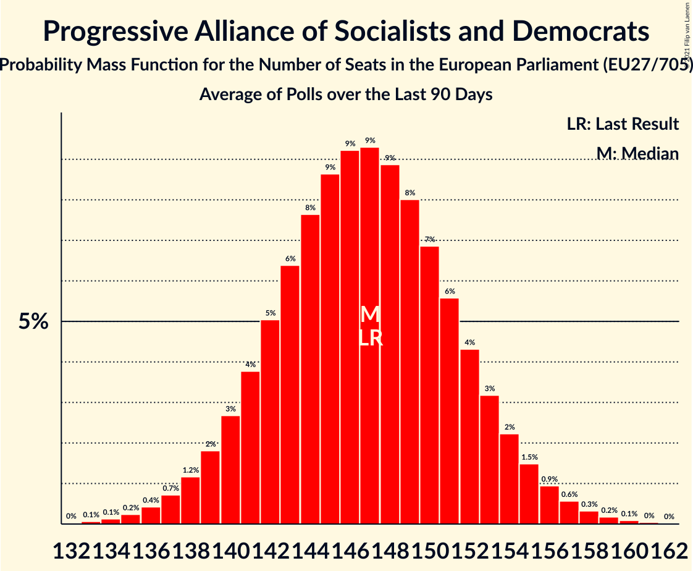

# Progressive Alliance of Socialists and Democrats

Members registered from **27 countries**:

> AT, BE, BG, CY, CZ, DE, DK, EE, ES, FI, FR, GR, HR, HU, IE, IT, LT, LU, LV, MT, NL, PL, PT, RO, SE, SI, SK

## Seats

Last result: **147** seats (General Election of 26 May 2019)

Current median: **146** seats (-1 seats)

At least one member in **26 countries** have a median of 1 seat or more:

> AT, BE, BG, CY, CZ, DE, DK, ES, FI, FR, GR, HR, HU, IE, IT, LT, LU, LV, MT, NL, PL, PT, RO, SE, SI, SK

### Confidence Intervals

| Party | Area | Last Result | Median | 80% Confidence Interval | 90% Confidence Interval | 95% Confidence Interval | 99% Confidence Interval |
|:-----:|:----:|:-----------:|:------:|:-----------------------:|:-----------------------:|:-----------------------:|:-----------------------:|
| Progressive Alliance of Socialists and Democrats | EU | 147 | 146 | 141–152 | 139–154 | 138–155 | 135–158 |
| Partido Socialista Obrero Español | ES | | 17 | 16–19 | 15–19 | 15–20 | 14–21 |
| Partito Democratico | IT | | 16 | 14–17 | 14–18 | 13–18 | 13–19 |
| Sozialdemokratische Partei Deutschlands | DE | | 15 | 14–16 | 13–17 | 13–17 | 12–18 |
| Partidul Social Democrat | RO | | 13 | 12–14 | 11–14 | 11–14 | 11–14 |
| United Opposition | HU | | 11 | 10–11 | 9–11 | 9–12 | 9–12 |
| Partido Socialista | PT | | 9 | 8–10 | 8–11 | 8–11 | 8–11 |
| Socialdemokraterne | DK | | 6 | 5–6 | 5–6 | 5–6 | 5–7 |
| Sveriges socialdemokratiska arbetareparti | SE | | 6 | 6–7 | 5–7 | 5–7 | 5–7 |
| Lewica | PL | | 5 | 4–6 | 4–7 | 4–7 | 3–7 |
| Parti socialiste | FR | | 5 | 4–7 | 0–7 | 0–7 | 0–8 |
| Sozialdemokratische Partei Österreichs | AT | | 5 | 4–5 | 4–5 | 4–5 | 4–6 |
| Българска социалистическа партия | BG | | 5 | 4–5 | 4–6 | 3–6 | 3–6 |
| HLAS–sociálna demokracia | SK | | 4 | 4–5 | 3–5 | 3–5 | 3–5 |
| Partij van de Arbeid | NL | | 3 | 2–3 | 2–3 | 2–3 | 2–3 |
| Partit Laburista | MT | | 3 | 3–4 | 3–4 | 3–4 | 3–4 |
| Socijaldemokratska partija Hrvatske | HR | | 3 | 3 | 2–3 | 2–3 | 2–4 |
| Suomen Sosialidemokraattinen Puolue | FI | | 3 | 3–4 | 3–4 | 3–4 | 3–4 |
| Parti Socialiste | BE-FRC | | 2 | 2 | 2 | 2 | 2–3 |
| SMER–sociálna demokracia | SK | | 2 | 1–2 | 1–2 | 1–2 | 1–2 |
| Socialistische Partij Anders | BE-VLG | | 2 | 1–2 | 1–2 | 1–2 | 1–2 |
| Socialni demokrati | SI | | 2 | 1–2 | 1–2 | 1–2 | 1–3 |
| Κίνημα Αλλαγής | GR | | 2 | 1–2 | 1–2 | 1–2 | 1–2 |
| Lietuvos socialdemokratų partija | LT | | 1 | 1 | 1 | 1 | 1–2 |
| Lëtzebuerger Sozialistesch Aarbechterpartei | LU | | 1 | 1–2 | 1–2 | 1–2 | 1–2 |
| PROGRESĪVIE | LV | | 1 | 1 | 1 | 0–1 | 0–1 |
| Social Democrats | IE | | 1 | 0–2 | 0–2 | 0–2 | 0–2 |
| Sociāldemokrātiskā partija “Saskaņa” | LV | | 1 | 1–2 | 1–2 | 1–2 | 1–2 |
| Česká strana sociálně demokratická | CZ | | 1 | 0–1 | 0–2 | 0–2 | 0–2 |
| Δημοκρατικό Κόμμα | CY | | 1 | 1 | 1 | 1 | 1 |
| Azione | IT | | 0 | 0–4 | 0–4 | 0–4 | 0–5 |
| Labour Party | IE | | 0 | 0 | 0 | 0 | 0 |
| Liberi e Uguali | IT | | 0 | 0–4 | 0–4 | 0–4 | 0–5 |
| Lietuvos socialdemokratų darbo partija | LT | | 0 | 0 | 0 | 0 | 0 |
| PRO România | RO | | 0 | 0 | 0 | 0 | 0 |
| Sotsiaaldemokraatlik Erakond | EE | | 0 | 0 | 0–1 | 0–1 | 0–1 |
| Κίνημα Σοσιαλδημοκρατών–Συνεργασία Πολιτών | CY | | 0 | 0 | 0–1 | 0–1 | 0–1 |
| Алтернатива за българско възраждане | BG | | 0 | 0 | 0 | 0 | 0 |

### Probability Mass Function

The following table shows the probability mass function per seat for the [poll average](average-2021-03-31.html) for Progressive Alliance of Socialists and Democrats.

| Number of Seats | Probability | Accumulated | Special Marks |
|:---------------:|:-----------:|:-----------:|:-------------:|
| 132 | 0% | 100% |  |
| 133 | 0.1% | 99.9% |  |
| 134 | 0.1% | 99.9% |  |
| 135 | 0.3% | 99.7% |  |
| 136 | 0.5% | 99.4% |  |
| 137 | 0.8% | 99.0% |  |
| 138 | 1.3% | 98% |  |
| 139 | 2% | 97% |  |
| 140 | 3% | 95% |  |
| 141 | 4% | 92% |  |
| 142 | 5% | 88% |  |
| 143 | 7% | 83% |  |
| 144 | 8% | 76% |  |
| 145 | 9% | 68% |  |
| 146 | 9% | 59% | Median |
| 147 | 9% | 50% | Last Result |
| 148 | 9% | 41% |  |
| 149 | 8% | 32% |  |
| 150 | 7% | 24% |  |
| 151 | 5% | 18% |  |
| 152 | 4% | 12% |  |
| 153 | 3% | 8% |  |
| 154 | 2% | 5% |  |
| 155 | 1.3% | 3% |  |
| 156 | 0.8% | 2% |  |
| 157 | 0.5% | 1.1% |  |
| 158 | 0.3% | 0.6% |  |
| 159 | 0.2% | 0.3% |  |
| 160 | 0.1% | 0.1% |  |
| 161 | 0% | 0.1% |  |
| 162 | 0% | 0% |  |

