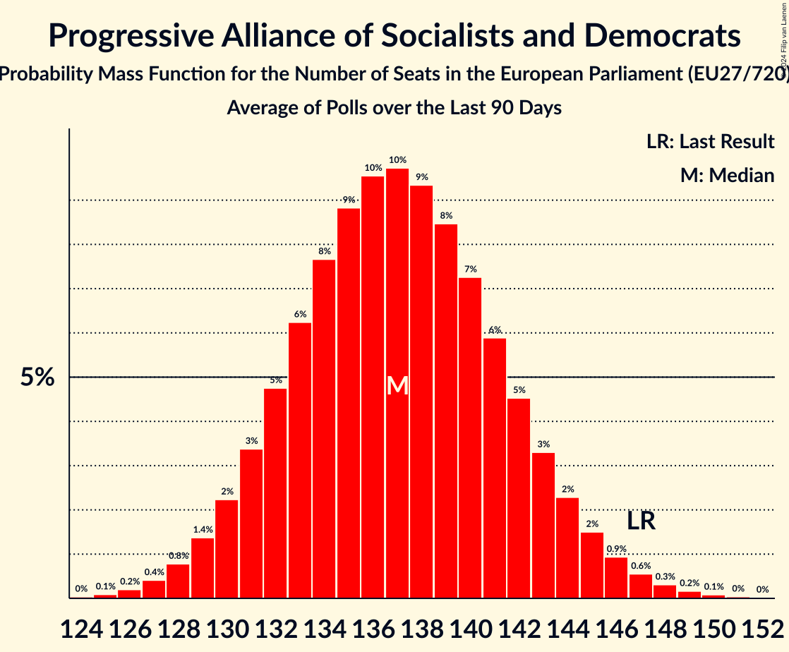

# Progressive Alliance of Socialists and Democrats

Members registered from **27 countries**:

> AT, BE, BG, CY, CZ, DE, DK, EE, ES, FI, FR, GR, HR, HU, IE, IT, LT, LU, LV, MT, NL, PL, PT, RO, SE, SI, SK

## Seats

Last result: **147** seats (General Election of 26 May 2019)

Current median: **138** seats (-9 seats)

At least one member in **25 countries** have a median of 1 seat or more:

> AT, BE, BG, CY, DE, DK, EE, ES, FI, FR, GR, HR, HU, IE, IT, LT, LU, LV, MT, NL, PL, PT, RO, SE, SK

### Confidence Intervals

| Party | Area | Last Result | Median | 80% Confidence Interval | 90% Confidence Interval | 95% Confidence Interval | 99% Confidence Interval |
|:-----:|:----:|:-----------:|:------:|:-----------------------:|:-----------------------:|:-----------------------:|:-----------------------:|
| Progressive Alliance of Socialists and Democrats | EU | 147 | 138 | 133–143 | 131–145 | 130–146 | 128–149 |
| Partido Socialista Obrero Español | ES | | 21 | 19–24 | 19–25 | 19–25 | 18–26 |
| Partito Democratico | IT | | 16 | 14–19 | 14–19 | 14–20 | 13–23 |
| Sozialdemokratische Partei Deutschlands | DE | | 15 | 13–17 | 12–17 | 12–17 | 12–18 |
| Partidul Social Democrat | RO | | 10 | 9–11 | 8–11 | 8–11 | 8–12 |
| Parti socialiste | FR | | 9 | 8–10 | 8–10 | 7–11 | 6–11 |
| Sveriges socialdemokratiska arbetareparti | SE | | 8 | 7–9 | 7–9 | 7–9 | 7–9 |
| Partido Socialista | PT | | 7 | 6–8 | 6–8 | 5–9 | 5–9 |
| Sozialdemokratische Partei Österreichs | AT | | 5 | 4–5 | 4–6 | 4–6 | 4–6 |
| Nowa Lewica | PL | | 4 | 3–4 | 3–4 | 3–4 | 2–5 |
| Partij van de Arbeid | NL | | 4 | 3–4 | 3–4 | 3–4 | 3–4 |
| Socialdemokraterne | DK | | 4 | 4 | 3–4 | 3–4 | 3–5 |
| Suomen Sosialidemokraattinen Puolue | FI | | 4 | 3–4 | 3–4 | 3–4 | 3–4 |
| Demokratikus Koalíció | HU | | 3 | 2–5 | 2–5 | 2–5 | 2–5 |
| HLAS–sociálna demokracia | SK | | 3 | 2–3 | 2–4 | 2–4 | 2–4 |
| Lietuvos socialdemokratų partija | LT | | 3 | 2–3 | 2–3 | 2–3 | 2–3 |
| Partit Laburista | MT | | 3 | 3 | 3–4 | 3–4 | 3–4 |
| Κίνημα Αλλαγής | GR | | 3 | 3–4 | 2–4 | 2–4 | 2–4 |
| Lëtzebuerger Sozialistesch Aarbechterpartei | LU | | 2 | 2 | 2 | 2 | 2 |
| Parti Socialiste | BE-FRC | | 2 | 2–3 | 2–3 | 2–3 | 2–3 |
| Socijaldemokratska partija Hrvatske | HR | | 2 | 2–3 | 2–3 | 2–3 | 1–4 |
| Vooruit | BE-VLG | | 2 | 2 | 2 | 2 | 1–2 |
| Българска социалистическа партия | BG | | 2 | 2 | 2 | 1–2 | 1–3 |
| Lietuvos regionų partija | LT | | 1 | 0–1 | 0–1 | 0–1 | 0–1 |
| Social Democrats | IE | | 1 | 1–2 | 1–2 | 1–2 | 1–2 |
| Sociāldemokrātiskā partija “Saskaņa” | LV | | 1 | 1 | 1 | 1 | 1 |
| Sotsiaaldemokraatlik Erakond | EE | | 1 | 1–2 | 1–2 | 1–2 | 1–2 |
| Δημοκρατικό Κόμμα | CY | | 1 | 1 | 1 | 1 | 1 |
| Labour Party | IE | | 0 | 0 | 0 | 0 | 0 |
| Magyar Szocialista Párt | HU | | 0 | 0–1 | 0–1 | 0–1 | 0–1 |
| PRO România | RO | | 0 | 0 | 0 | 0 | 0 |
| Parti radical de gauche | FR | | 0 | 0 | 0 | 0 | 0 |
| Parti radical de gauche–La Convention | FR | | 0 | 0 | 0 | 0 | 0 |
| Partidul Puterii Umaniste (social-liberal) | RO | | 0 | 0 | 0 | 0 | 0 |
| Socialni demokrati | SI | | 0 | 0–1 | 0–1 | 0–1 | 0–1 |
| Česká strana sociálně demokratická | CZ | | 0 | 0–1 | 0–1 | 0–1 | 0–1 |
| Κίνημα Σοσιαλδημοκρατών | CY | | 0 | 0 | 0 | 0 | 0 |

### Probability Mass Function

The following table shows the probability mass function per seat for the [poll average](average-2024-02-29.html) for Progressive Alliance of Socialists and Democrats.

| Number of Seats | Probability | Accumulated | Special Marks |
|:---------------:|:-----------:|:-----------:|:-------------:|
| 125 | 0% | 100% |  |
| 126 | 0.1% | 99.9% |  |
| 127 | 0.2% | 99.9% |  |
| 128 | 0.4% | 99.7% |  |
| 129 | 0.8% | 99.3% |  |
| 130 | 1.3% | 98% |  |
| 131 | 2% | 97% |  |
| 132 | 3% | 95% |  |
| 133 | 5% | 92% |  |
| 134 | 6% | 87% |  |
| 135 | 7% | 81% |  |
| 136 | 9% | 74% |  |
| 137 | 9% | 65% |  |
| 138 | 10% | 56% | Median |
| 139 | 9% | 46% |  |
| 140 | 9% | 36% |  |
| 141 | 7% | 28% |  |
| 142 | 6% | 20% |  |
| 143 | 5% | 14% |  |
| 144 | 3% | 10% |  |
| 145 | 2% | 6% |  |
| 146 | 2% | 4% |  |
| 147 | 1.0% | 2% | Last Result |
| 148 | 0.6% | 1.2% |  |
| 149 | 0.3% | 0.7% |  |
| 150 | 0.2% | 0.3% |  |
| 151 | 0.1% | 0.2% |  |
| 152 | 0% | 0.1% |  |
| 153 | 0% | 0% |  |

