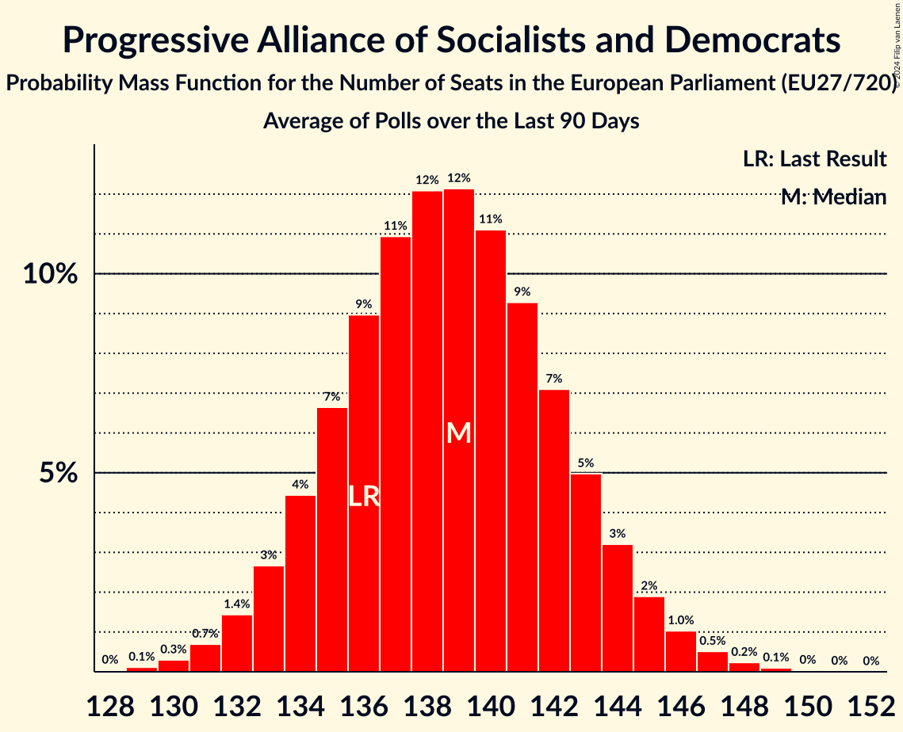

# Progressive Alliance of Socialists and Democrats

Members registered from **25 countries**:

> AT, BE, CY, CZ, DE, DK, EE, ES, FI, FR, GR, HR, HU, IE, IT, LT, LU, LV, MT, NL, PL, PT, RO, SE, SI

## Seats

Last result: **136** seats (General Election of 26 May 2019)

Current median: **138** seats (+2 seats)

At least one member in **23 countries** have a median of 1 seat or more:

> AT, BE, CY, DE, DK, EE, ES, FI, FR, GR, HR, HU, IT, LT, LU, LV, MT, NL, PL, PT, RO, SE, SI

### Confidence Intervals

| Party | Area | Last Result | Median | 80% Confidence Interval | 90% Confidence Interval | 95% Confidence Interval | 99% Confidence Interval |
|:-----:|:----:|:-----------:|:------:|:-----------------------:|:-----------------------:|:-----------------------:|:-----------------------:|
| Progressive Alliance of Socialists and Democrats | EU | 136 | 138 | 134–142 | 132–143 | 131–144 | 130–146 |
| Partito Democratico | IT | | 21 | 19–23 | 19–23 | 18–24 | 17–25 |
| Partido Socialista Obrero Español | ES | | 20 | 19–23 | 19–23 | 19–24 | 18–25 |
| Sozialdemokratische Partei Deutschlands | DE | | 14 | 12–16 | 12–16 | 12–16 | 11–17 |
| Parti socialiste | FR | | 13 | 13 | 13 | 13 | 13 |
| Partidul Social Democrat | RO | | 12 | 11–13 | 11–13 | 11–13 | 11–14 |
| Partido Socialista | PT | | 7 | 6–8 | 6–9 | 5–9 | 5–9 |
| Sveriges socialdemokratiska arbetareparti | SE | | 7 | 7–8 | 7–8 | 7–8 | 6–9 |
| Sozialdemokratische Partei Österreichs | AT | | 5 | 4–5 | 4–5 | 4–5 | 4–6 |
| Suomen Sosialidemokraattinen Puolue | FI | | 4 | 3–4 | 3–4 | 3–4 | 3–4 |
| Lietuvos socialdemokratų partija | LT | | 3 | 2–3 | 2–3 | 2–4 | 2–4 |
| Nowa Lewica | PL | | 3 | 3–4 | 3–5 | 3–5 | 2–5 |
| Partij van de Arbeid | NL | | 3 | 3–4 | 3–4 | 3–4 | 3–4 |
| Partit Laburista | MT | | 3 | 3 | 3 | 3 | 3 |
| Socialdemokraterne | DK | | 3 | 3–4 | 3–4 | 3–4 | 2–4 |
| Socijaldemokratska partija Hrvatske | HR | | 3 | 3–4 | 3–4 | 2–4 | 2–4 |
| Κίνημα Αλλαγής | GR | | 3 | 3 | 2–3 | 2–4 | 2–4 |
| Parti Socialiste | BE-FRC | | 2 | 2 | 2 | 2 | 2 |
| Vooruit | BE-VLG | | 2 | 2 | 2 | 2 | 2 |
| Demokratikus Koalíció | HU | | 1 | 1–2 | 1–2 | 0–2 | 0–2 |
| Lëtzebuerger Sozialistesch Aarbechterpartei | LU | | 1 | 1 | 1 | 1 | 1 |
| Socialni demokrati | SI | | 1 | 1 | 1 | 1 | 0–1 |
| Sociāldemokrātiskā partija “Saskaņa” | LV | | 1 | 1 | 1 | 1 | 1 |
| Sotsiaaldemokraatlik Erakond | EE | | 1 | 1–2 | 1–2 | 1–2 | 1–2 |
| Δημοκρατικό Κόμμα | CY | | 1 | 1 | 1 | 1 | 1 |
| Labour Party | IE | | 0 | 0–1 | 0–1 | 0–1 | 0–1 |
| Lietuvos regionų partija | LT | | 0 | 0–1 | 0–1 | 0–1 | 0–1 |
| Magyar Szocialista Párt | HU | | 0 | 0 | 0 | 0 | 0 |
| PRO România | RO | | 0 | 0 | 0 | 0 | 0 |
| Partidul Umanist Social Liberal | RO | | 0 | 0 | 0 | 0 | 0 |
| Social Democrats | IE | | 0 | 0 | 0–1 | 0–1 | 0–1 |
| Sociální demokracie | CZ | | 0 | 0 | 0 | 0 | 0–1 |
| Szocialisták és demokraták | HU | | 0 | 0 | 0 | 0 | 0 |
| Κίνημα Σοσιαλδημοκρατών | CY | | 0 | 0 | 0 | 0 | 0 |

### Probability Mass Function

The following table shows the probability mass function per seat for the [poll average](average-2024-08-31.html) for Progressive Alliance of Socialists and Democrats.

| Number of Seats | Probability | Accumulated | Special Marks |
|:---------------:|:-----------:|:-----------:|:-------------:|
| 127 | 0% | 100% |  |
| 128 | 0.1% | 99.9% |  |
| 129 | 0.3% | 99.8% |  |
| 130 | 0.7% | 99.5% |  |
| 131 | 1.5% | 98.8% |  |
| 132 | 3% | 97% |  |
| 133 | 4% | 95% |  |
| 134 | 7% | 90% |  |
| 135 | 9% | 84% |  |
| 136 | 11% | 75% | Last Result |
| 137 | 12% | 64% |  |
| 138 | 12% | 52% | Median |
| 139 | 11% | 39% |  |
| 140 | 9% | 28% |  |
| 141 | 7% | 19% |  |
| 142 | 5% | 12% |  |
| 143 | 3% | 7% |  |
| 144 | 2% | 4% |  |
| 145 | 1.0% | 2% |  |
| 146 | 0.5% | 0.9% |  |
| 147 | 0.2% | 0.4% |  |
| 148 | 0.1% | 0.1% |  |
| 149 | 0% | 0.1% |  |
| 150 | 0% | 0% |  |

