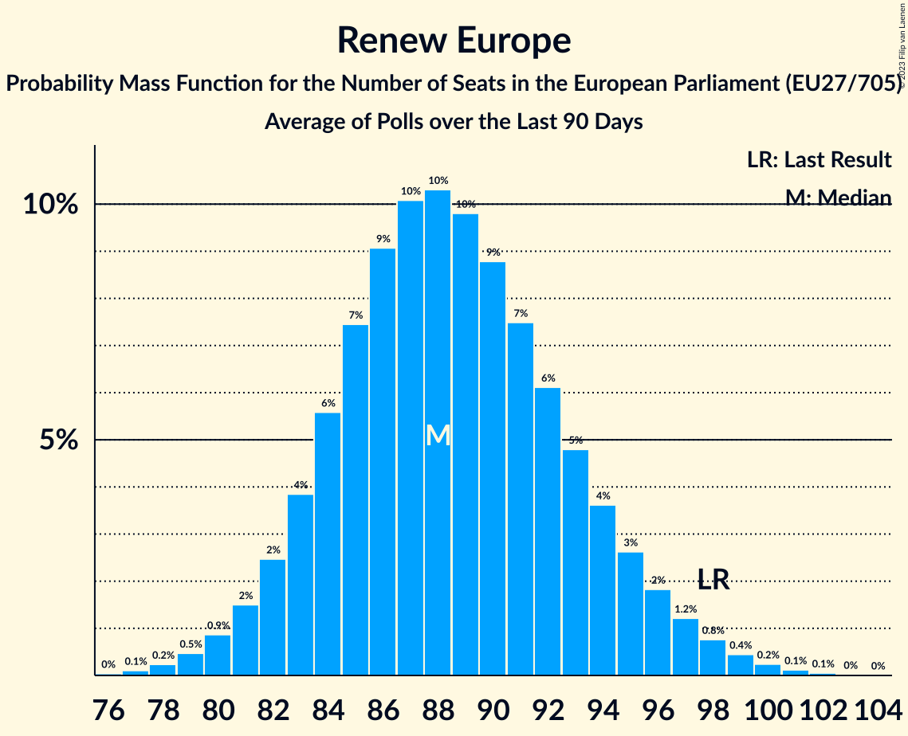

# Renew Europe

Members registered from **24 countries**:

> AT, BE, BG, CY, CZ, DE, DK, EE, FI, FR, HR, HU, IE, IT, LT, LU, LV, NL, PL, PT, RO, SE, SI, SK

## Seats

Last result: **98** seats (General Election of 26 May 2019)

Current median: **90** seats (-8 seats)

At least one member in **21 countries** have a median of 1 seat or more:

> AT, BE, BG, CZ, DE, DK, EE, FI, FR, HU, IE, LT, LU, LV, NL, PL, PT, RO, SE, SI, SK

### Confidence Intervals

| Party | Area | Last Result | Median | 80% Confidence Interval | 90% Confidence Interval | 95% Confidence Interval | 99% Confidence Interval |
|:-----:|:----:|:-----------:|:------:|:-----------------------:|:-----------------------:|:-----------------------:|:-----------------------:|
| Renew Europe | EU | 98 | 90 | 85–94 | 84–96 | 83–97 | 81–99 |
| La République en marche–Mouvement démocrate | FR | | 19 | 17–20 | 16–21 | 16–21 | 15–22 |
| ANO 2011 | CZ | | 9 | 8–10 | 8–10 | 8–10 | 8–10 |
| Freie Demokratische Partei | DE | | 7 | 5–8 | 5–8 | 5–9 | 4–9 |
| Volkspartij voor Vrijheid en Democratie | NL | | 6 | 6 | 6–7 | 6–7 | 5–7 |
| Trzecia Droga | PL | | 5 | 3–6 | 3–6 | 3–7 | 0–7 |
| Alianța 2020 USR-PLUS | RO | | 4 | 3–5 | 3–5 | 3–5 | 3–6 |
| Fianna Fáil | IE | | 4 | 3–4 | 3–4 | 2–4 | 1–4 |
| Продължаваме промяната–Демократична България | BG | | 4 | 3–4 | 3–4 | 3–5 | 3–5 |
| Gibanje Svoboda | SI | | 3 | 3–4 | 3–4 | 3–4 | 3–4 |
| Progresívne Slovensko | SK | | 3 | 2–3 | 2–3 | 2–4 | 2–4 |
| Движение за права и свободи | BG | | 3 | 2–3 | 2–3 | 2–3 | 2–4 |
| Democraten 66 | NL | | 2 | 1–3 | 1–3 | 1–3 | 1–3 |
| Eesti Reformierakond | EE | | 2 | 2 | 2–3 | 2–3 | 2–3 |
| Freie Wähler | DE | | 2 | 1–2 | 1–2 | 1–2 | 1–2 |
| Liberal Alliance | DK | | 2 | 2 | 2 | 1–2 | 1–2 |
| Momentum Mozgalom | HU | | 2 | 1–2 | 1–2 | 1–2 | 1–3 |
| Mouvement Réformateur | BE-FRC | | 2 | 2 | 2 | 1–2 | 1–2 |
| Venstre | DK | | 2 | 1–2 | 1–2 | 1–2 | 1–2 |
| Centerpartiet | SE | | 1 | 0–1 | 0–2 | 0–2 | 0–2 |
| Demokratesch Partei | LU | | 1 | 1 | 1 | 1 | 1–2 |
| Eesti Keskerakond | EE | | 1 | 1–2 | 1–2 | 1–2 | 1–2 |
| Iniciativa Liberal | PT | | 1 | 1–2 | 1–2 | 1–2 | 1–2 |
| Liberalų Sąjūdis | LT | | 1 | 1–2 | 1–2 | 1–2 | 0–2 |
| Moderaterne | DK | | 1 | 1 | 1 | 1 | 1 |
| NEOS–Das Neue Österreich und Liberales Forum | AT | | 1 | 1–2 | 1–2 | 1–2 | 1–2 |
| Open Vlaamse Liberalen en Democraten | BE-VLG | | 1 | 1 | 1 | 1 | 1 |
| Suomen Keskusta | FI | | 1 | 1–2 | 1–2 | 1–2 | 1–2 |
| Zaļo un Zemnieku savienība | LV | | 1 | 1 | 1 | 1 | 1 |
| Azione | IT | | 0 | 0–4 | 0–4 | 0–4 | 0–5 |
| Centar | HR | | 0 | 0 | 0 | 0 | 0 |
| Eesti 200 | EE | | 0 | 0 | 0–1 | 0–1 | 0–1 |
| Hrvatska narodna stranka–liberalni demokrati | HR | | 0 | 0 | 0 | 0 | 0 |
| Hrvatska seljačka stranka | HR | | 0 | 0 | 0 | 0 | 0 |
| Istarski demokratski sabor | HR | | 0 | 0 | 0 | 0 | 0 |
| Italia Viva | IT | | 0 | 0 | 0 | 0–4 | 0–4 |
| Konkretno | SI | | 0 | 0 | 0 | 0 | 0 |
| Kustība Par! | LV | | 0 | 0 | 0 | 0 | 0 |
| Laisvės partija | LT | | 0 | 0–1 | 0–1 | 0–1 | 0–1 |
| Latvijas attīstībai | LV | | 0 | 0 | 0 | 0 | 0 |
| Liberalerna | SE | | 0 | 0 | 0 | 0 | 0–1 |
| Partija „Laisvė ir teisingumas“ | LT | | 0 | 0 | 0–1 | 0–1 | 0–1 |
| Più Europa | IT | | 0 | 0 | 0 | 0 | 0–4 |
| Radikale Venstre | DK | | 0 | 0–1 | 0–1 | 0–1 | 0–1 |
| Svenska folkpartiet i Finland | FI | | 0 | 0 | 0–1 | 0–1 | 0–1 |
| Δημοκρατική Παράταξη | CY | | 0 | 0 | 0 | 0 | 0 |

### Probability Mass Function

The following table shows the probability mass function per seat for the [poll average](average-2023-09-30.html) for Renew Europe.

| Number of Seats | Probability | Accumulated | Special Marks |
|:---------------:|:-----------:|:-----------:|:-------------:|
| 78 | 0% | 100% |  |
| 79 | 0.1% | 99.9% |  |
| 80 | 0.2% | 99.9% |  |
| 81 | 0.5% | 99.6% |  |
| 82 | 1.0% | 99.1% |  |
| 83 | 2% | 98% |  |
| 84 | 3% | 96% |  |
| 85 | 5% | 93% |  |
| 86 | 7% | 88% |  |
| 87 | 9% | 81% |  |
| 88 | 10% | 73% |  |
| 89 | 11% | 62% |  |
| 90 | 11% | 52% | Median |
| 91 | 10% | 41% |  |
| 92 | 9% | 31% |  |
| 93 | 7% | 22% |  |
| 94 | 5% | 15% |  |
| 95 | 4% | 10% |  |
| 96 | 3% | 6% |  |
| 97 | 2% | 3% |  |
| 98 | 0.9% | 2% | Last Result |
| 99 | 0.5% | 0.8% |  |
| 100 | 0.2% | 0.4% |  |
| 101 | 0.1% | 0.2% |  |
| 102 | 0% | 0.1% |  |
| 103 | 0% | 0% |  |

